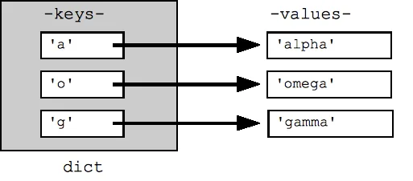

Like lists, Dictionaries are collections of many values. But in the lists, we have indexes whereas in dictionaries we can use any kind of data type, be it a string or integer or float.

The indexes, whatever we use in the dictionary are called keys and the keys with the associated values are called key-value pairs. It's one of the most used data-structure in the world.

dict = {}

dict = {key : value}

Here I showed some basic concepts and methods.

## Create Dictionary

```python
# empty dictionary

dict1 = dict()
dict1
{}

dict2 = {}
dict2
{}

#create dictionary

diction = {1:"one", 2:"two", 3:"three"}
diction
{1: 'one', 2: 'two', 3: 'three'}

diction = dict({1:"one", 2:"two", 3:"three"})
diction
{1: 'one', 2: 'two', 3: 'three'}

# Return Dictionary Keys using keys() method
mydict = {1:"one", 2:"two", 3:"three"}
mydict.keys()
dict_keys([1, 2, 3])

# Return Dictionary Values using values() method
mydict.values()
dict_values(['one', 'two', 'three'])
```

## Accessing Items
```python
# Access item using key
mydict = {1:"one", 2:"two", 3:"three", 4:"four"}
mydict[2]
'two'

# Access item using key using get() method
mydict.get(3)
'three'
```

## Add, Remove and Update items
String type value must be covered by single/double quotation.

```python
mydict = {'Name': "Rifat", "Id": 134670, "DOB": 1990, "Address":'Bangladesh'}
mydict
{'Name': 'Rifat', 'Id': 134670, 'DOB': 1990, 'Address': 'Bangladesh'}

# Adding Items

mydict["Job"] = "Data Scientist"
mydict
{'Name': 'Rifat',
 'Id': 134670,
 'DOB': 1990,
 'Address': 'Bangladesh',
 'Job': 'Data Scientist'}

 # Update Items

 mydict["DOB"] = 1991
 mydict
 {'Name': 'Rifat',
 'Id': 134670,
 'DOB': 1991,
 'Address': 'Bangladesh',
 'Job': 'Data Scientist'}

 # Removing items in the dictionary using Pop method

 mydict.pop('Job')
 mydict
 {'Name': 'Rifat', 'Id': 134670, 'DOB': 1991, 'Address': 'Bangladesh'}

 # Removing item using del method
 del[mydict["Id"]]
 mydict
 {'Name': 'Rifat', 'DOB': 1991, 'Address': 'Bangladesh'}

 # Delete all items of the dictionary using clear method

 mydict.clear()
 mydict
 {'Name': 'Rifat', 'DOB': 1991, 'Address': 'Bangladesh'}
```

## Dictionary Loop

```python
mydict = {'Name': "Rifat", "Id": 134670, "DOB": 1990, "Address":'Bangladesh'}
for i in mydict:
    print(mydict[i])
Rifat
134670
1990
Bangladesh
```

## Dictionary Comprehension
```python
square = {i:i*2 for i in range(10)}
square
{0: 0, 1: 2, 2: 4, 3: 6, 4: 8, 5: 10, 6: 12, 7: 14, 8: 16, 9: 18}

mydict = {'Name': "Rifat", "Id": 134670, "DOB": 1990, "Address":'Bangladesh'}
mydict1 = {k:v for (k,v) in mydict.items()}
mydict
{'Name': 'Rifat', 'Id': 134670, 'DOB': 1990, 'Address': 'Bangladesh'}
```
