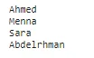
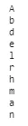
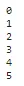
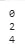
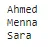
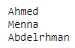
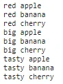

## Introduction :

A for loop is used for iterating over a sequence (that is either a list, a tuple, a dictionary, a set, or a string).

This is less like the for keyword in other programming languages, and works more like an iterator method as found in other object-orientated programming languages.

With the for loop we can execute a set of statements, once for each item in a list, tuple, set etc.

## Looping Through a List:
```python
names_list = ['Ahmed','Menna','Sara','Abdelrhman']
for n in names_list:
  print(n)
```



## Looping Through a String:

Even strings are iterable objects, they contain a sequence of characters

```python
for n in 'Abdelrhman':
  print(n)
```



## The range() Function:

To loop through a set of code a specified number of times, we can use the range() function, The range() function returns a sequence of numbers, starting from 0 by default, and increments by 1 (by default), and ends at a specified number.

range(start, end, steps)

i) start value the point to start looping with

ii) end value does not included.

iii) steps denote how many steps we can take by default = 1

```python
# range(start , end,step) end value excluded
for i in range(0,6):
  print(i)
```



```python
# range(start , end,step) end value excluded step = 2
for i in range(0,6,2):
  print(i)
```



## The break Statement :

With the break statement we can stop the loop before it has looped through all the items

```python
names_list = ['Ahmed','Menna','Sara','Abdelrhman']
for n in names_list:
  print(n)
  if n == 'Sara':
    break
```



## The continue Statement :

With the continue statement we can stop the current iteration of the loop, and continue with the next

```python
names_list = ['Ahmed','Menna','Sara','Abdelrhman']
for n in names_list:
  if n == 'Sara':
    continue
  print(n)
```



## The pass Statement :

for loops cannot be empty, but if you for some reason have a for loop with no content, put in the pass statement to avoid getting an error

```python
names_list = ['Ahmed','Menna','Sara','Abdelrhman']
for n in names_list:
  pass
```

## Nested Loops :

A nested loop is a loop inside a loop.

The "inner loop" will be executed one time for each iteration of the "outer loop"

```python
adj = ["red", "big", "tasty"]
fruits = ["apple", "banana", "cherry"]

for x in adj:
  for y in fruits:
    print(x, y)
```



## **Conclusion**:

for loops it`s so useful and we will see that when we will deal with a data frame in this camp.
