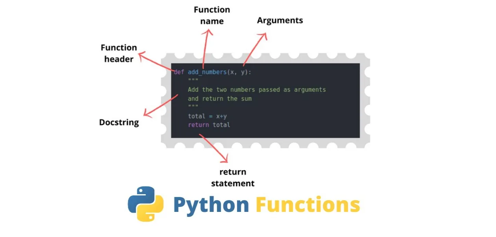

**What are Functions?**



Functions are a convenient way to divide your code into useful blocks, allowing us to order our code, make it more readable, reuse it and save some time. Also functions are a key way to define interfaces so programmers can share their code.

**Main Usage**

The idea is to put some commonly or repeatedly done tasks together and make a function so that instead of writing the same code again and again for different inputs, we can do the function calls to reuse code contained in it over and over again.

**Types of Functions**

Basically, we can divide functions into the following two types:

1. Built-in functions - Functions that are built into Python.
2. User-defined functions - Functions defined by the users themselves.

In this blog we will be discussing about the **user defined functions**.

**Syntax of Function**

```python
def function_name(arguments):
    """docstring"""
    # write your code here
```

Above shown is a function definition that consists of the following components.

1. Keyword def that marks the start of the function header.
2. A function name to uniquely identify the function.
3. Parameters (arguments) through which we pass values to a function. They are optional.
4. A colon (:) to mark the end of the function header.
5. Optional documentation string (docstring) to describe what the function does.
6. One or more valid python statements that make up the function body. Statements must have the same indentation level (usually 4 spaces).
7. An optional return statement to return a value from the function.

Now we will discuss each component in detail with the help of an example so let's get started.

**Example of a Function**

```python
def welcome(name):
    """This function will greet users every time it will be
       called. It contains an argument name which will be
       sent by the user when it is called"""
    print("Welcome " + name + ". We are glad to see you!")
```

- Function blocks begin with the keyword **def** followed by the function name and parentheses ( ( ) ). Any input parameters or arguments should be placed within these parentheses. but they are optional. In the above example **welcome** is the function name while **name** inside the parenthesis is the argument.
- The first statement of a function can be an optional statement - the **documentation string** of the function or ***docstring***. Docstring explains what the function is about.
- The code block within every function start with a colon (:).
- After that the logic of the function is written.

**Calling a Function**

When a function is called it will execute the logic written inside the function. To call a function, use the function name followed by parenthesis and inside the parenthesis pass the number arguments which were used when declaring the function.

```python
welcome('Hassan')
```

Our function name was welcome and it has only one argument **name** which we have passed by typing **'Hassan'** within the parenthesis.

**Output**

The following will be displayed after calling the function:

```python
Welcome Hassan. We are glad to see you!
```

**Function with Default Arguments**

A default argument is a parameter that assumes a default value if a value is not provided in the function call for that argument. The following example illustrates Default arguments.

```python
def number(x,y=10):
    print("Value of x:" + str(x))
    print("Value of y:" + str(y))
```

In the following example we have set the default value of y to 10.Here str is used to covert the value of integer to string so that we can concat it with a string. When we call this function the following output is displayed.

```python
number(20)  # calling the function
Value of x:20
Value of y:10
```

If the value of y is also passed then the following output will be displayed.

```python
number(80,50)  # calling the function
Value of x:80
Value of y:50
```

Note that the the default value of y is replaced by the value which we have passed inside the function. Hence the value of y is 50 and not 10.

**Return in Function**

The function return statement is used to exit from a function and go back to the function caller and return the specified value or data item to the caller. The return statement can consist of a variable, an expression, or a constant which is returned to the end of the function execution. If none of the above is present with the return statement a None object is returned.

To let a function return a value, use the **return** statement. The following example shows the use of return in a function.

```python
def addition(x,y,z):
    """This function returns the sum of the three variables
       which will be passed during the function call"""
    return x+y+z
```

On calling the function the sum of the variables passed as arguments will be displayed on printing.

```python
print(addition(10,20,30))
60
```

In the following we have seen the usage of functions in python. We can conclude that function plays an important role and act as a building block in any programming language. They make job easy for understanding and maintaining the code.

Hope you have enjoyed the blog. Happy Learning!

Here's the link to my [GitHub](https://github.com/MHS-crypto/python-functions/blob/master/Functions.ipynb) repository.
