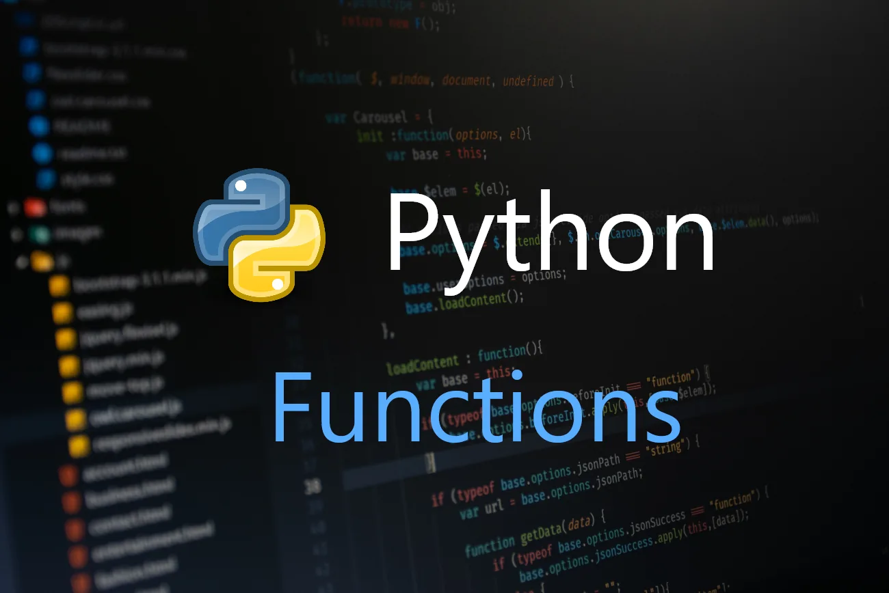

In Python, a function is a named sequence of statements that belong together. Their primary purpose is to help us organize programs into chunks that match how we think about the problem.

The syntax for a function definition is:

```python
def NAME( PARAMETERS ):
    STATEMENTS
```

We can make up any names we want for the functions we create, except that we can’t use a name that is a Python keyword, and the names must follow the rules for legal identifiers.

There can be any number of statements inside the function, but they have to be indented from the def. In the examples in this book, we will use the standard indentation of four spaces. Function definitions are the second of several compound statements we will see, all of which have the same pattern:

1. A header line which begins with a keyword and ends with a colon.

2. A body consisting of one or more Python statements, each indented the same amount — the Python style guide recommends 4 spaces — from the header line.

Example of a function

```python
def greet(name):
    """
    This function greets to
    the person passed in as
    a parameter
    """
    print("Hello, " + name + ". Good morning!")
```

How to call a function in python?

Once we have defined a function, we can call it from another function, program, or even the Python prompt. To call a function we simply type the function name with appropriate parameters.

```python
>>> greet('Arpan')
Hello, Arpan. Good morning!
```

Try running the above code in the Python program with the function definition to see the output.

```python
def greet(name):
    """
    This function greets to
    the person passed in as
    a parameter
    """
    print("Hello, " + name + ". Good morning!")

greet('Arpan')
```

In python, the function definition should always be present before the function call. Otherwise, we will get an error.

For example,

```python
# function call
greet('Arpan')

# function definition
def greet(name):
    """
    This function greets to
    the person passed in as
    a parameter
    """
    print("Hello, " + name + ". Good morning!")

# Erro: name 'greet' is not defined
```

The return statement :

The return statement is used to exit a function and go back to the place from where it was called.

Syntax of return:

```python
return [expression_list]
```

This statement can contain an expression that gets evaluated and the value is returned. If there is no expression in the statement or the return statement itself is not present inside a function, then the function will return the None object.

For example:

```python
>>> print(greet("Mark"))
Hello, Mark. Good morning!
None
```

Here, None is the returned value since greet() directly prints the name and no return statement is used.

Example of return :

```python
def absolute_value(num):
    """This function returns the absolute
    value of the entered number"""

    if num >= 0:
        return num
    else:
        return -num

print(absolute_value(2))

print(absolute_value(-4))
```
