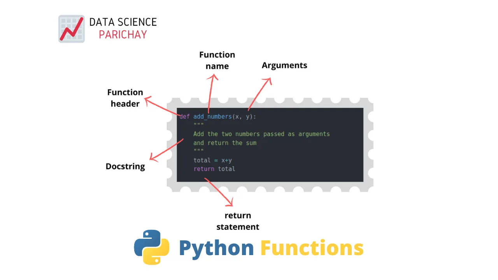

A function is a block of organized, reusable code that is used to perform a single, related action. Functions provide better modularity for your application and a high degree of code reusing.

As you already know, Python gives you many built-in functions like print(), etc. but you can also create your own functions. These functions are called *user-defined functions.*



##### Why are create a function? How can I create Function? What is mean
**ing by Calling a function and how I call it ? What is parameters? All this Question we will answer it...**

**Why we create a function?**

In Python, a function is a named sequence of statements that belong

together. Their primary purpose is to help us organize programs into chunks that match how we think about the solution to the problem.

OUR PURPOSE: organize our code and make it simple.

##### How can I create Function?

In Python a function is defined using the def keyword:

def my_function_name():

print("Ahmed")

## What is meaning by Calling a function and how I call it ?
To call a function, use the function name followed by parenthesis:

def my_function_name():

print("Omnia")

my_function_name()

##### What is parameters?

Information can be passed into functions as arguments or Parameters .

Arguments are specified after the function name, inside the parentheses. You can add as many arguments as you want, just separate them with a comma.

Example
def my_function(**firstname**):

print(**firstname** + " Refsnes")

my_function_name(**"Omnia"**)
my_function_name(**"Sayed"**)
my_function_name(**"Hamed"**)

#### Pass by reference vs value
All parameters (arguments) in the Python language are passed by reference. It means if you change what a parameter refers to within a function, the change also reflects back in the calling function.

## Function Arguments
You can call a function by using the following types of formal arguments −

- Required arguments
- Keyword arguments
- Default arguments
- Variable-length arguments

## Required arguments

Required arguments are the arguments passed to a function in correct positional order. Here, the number of arguments in the function call should match exactly with the function definition.

To call the function *printme()*, you definitely need to pass one argument, otherwise it gives a syntax error as follows −

```python
# Function definition is here
def printme( str ):
#"This prints a passed string into this function"
   print str
   return;
   # Now you can call printme function
printme("omnia")
```

When the above code is executed, it produces the following result −

```python
Traceback (most recent call last):
   File "test.py", line 11, in <module>
      printme();
TypeError: printme() takes exactly 1 argument (0 given)
```

## Keyword arguments

Keyword arguments are related to the function calls. When you use keyword arguments in a function call, the caller identifies the arguments by the parameter name.

This allows you to skip arguments or place them out of order because the Python interpreter is able to use the keywords provided to match the values with parameters. You can also make keyword calls to the *printme()* function in the following ways −

```python
# Function definition is here
def printme( str ):
#"This prints a passed string into this function"
   print (str)
   return;
   # Now you can call printme function
printme( str = "My string")
```

When the above code is executed, it produces the following result −

```python
My string
```

The following example gives more clear picture. Note that the order of parameters does not matter.

```python
def printinfo( name, age ):
#"This prints a passed info into this function"
   print ("Name: ", name)
   print ("Age ", age)
   return;
 # Now you can
```

call printinfo function
printinfo( age=50, name="Omnia" )

When the above code is executed, it produces the following result −

```python
Name:  Omnia
Age  50
```

## Default arguments

A default argument is an argument that assumes a default value if a value is not provided in the function call for that argument. The following example gives an idea on default arguments, it prints default age if it is not passed −

```python
# Function definition is here
def printinfo( name, age = 35 ):
#"This prints a passed info into this function"
   print ("Name: ", name)
   print ("Age ", age)
   return;
   # Now you can call printinfo function
printinfo( age=20, name="Omnia" )
printinfo( name="Omnia" )
```

When the above code is executed, it produces the following result −

```python
Name:  Omnia
Age  20
Name:  Omnia
Age  35
```

## Variable-length arguments
You may need to process a function for more

arguments than you specified while defining the function. These arguments are called *variable-length* arguments and are not named in the function definition, unlike required and default arguments.

Syntax for a function with non-keyword variable arguments is this −

```python
def functionname([formal_args,] *var_args_tuple ):
   "function_docstring"
   function_suite
   return [expression]
```

An asterisk (\*) is placed before the variable name that holds the values of all nonkeyword variable arguments. This tuple remains empty if no additional arguments are specified during the function call. Following is a simple example −

```python
# Function definition is here
def printinfo( arg1, *vartuple ):
#"This prints a variable passed arguments"
print ("Output is:")
print (arg1)
   for var in vartuple:
   print (var)
   return;
   # Now you can call printinfo function
printinfo( 10 )
printinfo( 70, 60, 50 )
```

When the above code is executed, it produces the following result −

```python
Output is:
10
Output is:
```

70
60
50
