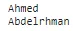
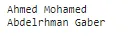
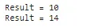
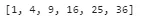

## What is function ?

A function is a block of code which only runs when it is called.

You can pass data, known as parameters, into a function.

A function can return data as a result.

## Creating a Function:

In Python a function is defined using the def keyword

```python
def welcome():
  print('Welcome to All')
```

## Calling a Function:

To call a function, use the function name followed by parenthesis

```python
welcome()
```


## Arguments :

Information can be passed into functions as arguments.

Arguments are specified after the function name, inside the parentheses. You can add as many arguments as you want, just separate them with a comma.

The following example has a function with one argument (name). When the function is called, we pass along a first name, which is used inside the function to print the name.

```python
def print_name(name):
  print(name)
# calling function
print_name('Ahmed')
print_name('Abdelrhman')
```



```python
# define function has more than one argument
def print_full_name(fname,lname):
  print(fname+' '+lname)
# calling function
print_full_name('Ahmed','Mohamed')
print_full_name('Abdelrhman','Gaber')
```



## Default Parameter Value :

The following example shows how to use a default parameter value.

If we call the function without argument, it uses the default value.

```python
# if we didn`t pass any value it will take the default
def add(x , y=3):
  z = x + y
  print('Result = '+str(z))
# calling function
add(7) # there is no error because it takes the default value of y = 3 so the result is 10
add(7,7)
```



## Return Values :

To let a function return a value, use the return statement

```python
# get the power 2 of any passing value in the list
def power_2(l):
  return [i**2 for i in l]
```

```python
# calling function and pass a list of numbers it will return a list of power two for each number
power_2([1,2,3,4,5,6])
```



## Conclusion :

functions make our code more readable and efficient and save time and call it when we need.
