A list is a container which holds comma-separated values (items or elements) between square brackets where items or elements need not all have the same type.

In general, we can define a list as an object that contains multiple data items (elements). The contents of a list can be changed during program execution. The size of a list can also change during execution, as elements are added or removed from it.

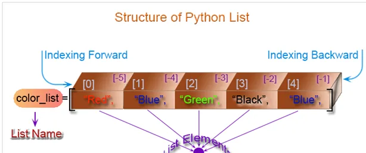

**Examples of lists:**

- numbers = [10, 20, 30, 40, 50]
- names = ["Sara", "David", "Warner", "Sandy"]
- student_info = ["Sara", 1, "Chemistry"]

## Create a Python list
**Following list contains all string:**

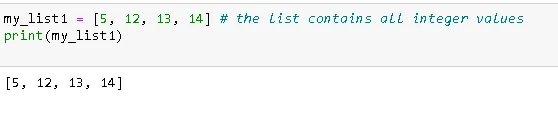

**Following list contains a string, an integer and a float values:**

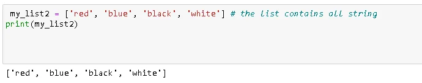

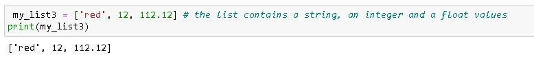

**use + operator to create a new list that is a concatenation of two lists and use \* operator to repeat a list. See the following statement**s.

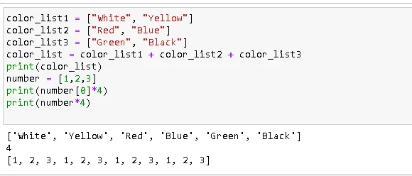

## List indices:
List indices work the same way as string indices, list indices start at 0. If an index has a positive value it counts from the beginning and similarly it counts backward if the index has a negative value. As positive integers are used to index from the left end and negative integers are used to index from the right end, so every item of a list gives two alternatives indices. Let create a list called color_list with four items.
color_list=["RED", "Blue", "Green", "Black"]

ItemREDBlueGreenBlackIndex (from left) 0 1 2 3Index (from right)-4-3-2-1

If you give any index value which is out of range then interpreter creates an error message. See the following statements.

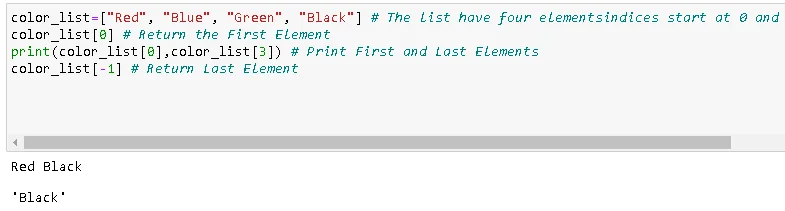

**Add an item to the end of the list:**

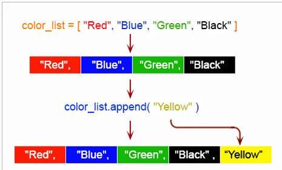

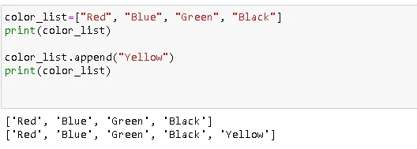

## Insert an item at a given position:
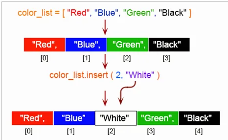

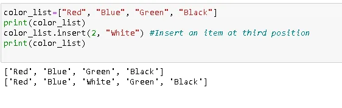

## Modify an element by using the index of the element:

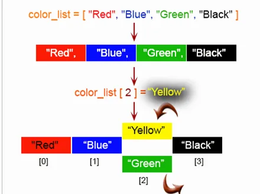

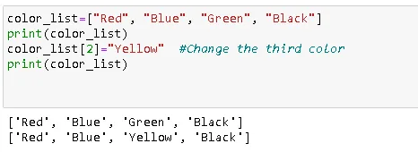

## Remove an item from the list:

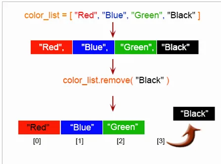

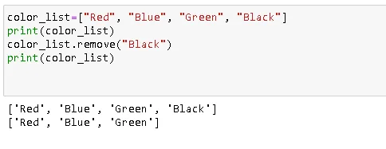

## Remove all items from the list:

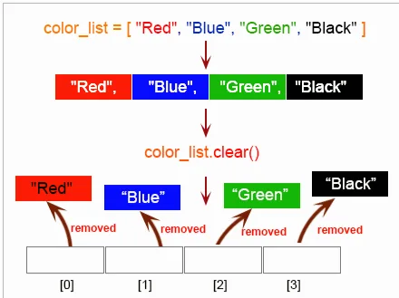

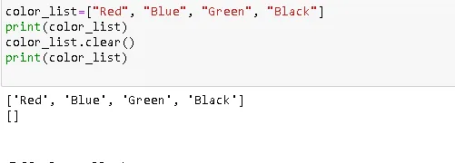

## Remove the item at the given position in the list, return it

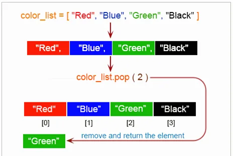

## Slicing list:
This refers to the items of a list starting at index startIndex and stopping just before index endIndex. The default values for list are 0 (startIndex) and the end (endIndex) of the list. If you omit both indices, the slice makes a copy of the original list.

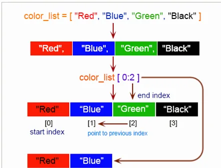

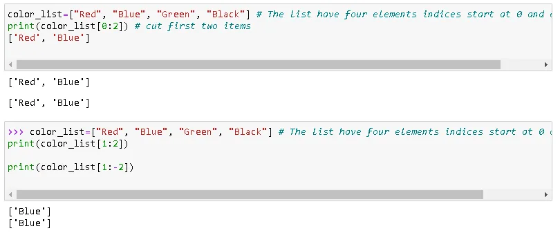

## Sort the items of the list in place:
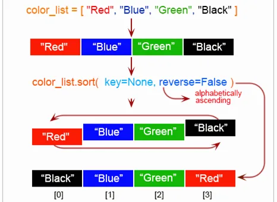

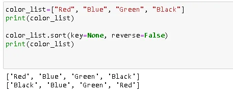
