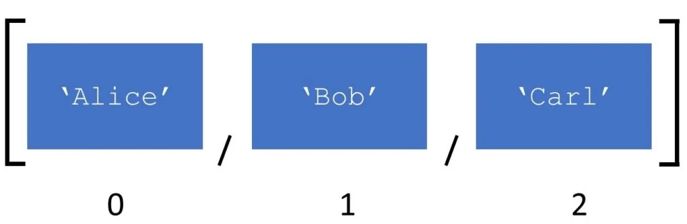

Lists are most used datatype in Python which can be written as a list of comma-separated values. Lists are created using square brackets.

List items are ordered, changeable, and allow **duplicate** values.

List items are indexed, the first item has index 0 , the second item has index 1 etc.

If we want to get number of items in the list then we can use len() function.

Lists could store multiple data types both at the same time and separately.

#### Multiple Dtypes

#### Multiple Dtypes at the same list

As we see in one list we can store multiple data types in one list. And it makes python lists more dynamics and slow.

#### And Python Lists lists have various functions

append()

Via append function we can add value to the end of list in each type.

In this section we apply append function for finding fibonacci numbers.

reverse()

Using reverse function we can reverse the order of our elements.

sort()

sort function is used for sorting each element in ascending (or descending) order in list. If we define reverse=True between the brackets function will sort values in descending oreder.

index()

Sometimes we can look for some value in the list. However, we don't know the exact index of this value. to find that we use index function.

In Conculusion:

In this blog, we got acquainted with List. And introduced some of the features of List but the functionality of the lists is very wide.

I hope this blog will be helpfull for you. If you want to look at full code you can click [here](https://github.com/Ibrahimbeu/Python_Lists/blob/main/Lists.ipynb)
