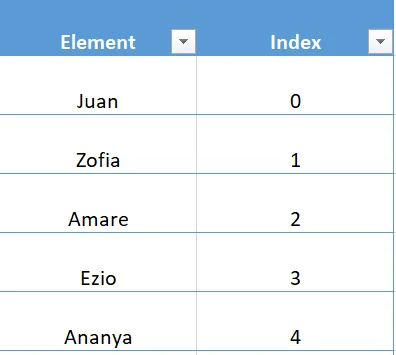

In programming, it is common to want to work with collections of data. In Python, a *list* is one of the many built-in data structures that allows us to work with a collection of data in sequential order. Suppose we want to make a list of the heights of students in a class:

- Noelle is 61 inches tall
- Ava is 70 inches tall
- Sam is 67 inches tall
- Mia is 64 inches tall

In Python, we can create a variable called heights to store these integers into a *list:*

```python
heights =[61,70,67,64]
```

Notice that:

1. A list begins and ends with square brackets ([ and ]).
2. Each item (i.e., 67 or 70) is separated by a comma (,)
3. It’s considered good practice to insert a space () after each comma, but your code will run just fine if you forget the space.

**What can a List contain?**

Lists can contain more than just numbers. Let’s revisit our classroom example with heights:

- Noelle is 61 inches tall
- Ava is 70 inches tall
- Sam is 67 inches tall
- Mia is 64 inches tall

Instead of storing each student’s height, we can make a list that contains their names:

```python
names =["Noelle","Ava","Sam","Mia"]
```

We can even combine multiple data types in one list. For example, this list contains both a string and an integer:

```python
mixed_list_string_number =["Noelle",61]
```

Lists can contain any data type in Python! For example, this list contains a string, integer, boolean, and float.

```python
mixed_list_common = ["Mia", 27, False, 0.5]
```

**Empty Lists**

A list doesn’t have to contain anything. You can create an empty list like this:

```python
empty_list = []
```

Why would we create an empty list? Usually, it’s because we’re planning on filling it up later based on some other input. We’ll talk about two ways of filling up a list in the next exercise.

**List Methods**

In Python, for any specific data-type ( strings, booleans, lists, etc. ) there is built-in functionality that we can use to create, manipulate, and even delete our data. We call this built-in functionality a method. For lists, methods will follow the form of list_name.method(). Some methods will require an input value that will go between the parenthesis of the method ( ). An example of a popular list method is .append(), which allows us to add an element to the end of a list.

```python
append_example = [ 'This', 'is', 'an', 'example']
append_example.append('list')

print(append_example)
```

Will output:

```python
['This', 'is', 'an', 'example', 'list']
```

**Growing a List: Append**

We can add a single element to a list using the .append() Python method. Suppose we have an empty list called garden:

```python
garden = []
```

We can add the element "Tomatoes" by using the .append() method:

```python
garden.append("Tomatoes")print(garden)
```

Will output:

```python
['Tomatoes']
```

We see that garden now contains "Tomatoes"! When we use .append() on a list that already has elements, our new element is added to the **end** of the list:

```python
# Create a list
garden = ["Tomatoes", "Grapes", "Cauliflower"]

# Append a new element
garden.append("Green Beans")print(garden)
```

Will output:

```python
['Tomatoes', 'Grapes', 'Cauliflower', 'Green Beans']
```

**Growing a List: Plus (+)**

When we want to add multiple items to a list, we can use + to combine two lists (this is also known as concatenation). Below, we have a list of items sold at a bakery called items_sold:

```python
items_sold = ["cake", "cookie", "bread"]
```

Suppose the bakery wants to start selling "biscuit" and "tart":

```python
items_sold_new = items_sold + ["biscuit", "tart"] print(items_sold_new)
```

Would output:

```python
['cake', 'cookie', 'bread', 'biscuit', 'tart']
```

In this example, we created a new variable, items_sold_new, which contained both the original items sold, and the new items. We can inspect the original items_sold and see that it did not change:

```python
print(items_sold)
```

Would output:

```python
['cake', 'cookie', 'bread']
```

We can only use + with other lists. If we type in this code:

```python
my_list = [1, 2, 3]
my_list + 4
```

we will get the following error:

```python
TypeError: can only concatenate list (not "int") to list
```

If we want to add a single element using +, we have to put it into a list with brackets ([]):

```python
my_list + [4]
```

**Accessing List Elements**

We are interviewing candidates for a job. We will call each candidate in order, represented by a Python list:

```python
calls = ["Juan", "Zofia", "Amare", "Ezio", "Ananya"]
```

First, we’ll call "Juan", then "Zofia", etc. In Python, we call the location of an element in a list its *index*. Python lists are *zero-indexed*. This means that the first element in a list has index 0, rather than 1. Here are the index numbers for the list calls:



In this example, the element with *index* 2 is "Amare". We can select a single element from a list by using square brackets ([]) and the index of the list item. If we wanted to select the third element from the list, we’d use calls[2]:

```python
print(calls[2])
```

Will output:

```python
Amare
```

**Note:** When accessing elements of an list, you *must* use an int as the index. If you use a float, you will get an error. This can be especially tricky when using division. For example print(calls[4/2]) will result in an error, because 4/2 gets evaluated to the float 2.0. To solve this problem, you can force the result of your division to be an int by using the int() function. int() takes a number and cuts off the decimal point. For example, int(5.9) and int(5.0) will both become 5. Therefore, calls[int(4/2)] will result in the same value as calls[2], whereas calls[4/2] will result in an error.

**Accessing List Elements: Negative Index**

What if we want to select the last element of a list? We can use the index -1 to select the last item of a list, even when we don’t know how many elements are in a list. Consider the following list with 6 elements:

```python
pancake_recipe = ["eggs", "flour", "butter", "milk", "sugar", "love"]
```

If we select the -1 index, we get the final element, "love".

```python
print(pancake_recipe[-1])
```

Would output:

```python
love
```

This is equivalent to selecting the element with index 5:

```python
print(pancake_recipe[5])
```

Would output:

```python
love
```

**Modifying List Elements**

Let’s return to our garden.

```python
garden = ["Tomatoes", "Green Beans", "Cauliflower", "Grapes"]
```

Unfortunately, we forgot to water our cauliflower and we don’t think it is going to recover. Thankfully our friend Jiho from Petal Power came to the rescue. Jiho gifted us some strawberry seeds. We will replace the cauliflower with our new seeds. We will need to modify the list to accommodate the change to our garden list. To change a value in a list, reassign the value using the specific index.

```python
garden[2] = "Strawberries"print(garden)
```

Will output:

```python
["Tomatoes", "Green Beans", "Strawberries", "Grapes"]
```

Negative indices will work as well.

```python
garden[-1] = "Raspberries"print(garden)
```

Will output:

```python
["Tomatoes", "Green Beans", "Strawberries", "Raspberries"]
```

**Shrinking a List: Remove**

We can remove elements in a list using the .remove() Python method. Suppose we have a filled list called shopping_line that represents a line at a grocery store:

```python
shopping_line = ["Cole", "Kip", "Chris", "Sylvana"]
```

We could remove "Chris" by using the .remove() method:

```python
shopping_line.remove("Chris")
print(shopping_line)
```

If we examine shopping_line, we can see that it now doesn’t contain "Chris":

```python
["Cole", "Kip", "Sylvana"]
```

We can also use .remove() on a list that has duplicate elements. Only the first instance of the matching element is removed:

```python
# Create a list
shopping_line = ["Cole", "Kip", "Chris", "Sylvana", "Chris"]

# Remove a element
shopping_line.remove("Chris")
print(shopping_line)
```

Will output:

```python
["Cole", "Kip", "Sylvana", "Chris"]
```

***Two-Dimensional (2D) Lists***

We’ve seen that the items in a list can be numbers or strings. Lists can contain other lists! We will commonly refer to these as *two-dimensional (2D)* lists. Once more, let’s look at a class height example:

- Noelle is 61 inches tall
- Ava is 70 inches tall
- Sam is 67 inches tall
- Mia is 64 inches tall

Previously, we saw that we could create a list representing both Noelle’s name and height:

```python
noelle = ["Noelle", 61]
```

We can put several of these lists into one list, such that each entry in the list represents a student and their height:

```python
heights = [["Noelle", 61], ["Ava", 70], ["Sam", 67], ["Mia", 64]]
```

We will often find that a two-dimensional list is a very good structure for representing grids such as games like tic-tac-toe.

```python
#A 2d list with three lists in each of the indices.
tic_tac_toe = [[["X"],["O"],["X"]],[["O"],["X"],["O"]],[["O"],["O"],["X"]]]
```

**Accessing 2D Lists**

Let’s return to our classroom heights example:

```python
heights = [["Noelle", 61], ["Ali", 70], ["Sam", 67]]
```

Two-dimensional lists can be accessed similar to their one-dimensional counterpart. Instead of providing a single pair of brackets [ ] we will use an additional set for each dimension past the first. If we wanted to access "Noelle"‘s height:

```python
#Access the sublist at index 0, and then access the 1st index of that sublist.
noelles_height = heights[0][1]
print(noelles_height)
```

Would output:

```python
61
```

**Modifying 2D Lists**

Now that we know how to access two-dimensional lists, modifying the elements should come naturally. Let’s return to a classroom example, but now instead of heights or test scores, our list stores the student’s favorite hobby!

```python
class_name_hobbies = [["Jenny", "Breakdancing"], ["Alexus", "Photography"], ["Grace", "Soccer"]]
```

"Jenny" changed their mind and is now more interested in "Meditation". We will need to modify the list to accommodate the change to our class_name_hobbies list. To change a value in a two-dimensional list, reassign the value using the specific index. # The list of Jenny is at index 0. The hobby is at index 1.

```python
class_name_hobbies[0][1] = "Meditation"
print(class_name_hobbies)
```

Would output:

```python
[["Jenny", "Meditation"], ["Alexus", "Photography"], ["Grace", "Soccer"]]
```

Negative indices will work as well.

```python
# The list of Jenny is at index 0. The hobby is at index 1.
class_name_hobbies[-1][-1] = "Football"
print(class_name_hobbies)
```

Would output:

```python
[["Jenny", "Meditation"], ["Alexus", "Photography"], ["Grace", "Football"]]
```

**Review**

So far, we have learned:

- How to create a list
- How to access, add, remove, and modify list elements
- How to create a two-dimensional list
- How to access and modify two-dimensional list elements
