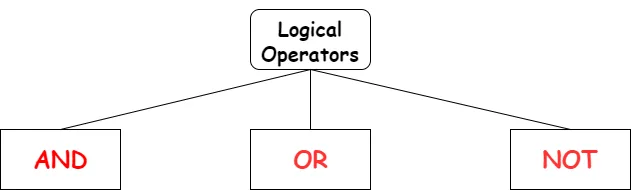
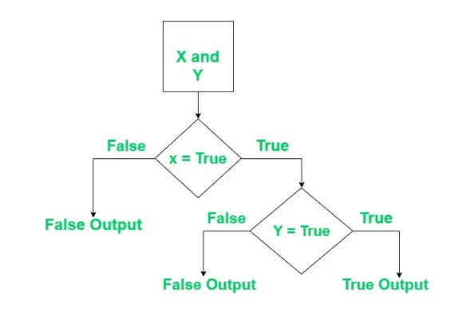
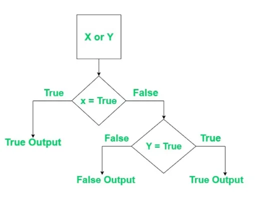
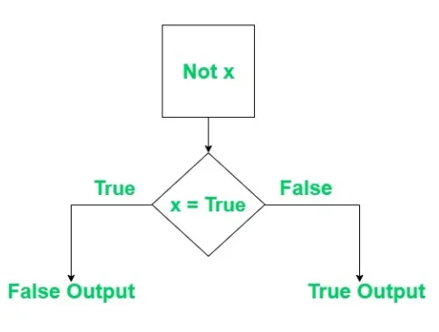
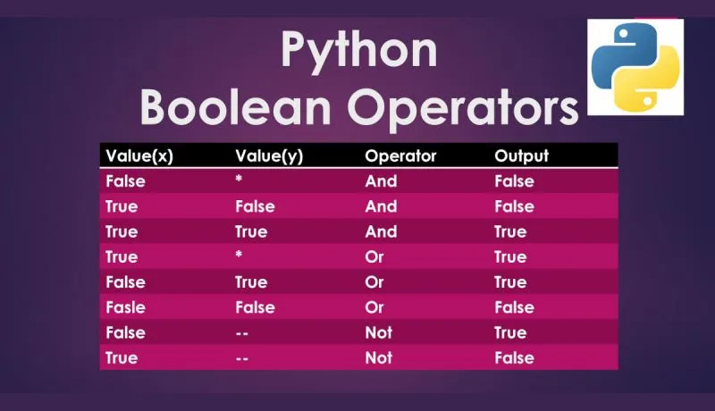

### What are Operators?
Operators are used to perform operations on values and variables. These are the special symbols that carry out arithmetic and logical computations. The value the operator operates on is known as **Operand**.

Python divides the operators in the following group:

- Arithmetic operators
- Assignment operators
- Comparison operators
- Logical operators
- Identity operators
- Membership operators
- Bitwise operators

In this blog we will discuss about the **logical operators** so let's get started.

### Logical Operators
In Python Logical operators, are used on conditional statements to check True or False. They perform **Logical AND, Logical OR** and **Logical NOT** operations.



#### Logical And Operator
Logical **AND** operator returns True if both the operands are True. It requires both the operands to be True to have a True output. In any other case the output will be False. Below diagram will explain the flow of events for the logical **AND** operator.



The above diagram shows that if any of the operand is False then the output would also be False. To have a True output, it is mandatory that both the operands must be True. Let's explain this with the help of an example.

```python
#python program to demonstrate
#the use of logical and operator
a = 15
b = 10

# firstly we will give both true operands
if a > 0 and b > 0:
    print("The numbers are greater than 0")
else:
    print("The numbers are less than 0")

# now we will give both false operands
if a > 20 and b > 20:
    print("Both numbers are greater than 0")
else:
    print("Both numbers are less than 0")


# lastly we will give one true and one false operator
if a >12 and b > 12:
    print("Both numbers are greater than 12")
else:
    print("Both numbers are not greater than 12")
```

##### Case 1
In the first case both operands are true hence the if part is executed. The following output is displayed.

```python
The numbers are greater than 0
```

##### Case 2
In the second case both operands are false hence else part is executed. The following output is displayed.

```python
Both numbers are less than 20
```

##### Case 3
In the last case one operator is true and the other is false but still the else condition is executed because AND operator requires both operands to be True to execute the if condition. The following output is displayed.

```python
Both numbers are not greater than 12
```

#### Logical OR Operator
Logical **OR** operator returns True if either of the operands is True. It requires only one operand to be True to return a True output. Below diagram will explain the flow of events for the logical **OR** operator.



The above diagram shows that if any one of the operand is true than logical OR operator will return True value. Let's explain this with the help of an example.

```python
#python program to demonstrate
#the use of logical OR operator

a = 15
b = 10

# firstly we will give both true operands
if a > 0 or b > 0:
    print("The numbers are greater than 0")
else:
    print("The numbers are less than 0")

# now we will give both false operands
if a > 20 or b > 20:
    print("Both numbers are greater than 20")
else:
    print("Both numbers are less than 20")


# lastly we will give one true and one false operator
if a >12 or b > 12:
    print("Both numbers are greater than 12")
else:
    print("Both numbers are not greater than 12")
```

##### Case 1
In the first case both operands are true hence true is returned due to which if condition is executed. Hence, the following output is displayed.

```python
The numbers are greater than 0
```

##### Case 2
In the second case both operands are false hence false is returned due to which else condition is executed. Hence, the following output is displayed.

```python
Both numbers are less than 20
```

##### Case 3
In the last case one operand is false and other is true hence true is returned due to which if condition is executed. Hence, the following output is displayed.

```python
Both numbers are greater than 12
```

#### Logical NOT Operator
Logical not operator work with the single Boolean value. If the Boolean value is True it returns False and vice-versa. The following figure shows the flow of events in a NOT operator.



The above diagram shows that logical NOT operator changes the Boolean value from true to false and vice versa. Let's explain this with the help of an example.

```python
# python program to demonstrate
# the use of logical NOT operator

a = True

if not a:
    print("The new value of a is:", a)
```

Here the value of a will be change from True to False and hence following output will be displayed.

```python
    The new value of a is: False
```

In the end, the logical operators are summarized with the help of following diagram.



Hope you have enjoyed the blog. Happy Learning!

Here's the link to my [Git Hub](https://github.com/MHS-crypto/python--logical-operators) repository.
