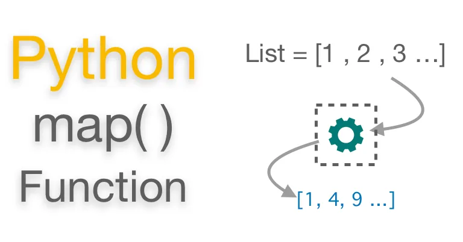

However, back in 1993, the Python community was demanding some functional programming features. They were asking for:

- Anonymous functions
- A map() function
- A filter() function
- A reduce() function

These functional features were added to the language thanks to the contribution of a community member. Nowadays, map(), filter(), and reduce() are fundamental components of the functional programming style in Python.

In this tutorial, you’ll cover one of these functional features, the built-in function map(). You’ll also learn how to use list comprehensions and generator expressions to get the same functionality of map() in a Pythonic and readable way.

## Understanding map()

map() loops over the items of an input iterable (or iterables) and returns an iterator that results from applying a transformation function to every item in the original input iterable.

blueprint of map is,

```python
map(function_to_apply, list_of_inputs)
```

here is the simple example

```python
items = [1, 2, 3, 4, 5]
squared = list(map(lambda x: x**2, items))
print(squared)
```

```python
def multiply(x):
    return (x*x)
def add(x):
    return (x+x)

funcs = [multiply, add]
for i in range(5):
    value = list(map(lambda x: x(i), funcs))
    print(value)

# Output:
# [0, 0]
# [1, 2]
# [4, 4]
# [9, 6]
# [16, 8]
```

## Using Math Operations

A common example of using math operations to transform an iterable of numeric values is to use the power operator (\*\*). In the following example, you code a transformation function that takes a number and returns the number squared and cubed:

```python
def powers(x):
    return x ** 2, x ** 3

numbers = [1, 2, 3, 4]

list(map(powers, numbers))
```

## Using Generator Expressions

map() returns a **map object**, which is an iterator that yields items on demand. So, the natural replacement for map() is a generator expression because generator expressions return generator objects, which are also iterators that yield items on demand.

Python iterators are known to be quite efficient in terms of memory consumption. This is the reason why map() now returns an iterator instead of a list.

There’s a tiny syntactical difference between a list comprehension and a generator expression. The first uses a pair of square brackets ([]) to delimit the expression. The second uses a pair of parentheses (()). So, to turn a list comprehension into a generator expression, you just need to replace the square brackets with parentheses.

## Conclusion

Python’s map() allows you to perform mapping operations on iterables. A mapping operation consists of applying a transformation function to the items in an iterable to generate a transformed iterable. In general, map() will allow you to process and transform iterables without using an explicit loop.

In this tutorial, you’ve learned how map() works and how to use it to process iterables. You also learned about some Pythonic tools that you can use to replace map() in your code. you now know how to use the map in python.

[Github repo](https://github.com/arunanuwantha97/Datacamp-Assignment/blob/main/map.ipynb)
