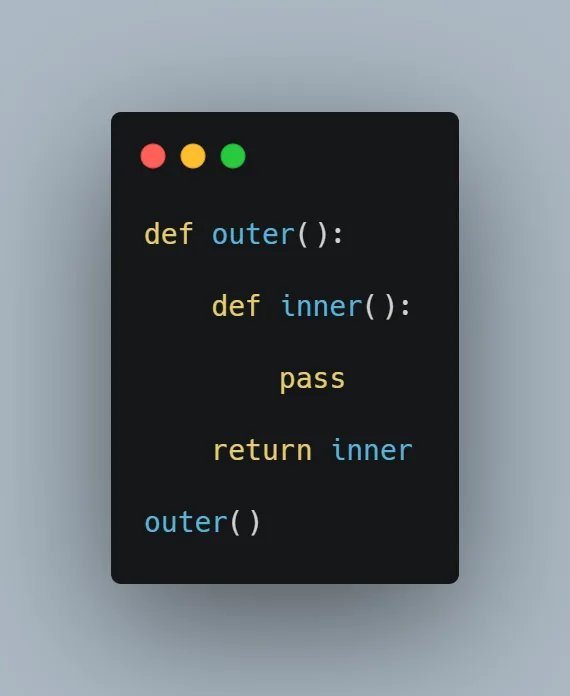
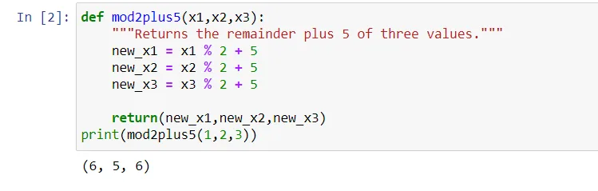
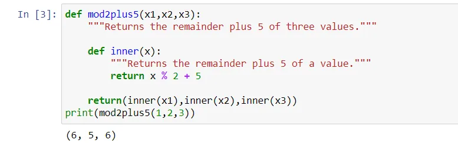
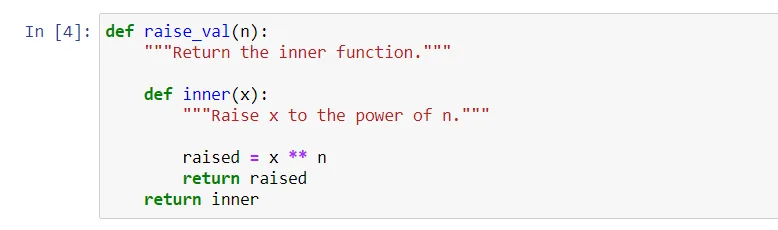
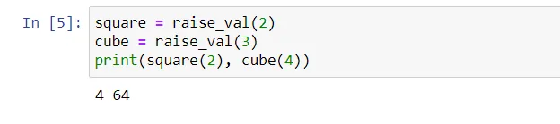

## In this blog, we will understand the python concept of nested functions, and use that concept to build a function for mathematical raise power!

**Let's dive in!**

## Introduction
Let's say that we want to use a process a number of times within a function.

For example, we want a function that takes 3 numbers as parameters

and performs the same function on each of them.

One way would be to write out the computation 3 times

**However,** this definitely does not scale if you need to perform the computation many times!

What we can do instead is define an inner function within our function definition, such as we will do next, and call it where necessary. This is called a nested function.

The syntax for the inner function is exactly the same as that for any other function!

**Looks Better! Right?**

## Raise to Power Function
Let's now look at another important usage of *Nested Functions* in creating a function that returns a function without calling it!

So each time we call the *outer* function it creates for us a new *inner* one!

I know it's hard to understand this way, so let's see our *raise_val(n)* function.

In this example, we define an **outer** function *raise_val*, which contains an **inner** function called *inner*.

**Now look at what** *raise_val***returns:**

It returns the **inner** function *inner* !

*raise_val* takes an argument **n** and creates a function **inner** that returns the **nth** power of any number.

That's a bit complicated and will be clearer when we use the function *raise_val*

**Things will get clearer now!**

Passing the number *2* to *raise_val* **creates** a function that **squares** any number.

Similarly, passing the number *3* to *raise_val* **creates** a function that **cubes** any number ! **Isn't that amazing!**

**One interesting detail:**

When we call the function *square*, it remembers the value *n=2*, **although** the enclosing scope defined by *raise_val* and to which *n=2* is local, **has finished execution!** This is a subtlety referred to as a *closure* in Computer Science and it shouldn't concern you too much. And that is why it is also called **enclosing function.**

## Well, that is all. Congrats in understanding one of the coolest things python provides!

**The code and the explanation are available on my** [**GitHub.**](https://github.com/96ibman/datainsight_datascience_program/tree/main/nested_functions) **Have fun with python!**
