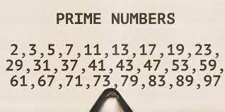
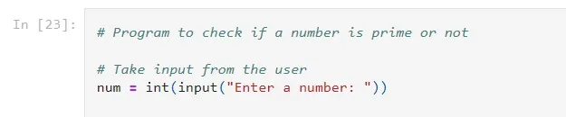
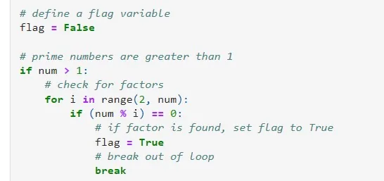
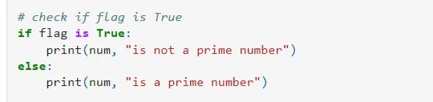
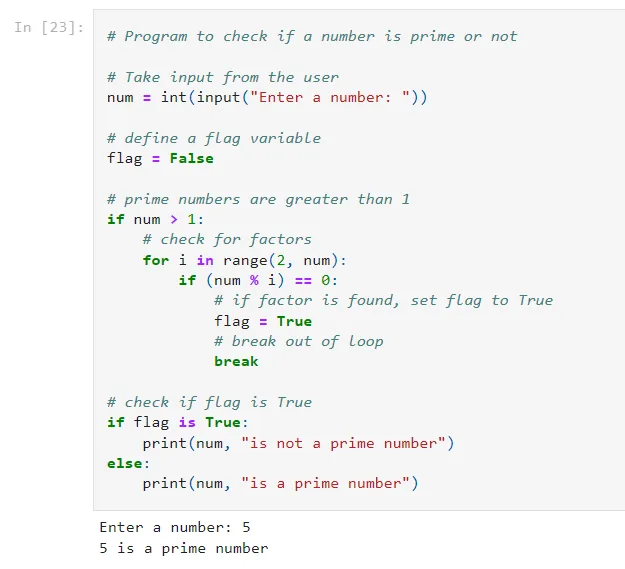

In this article an example to check whether an integer is a prime number or not using for loop and if...else statement. If the number is not prime, it's explained in output why it is not a prime number.

**Understanding Prime Number**

A positive integer greater than 1 has no other factors except 1 and the number itself is called a prime number. 2, 3, 5, 7, etc. are prime numbers as they do not have any other factors.

**Creating the App**

We will start by taking a number from the user.

In this program, we have checked if the num is prime or not. Numbers less than or equal to 1 are not prime numbers. Hence, we only proceed if the num is greater than 1 and check if the num is exactly divisible by any number from 2 to num - 1. If we find a factor in that range, the number is not prime, so we set a flag to True and break out of the loop.

Outside the loop, we check if the flag is True or False.

- If it is True, the num is not a prime number.
- If it is False, the num is a prime number.

Great!, We have successfully made a Python Program to Check Prime Numbers. Let's see the full file,

