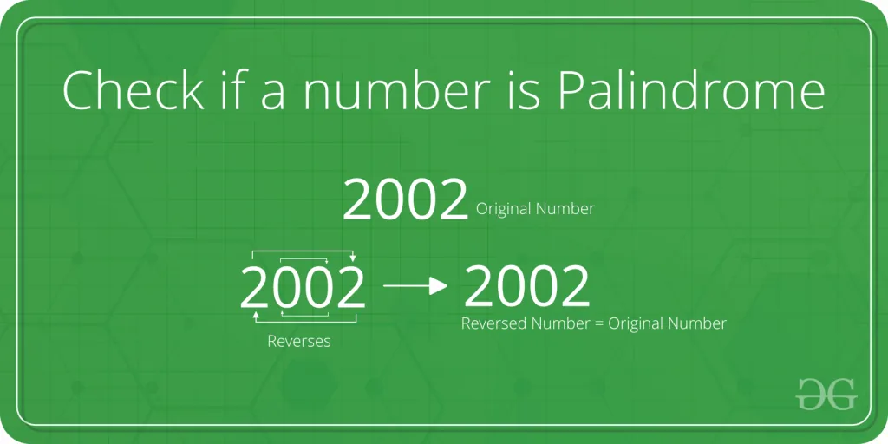

In this blog we will make an application to check whether a number is palindrome or not. First we should know what is a palindrome. So let's get started!

## What is Palindrome?
A palindrome is a number or letter which remains the same even if the numbers or letters are inverted

## For Example
121, 11, 414, 1221, 74747 are the palindrome numbers.

MOM, DAD, MADAM, REFER are the palindrome letters.

## Approach
- First we will take input from user and pass it to a function.
- Then, we will store this number in a temporary variable to use that later.
- We will start a while loop which will continue until the number is greater than 0.
- We will find the quotient and store it in reminder variable to get the last value of the given number.
- Multiply the previous value of reminder by 10 in order to add the digit to the nth place in the number. and adding it with the new value so that we can reverse the number.
- We will divide the number by 10 to decrease the nth place in the original number.
- Finally, we will compare the temp variable and the check variable to find palindrome.

### The Main Function
In this function we will implement the logic for palindrome.

def palindrome(number) :

temp = number

check = 0

while(number>0):

reminder = number % 10

check = (check \* 10) + reminder

number = number // 10

if(temp == check):

print("As ", temp, " is equal to ", check , " so this is a palindrome")

else:

print("As ", temp, " is not equal to ", check , " so this is not a palindrome")

This function receives a number which is being put in a temporary variable. In the while loop this number is reversed by separating the last digit of the number using the code reminder = number % 10. This digit is then added to the check variable. Before adding the reminder to check, we first need to multiply the current data in the check variable by 10 in order to add the digit to the nth place in the number.

**For example:** in the number 123, 3 is in the oneth place, 2 in the tenth place and 1 in the hundredth place. So if we want to add 4 after 123 we need to multiply 123 with 10 to shift the numbers by one place and then adding 4 in it will make it 1234. Same has been done in the above code.

## Let's Test this Function
n = int(input("Enter a numer:"))

palindrome(n)

We have just passed the value to our function and the function check whether the give number is palindrome or not.

## Example for the Output
```python
Enter a numer:354
As  354  is not equal to  453  so this is not a palindrome

Enter a numer:121
As  121  is equal to  121  so this is a palindrome
```

**That's it! Hope you enjoyed the blog.**

**You can find the project on my** [**GitHub**](https://github.com/MHS-crypto/palindrome-python.git)
