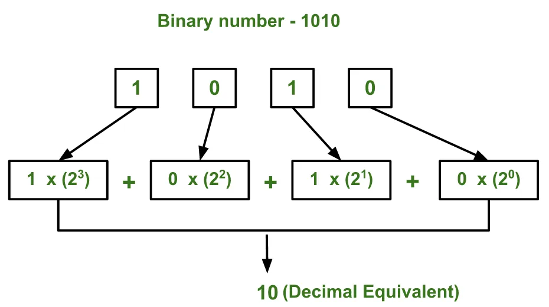

- 

***Introduction:***

A *binary number* is a number expressed in the base-2 numeral system or binary numeral system, which uses only two symbols 0 and 1.

The *decimal numeral system* is the standard system for denoting integer and non-integer numbers.

*In this blog*, we will create python programs for converting a binary number into decimal.

***Pythonic way to convert binary into decimal***

***step1:***

Enter a binary number, make it as a list and make the value of decimal number equals zero.

```python
binary = list(input("please enter a binary number: "))
d_num = 0
```

***step2***:

- Use a *for* loop to iterate over the length of our list .

- Use the *pop()* method that returns the item present at the given index. This item is also removed from the list and assign its value to the digit variable.

- Use the *if* statement to check whether the digit equals one or not . If it is true , the d_num will equal to the sum of itself and two raised to the ***i*** power .

```python
for i in range(len(binary)):
    digit = binary.pop()
    if digit == '1':
        d_num = d_num + pow(2,i)
print("The Decimal Number is ", d_num)
```

***Finally***, This is an example of the results

```python
please enter a binary number: 111000
The Decimal Number is  56
```
