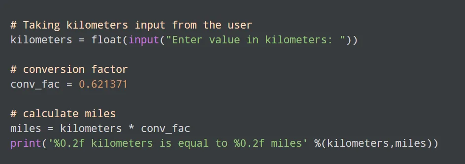

In this blog, we're going to discover ways to convert kilometers to miles and show it.

To apprehend this situation, you have to have knowledge of the subsequent Python programming topics:

- Python Data Types
- Python Input, Output, and Import
- Python Operators

## Kilometers to Miles

**Output**

Here, the user is asked to enter kilometers. This value is stored in the kilometers variable. Since 1 kilometer is equal to 0.621371 miles, we can get the equivalent miles by multiplying kilometers with this factor.

**That's all. Happy Learning.**
