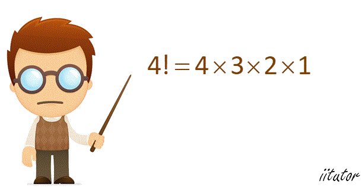

In this article, we will find the factorial of a number with python.

The factorial of a number is the product of all the integers from 1 to that number.

For example, the factorial of 6 is 1\*2\*3\*4\*5\*6\* = 720.

Factorial is not defined for negative numbers, and the factorial of zero is one, 0! = 1.



#### We will implement two methods to solve the factorial of a number.

## Method 1:

#### Step 1:
First, we will define the factorial function which will take an interger argument n.

```python
def factorial(n):
```

#### Step 2:

Initialising the factorial to 1

```python
factorial = 1
```

#### Step 3:

If n is equal to 0 the factorial will be 1 by default.

```python
if n == 0: return 1
```

#### Step 4:

Else, we implement a for loop to iterate through intergers ranging from 1 to n to return their product.

```python
else:
    for i in range(1,n+1):
        factorial *= i
return factorial
```

**Let's apply this code !**

```python
factorial(8)
40320
```

## Method 2:

#### Step 1: Recursive function
We will implement a function that recursively calls itself by decreasing the number..

First, we will define the factorial_rec function which will take an interger argument n.

```python
def factorial_rec(n):
```

#### Step 2:

Base condition n=0 :

```python
if n == 0:
    return 1
```

#### Step 3:

Recursion:

```python
return factorial_rec(n-1)
```

**Let's apply this code !**

```python
factorial_rec(5)
120
factorial_rec(0)
1
```

### [**source code**](https://github.com/Jihed503/data_insight/blob/main/factorial.ipynb)
