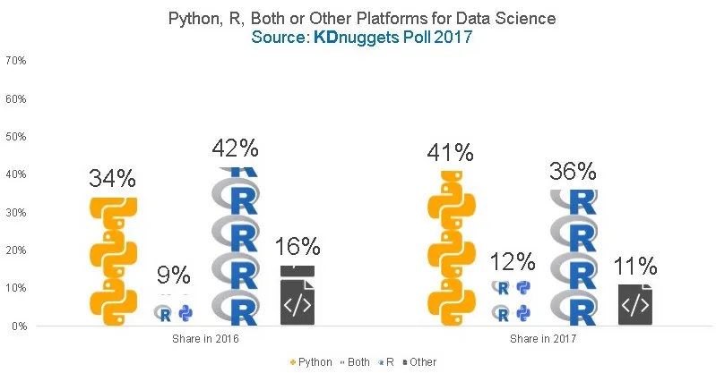

The above chart says a lot but not all.

More often than not, I receive messages from Data Science (DS) enthusiasts requesting guidance on how to pursue and sustain a career in DS. I typically conclude my response with the need to make a decision between the primary open source tools – R and Python – as the language of choice for ‘coding’ Machine Learning (ML) solutions.

> But are we limited to only those two options? Certainly not!

With the advent of many proprietary and other open-source tools like KNIME, DataIku, Microsoft’s Azure ML Studio, Google’s AutoML, et al, more options have become available. An unskilled programmer or DS newbie can now build a ML model without a single line of code, congratulations Data Scientist!

Chances of a thriving Data Science career however, are higher with either Python or R and highest with both. The latter, of course, is if you are able to successfully manage the confusions around syntax, libraries or keyboard shortcuts, such that you quickly figure out why your ***print(“Hello\nWorld”)***

code does not return the words on two separate lines in RStudio.

Most of the jobs can be accomplished by both languages. While the goal of this article is not to fuel the perpetual “Python vs. R” debate, I would attempt to shed some light on the best use cases for each by relating my personal experience with generic conclusions.

I started my data science journey with Python but I built my first ML model in R! Yes, you read that correctly. Few months into my first DS job, the need for heavy statistical analysis increased drastically. This propelled me to shelve my *NumPy* knowledge and trade my *Pandas* for *dplyr*. R was developed by statisticians, for statisticians, so if your mission is inclined towards statistical deliveries, R is a better bet, even though not by a very wide margin anymore.

My team scaled up. We got more data scientists all of whom were Python programmers. Soon I was the only R person in the team and this hampered effective collaboration. I am now in the process of reverting to Python which is like a fresh start but a rather easy one. Your choice of language and tools should be influenced by your work environment or prospective workplace but if you are unsure and looking for an easy start, of the two, Python is simpler to learn.

Deploying my first R predictive model to production was no cakewalk. It was during my research for options that I realized how large the support community for Python users is, compared to the R counterparts. Although deploying to Microsoft SQL Server database as a stored procedure was the most suitable solution at the time, with Flask, a web micro-framework, model deployment is easier with Python.

Also, in recent times, there have been heavier investments in Python as most proprietary applications/packages are built off Python back-ends and frameworks. Most of which require Python skills to utilize or manipulate, though packages like *KerasR* and *sparklyr*, amongst others were developed to provide R interface to certain Python packages, precisely Keras and Apache Spark.

Whilst there are other factors that may influence the initial choice, my recommendation is to be open-minded and “go with the flow”. It is easy to switch once you have learned either first. This has been my experience so far. However, the final decision is yours to make.
