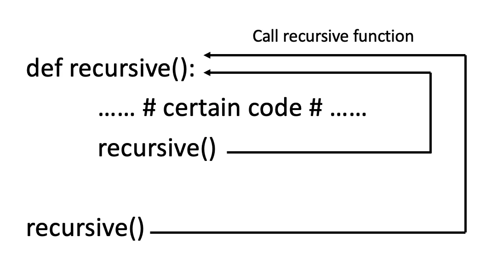

Recursive function is a function that calls itself. It is a common programming concept which is frequently used. Through this function we can automate the looping through the data until a certain result or condition is met. It is important to carefully analyze the condition to be met because if something is wrong with the condition, the loop will never begin or it will never end.



Example:

Let's calculate the factorial for the given number by using recursive function. Suppose, we need to calculate the factorial for 8.

8! = 8 \* 7 \* 6 \* 5 \* 4 \* 3 \* 2 \* 1 = 40320

The snippet of the code is as below:

```python
# Recursive function for factorial calculation
def fact(n):
    """This is a recursive function to calculate the factorial of the given integer"""

    if n == 1:
        return 1
    else:
        return (n * fact(n-1))

# User input
user_input = 8

if user_input != 0:
    result = fact(user_input)
else:
    result = 0
    print("The factorial of {} is {}".format(user_input, result))
```

Here we store the user input in a variable called user_input. Then we will check whether the user_input is more than 0 or not. If the user_input is 0 then the result will be 0 as 0! = 0. If the user_input is more than 0, the recursive function called fact(n) will be called. The handle is then passed to the recursive function fact(n).

In the function, we will check whether the argument passed is equal to 1 or not. If the argument is equal to 1 then the value 1 will be returned. If the argument is not equal to 1 then the result of (n \* fact(n-1)) will be returned.

### When user_input = 8 ###

fact(8) # 1st call

8 \* fact(7) # 2nd call

8 \* 7 \* fact(6) # 3rd call

8 \* 7 \* 6 \* fact(5) # 4th call

8 \* 7 \* 6 \* 5 \* fact(4) # 5th call

8 \* 7 \* 6 \* 5 \* 4 \* fact(3) # 6th call

8 \* 7 \* 6 \* 5 \* 4 \* 3 \* fact(2) # 7th call

8 \* 7 \* 6 \* 5 \* 4 \* 3 \* 2 \* fact(1) # 8th call

8 \* 7 \* 6 \* 5 \* 4 \* 3 \* 2 \* 1 # return from 8th call

8 \* 7 \* 6 \* 5 \* 4 \* 3 \* 2 # return from 7th call

8 \* 7 \* 6 \* 5 \* 4 \* 3 # return from 6th call

8 \* 7 \* 6 \* 5 \* 4 # return from 5th call

8 \* 7 \* 6 \* 5 # return from 4th call

8 \* 7 \* 6 # return from 3rd call

8 \* 7 # return from 2nd call

8 # return from 1st call

Every recursive function has a base condition which indicates whether the recursion should continue or stop. Here for this example, the base condition is whether the argument is equal to 1 or not.
