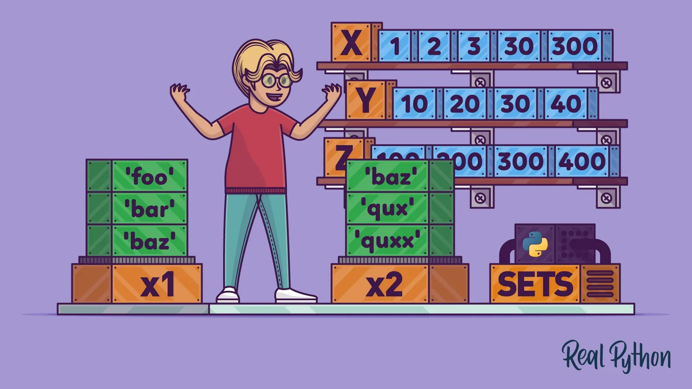
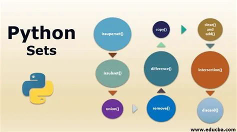

## Sets are used to store multiple items in a single variable.

Set is one of 4 built-in data types in Python used to store collections of data, the other 3 are [List](https://www.w3schools.com/python/python_lists.asp), [Tuple](https://www.w3schools.com/python/python_tuples.asp), and [Dictionary](https://www.w3schools.com/python/python_dictionaries.asp), all with different qualities and usage.

A set is a collection which is both *unordered* and *unindexed*.

Sets are written with curly brackets.





Creating sets :

now we want to create a set call "my set" and define it from the beginning

that set includes strings. how we can do that ??

```python
#creating sets
#set of strings
myset = {"apple", "banana", "cherry"}
print(myset)
{'banana', 'cherry', 'apple'}
```

A set can be strings, integers, and boolean values:

```python
set1 = {"abc", 34, True, 40, "male"}
```

Type

we can use here type() function to tell us what is the type of the variable called myset

```python
print(type(myset))
<class 'set'>
```

Access items

How we can access items of the set "set1" ??

first, we declare it .second we make a for loop to loop into every item of the set and print it out in the output

```python
#Access items
set1= {True ,34 ,40 ,"male" ,"abc"}
for x in set1:
  print(x)

#output
True
34
40
male
abc
```

## Python - Add Set Items
**Adding item in the set can be done** in **many ways first we can** do **it with add function second we can do it with** an **update()** function

## Add
```python
set1.add("orange")

print(set1)

#output
{True, 34, 40, 'male', 'abc', 'orange'}
```

## update
```python
thisset = {"apple", "banana", "cherry"}
tropical = {"pineapple", "mango", "papaya"}

thisset.update(tropical)

print(thisset)

#output
{'papaya', 'cherry', 'apple', 'pineapple', 'mango', 'banana'}
```

```python
thisset = {"apple", "banana", "cherry"}
mylist = ["kiwi", "orange"]

thisset.update(mylist)

print(thisset)

#output
{'banana', 'cherry', 'apple', 'orange', 'kiwi'}
```

## remove items

**we can remove an item from the set be remove() function which** removesthe specific **item from the set**

```python
thisset = {"apple", "banana", "cherry"}
​
thisset.remove("banana")
​
print(thisset)

#output
{'cherry', 'apple'}
```

```python
thisset = {"apple", "banana", "cherry"}
​
thisset.remove("banana")
​
print(thisset)

#output
{'cherry', 'apple'}
```

we can also use pop() to remove the first item in the set

```python
#pop()
​
thisset = {"apple", "banana", "cherry"}
​
x = thisset.pop()
​
print(x)
​
print(thisset)

#output
banana
{'cherry', 'apple'}
```
