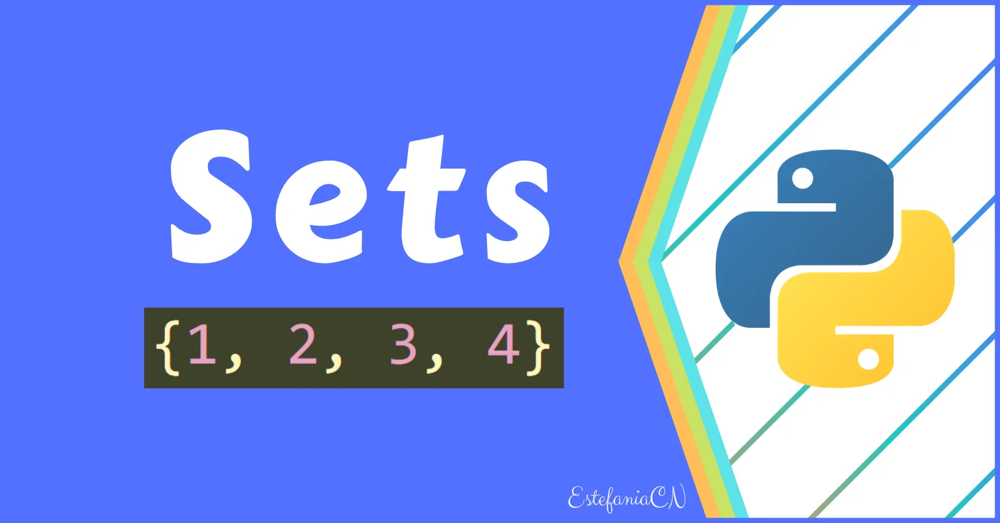

- 

Python sets are unordered collection of items with no duplicates and the elements cannot be changed. It can be used to perform mathematical set operations.

Sets are created by placing the elements inside the curly brackets { }, separated by commas. Empty set is created with set( ) function.

```python
#creating Sets
#set of integers
my_set1 = {1, 2, 3, 4}

#set of mixed datatype
my_set2 = {5.4, (1,2,3), 'python'}

#empty set
my_set3 = set()

#set created from list
my_set4 = set([1, 2, 3])
```

Since sets are unordered, indexing makes no meaning to set.

To add elements we use add() and update() methods, where add() is used to add single element and update() is used to add multiple elements to the set.

```python
#Modifying set
#adding elements
#add() method to add single element
my_set = {1, 3, 4}
my_set.add(2)
print(my_set)
{1, 2, 3, 4}

#update() method to add multiple elements
my_set1 = {1, 3, 5, 7}
my_set1.update([2, 4], {6, 8, 9})
print(my_set1)
{1, 2, 3, 4, 5, 6, 7, 8, 9}
```

An item can be removed by discard() and remove() methods. Where discard() method leaves a set unchanged if the element is absent. Whereas remove() will raise an error if the element is absent in the set.

```python
#removing elements by discard() and remove() methods

#discard() method leaves the set unchanged if the element is absent in the set
my_set = {1, 2, 3, 4, 6}
my_set.discard(4)
print(my_set)
{1, 2, 3, 6}

my_set.discard(5)
print(my_set)
{1, 2, 3, 6}

#remove() method will raise error if the element is absent in the set
my_set1= {1, 2, 3, 5, 6}
my_set1.remove(3)
print(my_set1)
{1, 2, 5, 6}

my_set1.remove(4)
print(my_set1)
KeyError: 4
```
