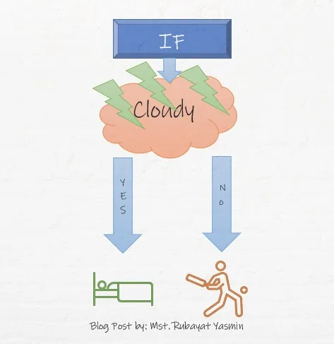

Making a decision with lots of possibilities is too hard, but it's also essential to decide on a single solution. We make decisions every day based on potentiality.

In our head, we do go through lots of possibilities then make decisions by calculating the consequences. Let's think about a common scenario here, for example. If we see the sky is cloudy, then we check the weather forecast, now if we see that there is a possibility of raining, then we take an umbrella with us before going outside. Else we go outside without an umbrella so, this is the common scenario of our daily life.

Actually, we are going through a process or some conditions with consequences. What we are doing is, playing with a bunch of if and else in our brain that we didn't notice. In programming, the term is called conditions or if...else statement.

## Python If**...**Else Statement

In python, the decision is made through some statements.

|  |  |
| --- | --- |
| **Statement** | **Decision** |
| **If** | This statement is used to check the if block, if the statement is true it goes through the block inside the if statement. |
| **If......Else** | It is similar to the if statement, if the condition inside the if is not true then else block is used. |
| **Nested if** | This statement can be used inside another if statement. |

We use logical operators to check a condition. Let's have a look at some logical operators.

- Equal to: a == b (read, a is equal to b)
- Not Equal to: a != b
- Less than: a < b
- Less than or equal to: a <= b
- Greater than: a > b
- greater than or equal to: a >= b

## Example of If...Else

The following if statement checks that if b is greater than a or not.

```python
a = 10
b = 100
if b > a:
print("b is greater than a")
```

Output:

```python
b is greater than a
```

Let's check another example,

```python
c = 20
d = 20
if c > d:
  print("d is greater than c")
elif c == d:
  print("c and d are equal")
```

Output:

```python
c and d are equal
```

The elif keyword is used if the previous statements were false. The above code is an example of that.

```python
Note that, indentation is important here. If you use wrong indentation, you will find error.
```

Else keyword is used if either statement is not true. Here the following code is an example, where we can see a is > than b so the if and elif statements were false.

```python
#else keyword is used if either statement is not true
a = 100
b = 20
if b > a:
  print("b is greater than a")
elif a == b:
  print("a and b are equal")
else:
  print("a is greater than b")
```

Output:

```python
a is greater than b
```

## Ternary operator
If we have a single condition to check then we can use the shorthand technique also known as the ternary operator.

```python
#if we have single conditions to check, we can use ternary operator
a = 200
b = 20
if a > b: print("a is greater than b")
```

## Nested if

We can use if statement inside another if this is known as nested if. Let's check an example.

```python
#nested if
x = 100

if x > 10:
  print("x is bove ten,")
  if x >= 40:
    print("also x is above or equal to 40!")
  else:
    print("but not above 40.")
```

Output:

```python
x is bove ten,
also x is above or equal to 40!
```

That's all for today. I hope this article helped you understand the if...else statement of python. You can find the demo code for this article [here](https://github.com/rubayat-tithi/Python-if..else-statement-for-data-insight-s-blog). You can check my other [article](https://www.datainsightonline.com/post/615dc196003eb90016345542), where I have used the if...else statement.

Thanks for reading.
