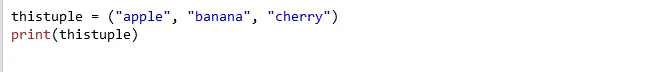
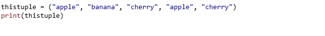

## Tuple

Tuples are used to store multiple items in a single variable.

Tuple is one of 4 built-in data types in Python used to store collections of data, the other 3 are List, Set, and Dictionary, all with different qualities and usage.

A tuple is a collection which is ordered and **unchangeable**.

Tuples are written with round brackets.

### Example

Create a Tuple:

## Tuple Items

Tuple items are ordered, unchangeable, and allow duplicate values.

Tuple items are indexed, the first item has index [0], the second item has index [1] etc.

## Ordered

When we say that tuples are ordered, it means that the items have a defined order, and that order will not change.

## Unchangeable

Tuples are unchangeable, meaning that we cannot change, add or remove items after the tuple has been created.

## Allow Duplicates

Since tuples are indexed, they can have items with the same value:

Example
Tuples allow duplicate values:

