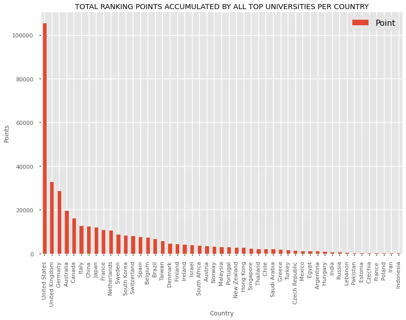
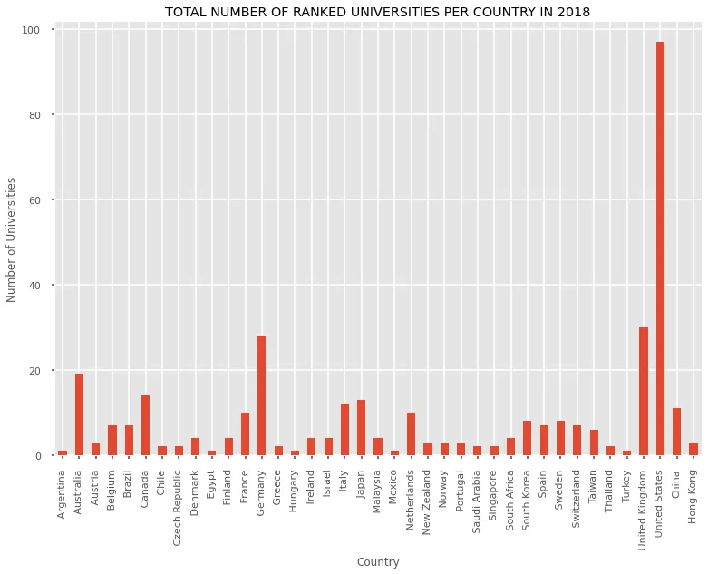
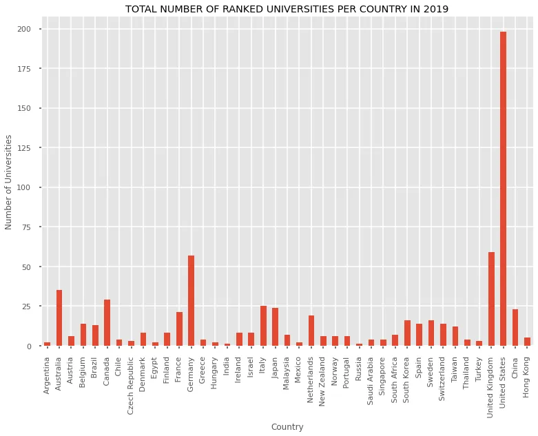
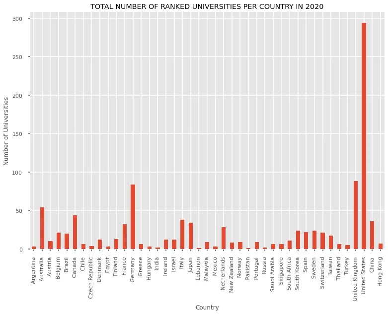
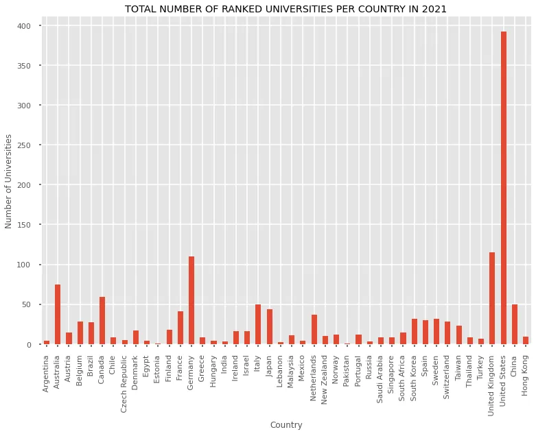
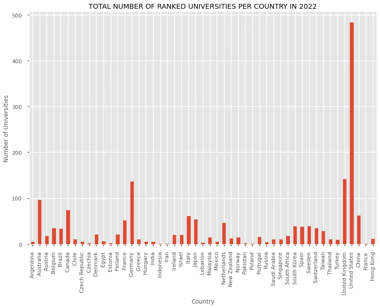
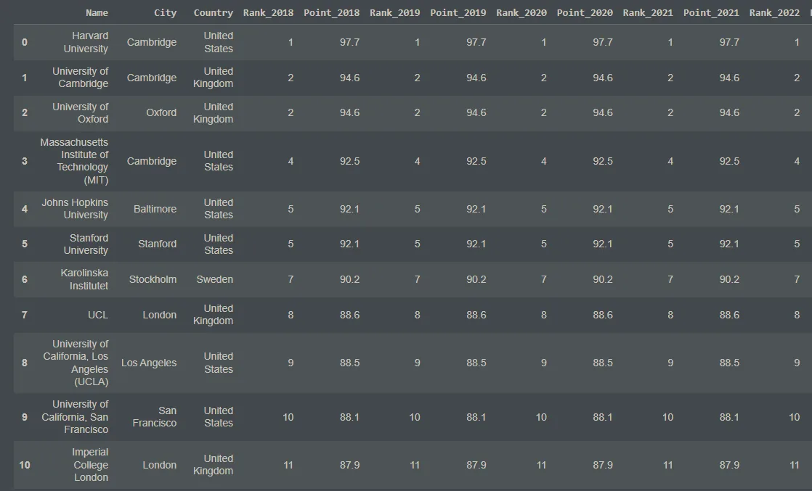

## QS WORLD RANKED UNIVERSITIES ANALYSIS
This is in fulfillment of my final project as part of Data Insight Data Scientist Program. My final analysis project is on thorough analysis of QS World Ranked Universities (2018-2022) from Kaggle. The dataset is about top universities around the world according to QS ranking from 2018 to 2022, Life Science and Medicine Department.

### Overview of Dataset
This dataset contains 6 columns and 5200+ rows. The columns are:

1. **Year**: This column has value 2018, 2019, 2020, 2021, 2022.
2. **Rank**: Rank is given by QS according to point starts with 1.
3. **Name**: Every university names based on Rank.
4. **Point**: Every university has earned point, based on education quality, faculty facilities, student facilities and so on.
5. **City**: A university located city.
6. **Country**: University's located Country.

### My Project Flow
The following are the steps I took in order to analyze the QS World Ranked Universities dataset to get the needed answers to my questions:

1. Exploratory Data Analysis (E.D.A.)
   - Data Investigation
   - Data Cleaning
2. Insights and Data Visualization

**Exploratory Data Analysis (E.D.A.)**

Exploration of the data from all angles is necessary for comprehensive understanding. Making judgments that have meaning and are advantageous is made possible by the impacting features, which makes EDA an essential component of data science.

**Data Investigation**

This is to know more about the dataset and what it entails. The codes below shows what I did in this regard:

```python
#Importing the needed libraries
import pandas as pd
import numpy as np
import seaborn as sns
import matplotlib.pyplot as plt
import missingno as msno
import matplotlib.style as style
%matplotlib inline

#Setting the plotting style
style.use('seaborn-poster') #sets the size of the charts
style.use('ggplot')

#Uploading the dataset from local
from google.colab import files
files.upload()

#Loading the dataset into a pandas dataframe
df = pd.read_csv('/content/universities.csv')

#Showing the first 5 rows
df.head()

#Checking the columns of the dataset
df.columns

#Shape of the dataset
df.shape

#Getting information about the dataset
df.info()

#Describing the numerical columns of the dataset
df.describe()

#Checking the count of Country column
df['Country'].value_counts()

#Checking the count of the city column per country
df.groupby('Country')['City'].value_counts()

#Checking for missing values
df.isna().sum()

#Visualizing missing values of each column
msno.bar(df)

#Checking the unique countries in the dataset
df['Country'].unique()

df.loc[df['Country'].isna()]

#Checking for duplicates in the dataset
df[df.duplicated()]
```

The major insights from the data investigation process shows:

1. The columns of the dataset are **Year, Rank, Name, Point, City** and **Country**.
2. There are **5260** rows and **6** columns.
3. There are **220** missing values in the Points column and **1** missing value in the Country column.

**Data Cleaning**

The practice of correcting or deleting inaccurate, damaged, improperly formatted, duplicate, or incomplete data from a dataset is known as data cleaning. There are numerous ways for data to be duplicated or incorrectly categorized when merging multiple data sources. The codes are as follows:

```python
#Making a copy of dataset
df1 = df.copy()

#Finding the exact input with no country
df1[df1['Country'].isna()]

#Filling NaN with France since the university is located in France
df1.loc[4990, 'Country'] = 'France'

#Checking if the change has been effected
df1.isna().sum()

#Showing the rows with empty Point column
df1[df1['Point'].isna()]

#Making a copy of df1 dataset to effect changes on the Point column
df2 = df1.copy()

#Getting the indices of all missing point rows
missing_points = df[df['Point'].isnull()].index.tolist()

#Filling missing points with the average of the points before and after them
for i in missing_points:
  df2.at[i,'Point'] = (df2.loc[i-1, 'Point']+df2.loc[i+1, 'Point'])/2

#Checking if all the columns have no empty values
df2.isna().sum()

#Displaying the empty rows
df2[df2['Point'].isna()]

#Showing the rows above and below indexes 5135 and 5136
df2.iloc[5134:5138]

#Filling indexes 5135 and 5136 Point columns with 65.9
df2.loc[[5135,5136], 'Point'] = 65.9

#Showing the rows above and below indexes 5135 and 5136
df2.iloc[5221:5225]

#Filling Point column of index 5223 with 61.9 since it has the same rank as index 5224
df2.loc[5223, 'Point'] = 61.9

#Filling Point column of index 5222 with average of 5221 and 5223
df2.loc[5222, 'Point'] = (df2.loc[5221, 'Point']+df2.loc[5223, 'Point'])/2

#Checking if all changes have been effected now
df2.isna().sum()

#Grouping dataset by years
df2_18 = df2[df2['Year']==2018]
df2_19 = df2[df2['Year']==2019]
df2_20 = df2[df2['Year']==2020]
df2_21 = df2[df2['Year']==2021]
df2_22 = df2[df2['Year']==2022]
```

The missing value in Country was made to be France because University Paris-Saclay is located in France. The missing values in Points were achieved by using the average of the points before and after that row to fill it up. Some other ones the same for the row before them were used since they had the same ranks.

**Insights And Data Visualization**

The graphic display of information and data is known as data visualization. Data visualization tools offer an easy approach to observe and analyze trends, outliers, and patterns in data by utilizing visual elements like charts, graphs, and maps.

The questions I wanted to use as the basis for drawing insights from this dataset were:

1. What top 5 countries have the highest cumulative ratings according to the dataset?
2. Which countries have the most rated universities per year according to the dataset?
3. What are the top 10 universities in the world according to the points accumulated over the 4 years span according to the dataset?

The code below shows the process of answering the first question(What top 5 countries have the highest cumulative ratings according to the dataset?):

```python
#Grouping by countries and summing up the points
grouped_df2 = pd.DataFrame(df2.groupby('Country')['Point'].sum().sort_values(ascending=False))
grouped_df2

#Plotting the graph
grouped_df2.plot(xlabel='Country', ylabel='Points', kind='bar', fontsize=11, title='TOTAL RANKING POINTS ACCUMULATED BY ALL TOP UNIVERSITIES PER COUNTRY')
```

The output is as follows:



The above output shows that the top 5 countries with more rated universities are:

1. United States
2. United Kingdom
3. Germany
4. Australia
5. Canada

The code below shows the process of answering the second question(Which countries have the most rated universities per year according to the dataset?):

```python
#Grouping dataset by years
groupdf2_18 = df2_18.groupby('Country')['Name'].count()
groupdf2_19 = df2_19.groupby('Country')['Name'].count()
groupdf2_20 = df2_20.groupby('Country')['Name'].count()
groupdf2_21 = df2_21.groupby('Country')['Name'].count()
groupdf2_22 = df2_22.groupby('Country')['Name'].count()

#Plotting total number of universities per country for 2018
groupdf2_18.plot(xlabel='Country', ylabel='Number of Universities', kind='bar', fontsize=11, title='TOTAL NUMBER OF RANKED UNIVERSITIES PER COUNTRY IN 2018')

#Plotting total number of universities per country for 2019
groupdf2_19.plot(xlabel='Country', ylabel='Number of Universities', kind='bar', fontsize=11, title='TOTAL NUMBER OF RANKED UNIVERSITIES PER COUNTRY IN 2019')

#Plotting total number of universities per country for 2020
groupdf2_20.plot(xlabel='Country', ylabel='Number of Universities', kind='bar', fontsize=11, title='TOTAL NUMBER OF RANKED UNIVERSITIES PER COUNTRY IN 2020')

#Plotting total number of universities per country for 2021
groupdf2_21.plot(xlabel='Country', ylabel='Number of Universities', kind='bar', fontsize=11, title='TOTAL NUMBER OF RANKED UNIVERSITIES PER COUNTRY IN 2021')

#Plotting total number of universities per country for 2022
groupdf2_22.plot(xlabel='Country', ylabel='Number of Universities', kind='bar', fontsize=11, title='TOTAL NUMBER OF RANKED UNIVERSITIES PER COUNTRY IN 2022')
```

The output are as follows:











The code below answers the third question(What are the top 10 universities in the world according to the points accumulated over the 4 years span according to the dataset?):

```python
#Taking the top 30 universities for each year
top30_18 = df2_18.head(30)
top30_19 = df2_19.head(30)
top30_20 = df2_20.head(30)
top30_21 = df2_21.head(30)
top30_22 = df2_22.head(30)

#Merging the top 30 universities from various years into one
df_18_19 = pd.merge(top30_18,top30_19, on='Name',suffixes=['_2018','_2019'])
df_18_19_20 = pd.merge(df_18_19,top30_20, on='Name')
df_18_19_20_21 = pd.merge(df_18_19_20,top30_21, on='Name')
df_18_19_20_21_22 = pd.merge(df_18_19_20_21,top30_22, on='Name')
df_18_19_20_21_22

#Making a copy of the merge datasets
df_combined = df_18_19_20_21_22.copy()

#Displaying the columns of the combined dataset
df_combined.columns

#Dropping the unnecessary columns
df_combined.drop(['City_2018', 'Country_2018', 'City_2019', 'Country_2019', 'City_y', 'City_x', 'Country_x', 'Country_y'], axis=1,inplace=True)
df_combined

#Renaming the columns for more meaning
df_combined.rename(columns={'Year_x':'Year_2020', 'Rank_x':'Rank_2020', 'Point_x':'Point_2020',
                            'Year_y':'Year_2021', 'Rank_y':'Rank_2021', 'Point_y':'Point_2021',
                            'Year':'Year_2022', 'Rank':'Rank_2022', 'Point':'Point_2022'}, inplace=True)

#Rearranging the columns
df_combined = df_combined[['Name','City', 'Country', 'Year_2018', 'Rank_2018', 'Point_2018', 'Year_2019', 'Rank_2019',
       'Point_2019', 'Year_2020', 'Rank_2020', 'Point_2020', 'Year_2021', 'Rank_2021',
       'Point_2021', 'Year_2022', 'Rank_2022', 'Point_2022']]

#Removing the years columns
df_combined.drop(['Year_2018', 'Year_2019', 'Year_2020', 'Year_2021', 'Year_2022'], inplace=True, axis=1)
df_combined.head()

#Creating average columns for rank and point
df_combined['Average_Rank'] = (df_combined['Rank_2018']+df_combined['Rank_2019']+df_combined['Rank_2020']+df_combined['Rank_2021']+df_combined['Rank_2022'])//5
df_combined['Average_Point'] = (df_combined['Point_2018']+df_combined['Point_2019']+df_combined['Point_2020']+df_combined['Point_2021']+df_combined['Point_2022'])/5

#Sorting dataset by Average Point Column
df_combined.sort_values(by=['Average_Point'],ascending=False)
```

The output is:



**Final Remarks**

This is the analysis of QS World Ranked Universities Analysis from 2018 to 2022 as part of my fulfillment for DataInsight project.

Github Link:

<https://github.com/Jegge2003/DataInsightFinalProject/blob/main/universities_analysis.ipynb>
