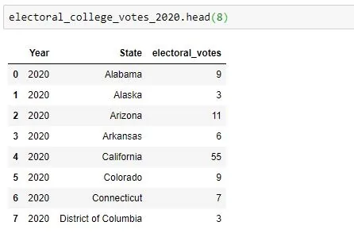
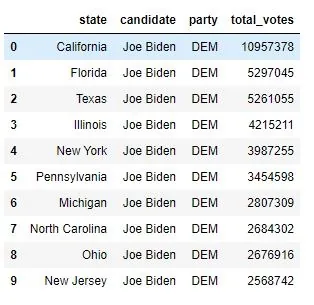
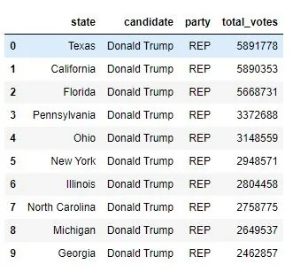
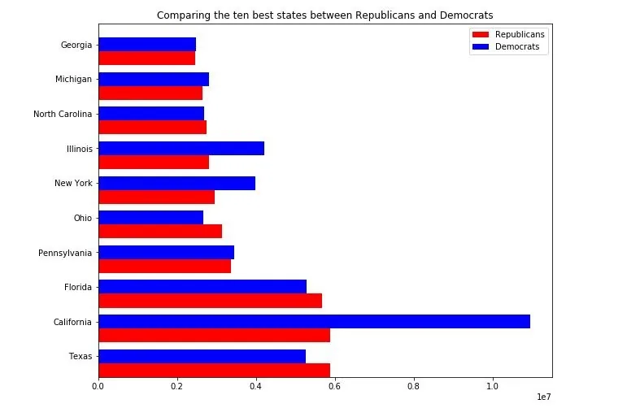

The United States (US) is the only country with a continuous democracy for more than 200 years. However, the US is more accurately defined as a constitutional republic. “Constitutional” refers to the fact that the government in the US is based on a Constitution, which is the supreme law of the US. Election are conducted every four years and 2020 is the year for yet another election. This election is keenly contest between the incumbent president Donald Trump and Joe Biden. Although there are other parties with their presidential candidate however, these two personalities are the two key contenders for the presidency. Donald Trump is a Republican, from the Republican Party whiles Joe Biden is a Democrats, from the Democratic Party.

Joe Biden Donald Trump

The data used in this analysis is obtained from <https://www.kaggle.com/unanimad/us-election-2020>

and <https://www.kaggle.com/daithibhard/us-electoral-college-votes-per-state-17882020> which contains presidential, senate, governors votes for every counties and the electoral votes for each state of the States since 1788 respectively.

The focus of this analysis is on the two main major parties of the USA, Democratic and Republican Party, i.e. Joe Biden and Donald Trump respectively, therefore the main dataset will be the president_county_candidate from the site above.

Few rows of the data is shown below.

Exploratory analysis on the dataset revealed that there are **31,283** rows and 6 columns. Some counties had zero votes which the analysis would find out. There are no null row or column.

The United State of America use electoral college system in their election, although every citizen, who is eligible can vote, a presidential candidate needs **270** electoral college votes to win the presidency. Every state is assigned an electoral vote, for example, California state has an electoral college vote of 55, therefore any candidate who wins the majority of the California votes will be apportion an electoral vote of 55 which a candidate needs **270** to win the race.

Below is the few rows of the dataset having the electoral college votes for 2020.

A candidate can have the majority of votes casted known as the popular votes but won't be able to win the race to the White House as it happened in 2016, where Harry Clinton won majority of the popular votes but didn't win the race.

### What is the total number of votes (popular votes) obtained by Joe Biden and Donald Trump?
Therefore, before we head to the electoral college votes to predict the win of the race, let have a look at who won the popular votes.

**Joe Biden** had ***80,413,404*** of the popular votes representing ***52.06%*** of the popular votes while **Donald Trump** also had ***74,035,377*** representing ***47.94%*** of the total popular votes casted. **Joe Biden** had ***4.13%*** (i.e. ***6,378,027***)more of the popular votes than **Trump**.

### Which county voted the most for both candidates?

The total number of counties in the dataset is 3007, out of these numbers, the one which voted massively for both candidates is analyzed below.

***Los Angeles County*** in the ***California state*** is the county which voted massively for both candidates. This county gave Joe Biden ***3,001,862*** and ***1,132,647*** for Donald Trump.

### Which ten states voted massively for both candidates?
The following states voted massively for the Republican's Donald Trump:

***Texas, California, Florida, Pennsylvania, Ohio, New York, Illinois, North Carolina, Michigan and Georgia*** in descending order of votes obtained by Trump.

Nine of the states above also voted massively for Biden except Georgia which is not among the best ten performing state for Biden which is replaced by New Jersey.

Texas, California and Florida took the first three spots for both candidates.

The bar chart below compares the ten best performing states for both candidates replacing Georgia with New Jersey in Joe Biden's best ten states.

**Which counties casted zero votes for both candidates?**[**¶**](http://localhost:8888/notebooks/Documents/US%20election%202020%20analysis/US%20Election%20analysis.ipynb#4.-Which-counties-casted-zero-votes-for-both-candidates?)

It was discovered that some counties had zero votes for some candidates, now let's see how many they are and their names. 107 and 132 counties have no votes for Republican and Democrats party respectively. The reasons for the no votes for both candidate is not available during the analysis of the dataset.

**Predicting the winner using electoral votes**

First of all, the votes obtained by each candidate in each state is compared to find out the winner for that particular state and the electoral votes is assigned to the winner and the loser given zero electoral votes for the particular state.

Out of the 51 states, republican's Donald Trump has 25 states whiles democrat's Joe Biden won the remaining states (i.e. 26).

In respect of the electoral votes, Joe Biden had 306 out of the 538, representing 56.88% whiles Trump had 232 electoral votes, representing 43.12%.

**Conclusion**

**Joe Biden** won the popular votes, which Harry Clinton won in the last election. He also garnered ***306*** electoral college votes, ***36 more*** of the expected ***270***. He also perform incredibly well in all aspect of this analysis. Therefore Joe Biden is the winner of the race to the White House, election 2020.
