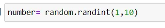
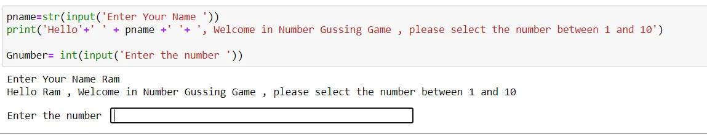
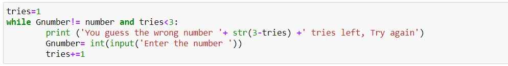
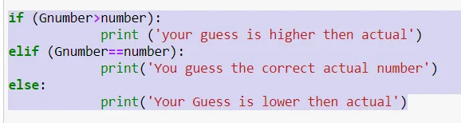
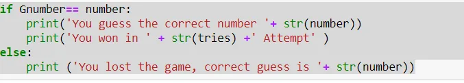
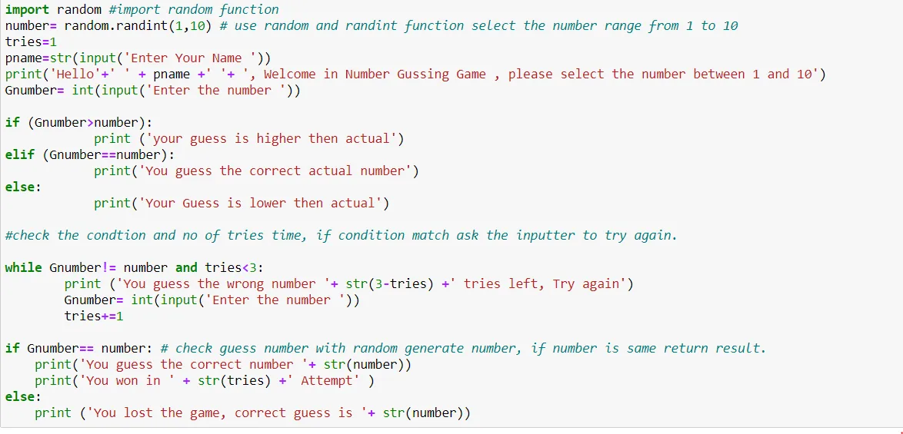
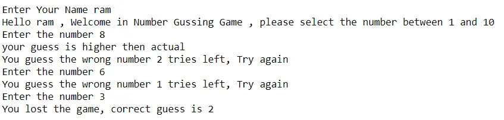
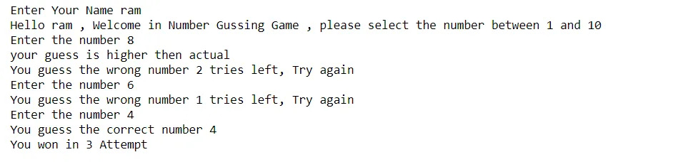

In this blog we will see how we create a simple number guessing game using python. The Number guessing game is about guessing the number randomly chosen by the computer in the given number of chances.

import random function in python

use random and randint function select the number range from 1 to 10. we can increase number range as required.

Take the number from the user

check the condition and no of tries time, if condition match ask the inputter to try again.

Provide hint after first attempt. only one time give hint.

check guess number with random generate number, if number is same return result with win message and No of time attempt, otherwise game lost.

Complete Code:

Output:

