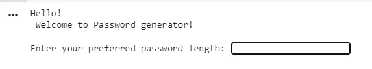
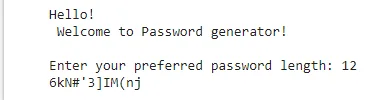

In this blog post, we will learn how to make a simple random password generator.

We all know what a password is! We use passwords every day to secure our credentials. This explanation is for those who want a definition of a password. Well, a password is a combination of strings, integers, and special characters.

String means the characters such as 'A-Z or a-z'.

Integer means the numbers such as '0-9', and special character means '@, #, $, %, ^ and so on.

Typically passwords are used to confirm the identity of someone to protect personal data from data thieves. As the world is making progress, so we are doing every single thing using the internet. We are using bank account online, paying bills, keeping secret information, and vice versa, so it is pivotal to make a strong password that is strong enough.

Enough of the theory part! Let's write the code or you can check my [Github Repository](https://github.com/rubayat-tithi/Python-Projects-for-Data-Insight-s-Blog) for this code. You are welcome to give a star if my blog/code helps you a bit.

You can use [jupyter notebook](https://jupyter.org/) or [pycharm](https://www.jetbrains.com/pycharm/) to write python code. If you are too lazy to install an IDE, I have a solution for you. You can use [google colab](https://colab.research.google.com/) to write this code or any python code.

First import the necessary modules. Here we will be using String and random modules.

```python
#import the necessary modules!
import random
import string
```

import command will import the random and string method for us. After importing, the first thing we will do is display a welcome message. We should at least welcome our users, right! So, below is the code.

```python
print('Hello! \n Welcome to Password generator!')
```

The print statement above will display a welcome message for the user.

```python
#Enter the length of the password
pwd_length = int(input('\nEnter your preferred password length: '))
```



The input method in the code will make a field that will ask for the desired password length. To make a strong password, we will be using a combination of special characters, numbers, and characters. So, the [string](https://docs.python.org/3/library/string.html) module will help us achieve this.

```python
#define data
pwd_lower = string.ascii_lowercase
pwd_upper = string.ascii_uppercase
pwd_num = string.digits
pwd_symbols = string.punctuation
```

Now that, we have set up the variables, let's add all four variables together inside a single variable.

```python
#combine the data
all = pwd_lower + pwd_upper + pwd_num + pwd_symbols
```

Now is the time to call the random function to do the rest.

```python
#use random
cal = random.sample(all,pwd_length)
```

Finally, join the randomly calculated result in a variable and print it out.

```python
#create the password
password = "".join(cal)

#print the password
print(password)
```

This will display a password that is randomly generated.



Thank you for reading my blog!
