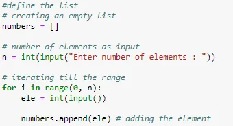
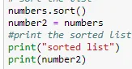
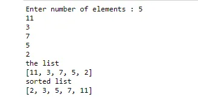

In this post, I'm going to demonstrate reading a giving list from the user and sort it using Python.

First of all, we will start with reading the list as shown in the code below:

in this block of code, I defined an empty list then I going to ask the user the number of elements in his/her list as the length of the list and use a for iterating till the length of the list and as the user to give the elements of the list one by one.

After getting the list, now we are going to sort it using the **sort()** method

as shown in the code below:

that modifies the list in place. There is also a sorted() built-in function that builds a new sorted list from an iterable.

and as a result, we will get a sorted list as shown below:

You can find my code here

[Link](https://github.com/tasnimassali/Application2_Data-insight)
