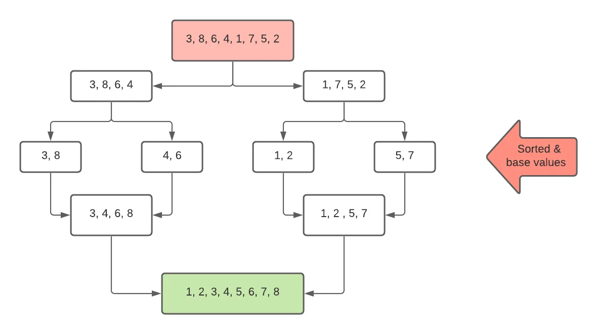
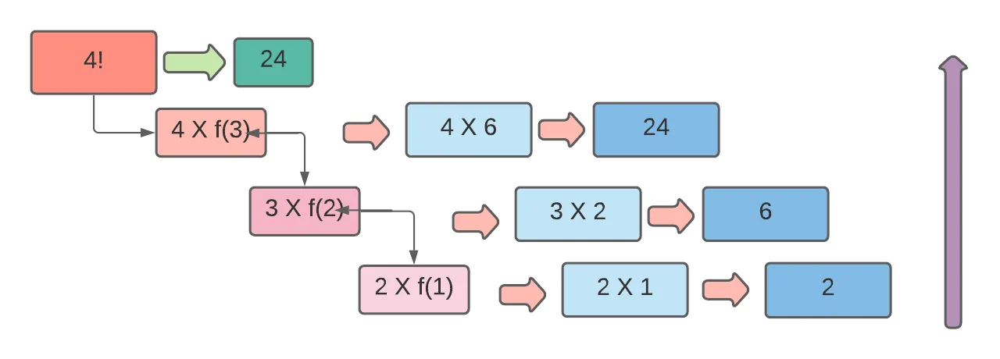

First, let's talk about the recursion theory. Look at the picture carefully. We want to sort the number Increasingly. We break the first box into two sub- boxes. And each sub box breaks into two sub-box. In the second stage we want to stop. That's called base point/value. Then we sorted these sub boxes. After that, each two sub box combined one with sort. Another two were the same. Finally, the last two boxes combined one with the final sort values. This is how the recursion works. That means for its convenience it breaks into some subsets and then combines again.

Let's dive into an example,

## *Factorial! (Normal function)*
```python
def factorial(n):
    temp = 1

    for i in range(2, n+1):
        temp = temp * i

    return temp

n = int(input())
result = factorial(n)
print(result)
```

> input: 4

> Ans: 24

## Recursion is a function that calls itself.

## *Factorial! (Recursive function)*
```python
def factorial(n):
    if n == 1:        #base value
        return 1

    return n * factorial(n-1)

n = int(input())
result = factorial(n)
print(result)
```

> input:4

> Ans: 24

Let's Explain,

It is a widely used idea in programming to solve complex problems by breaking them down into simpler ones. We can think about a big box. For our convenience, we break down the box into sub box. If we need it more simple, we can break it into more sub box. And there is an endpoint. Endpoint means where we want to stop breaking the box. It is called base value/point. In recursion, we have to locate this base value in our programme.

4! = 4 x 3 x 2 x 1. Here 1 is the last value where we want to stop. So 1 is the base value.

return n \* factorial(n -1)

=> 4 \* factorial(4 -1)

=> 4 \* factorial(3)

Here factorial(3) is a new function that calls itself. And this process is running until then equal to 1.

=> 4 \* factorial(3)

=> 4 \* 3 \* factorial(3 -1) "return n \* factorial(n -1)"

=> 4 \* 3 \* factorial(2)

...continue


