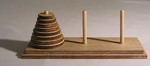
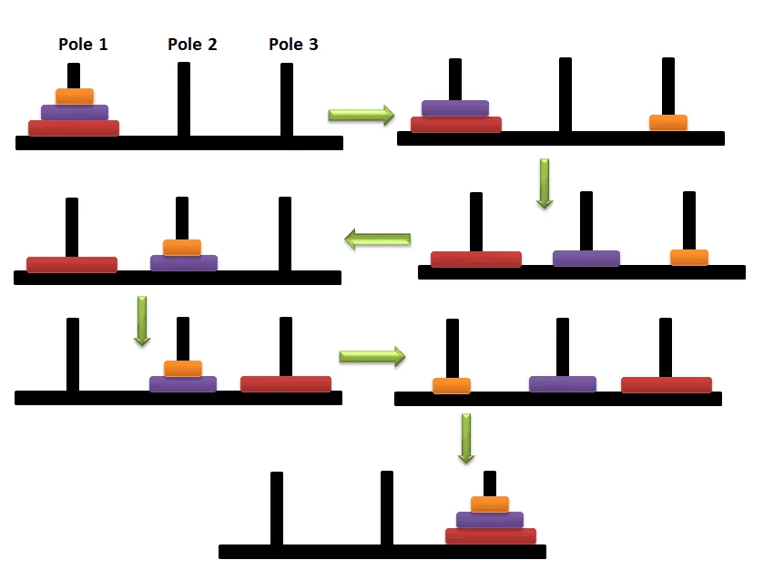

Let's imagine you are standing in a long queue waiting to buy ice cream. How do you know the number of people before you without getting out of the queue and count?

It is easy; just ask the person in front of you. This person will ask in front of him the same question until the first one. Let's say it is the asking phase. The first one will give back the answer "There is no person in front, or zero" to the person behind, again, the person behind will answer 'one' to behind, then 'two','three' till it finally reaches you. This is the answering phase. In programming, it is called **recursion**. A program is called recursive if it calls itself, thus reducing an instance of a problem to some other instance of the same problem. To be clear, a recursive function is **function(function(function(function))))**. The functions are the same function.

I haven't cleared the concept of recursion until this example from the book [Discrete Mathematics for computer science](http://discrete-math.tilda.ws/).

To create a recursive function, first think about the base function, for example, from the above example, the base function is asking the person in front and this person will give the answer-back.

Let's look at this example with codes. Printing is just for understanding the code. The function is to count the length of the queue.

```python
def ask_queue(lst):
    print(f"Asking the person in front : {lst}")
    if not lst:
    # same as len(lst) == 0, no person in the list
        print("There is no one in front. I am the first person.")
        return 0
    else:
        # if there are persons in front, ask again and
          again by calling the function itself.
        total = 1 + ask_queue(lst[1:])
        print(f"Answering the person behind : {lst}")
        # will return the total lenght of the queue
        return total

# let's say in the queue 'e' in the last and 'a' in the first person in the queue.
queue = ['e','d','c','b','a']
ask_queue(queue)
```

**Output**

```python
Asking the person in front : ['e', 'd', 'c', 'b', 'a']
Asking the person in front : ['d', 'c', 'b', 'a']
Asking the person in front : ['c', 'b', 'a']
Asking the person in front : ['b', 'a']
Asking the person in front : ['a']
Asking the person in front : []
There is no one in front. I am the first person.
Answering the person behind : ['a']
Answering the person behind : ['b', 'a']
Answering the person behind : ['c', 'b', 'a']
Answering the person behind : ['d', 'c', 'b', 'a']
Answering the person behind : ['e', 'd', 'c', 'b', 'a']
Out[1]:
5
```

```python
# in short you can write like this
def ask_queue_short(lst):
    return 1 + ask_queue_short(lst[1:]) if lst else 0

ask_queue_short(queue)
```

### Tower of Hanoi Puzzle


The game is simple, **just move the discs from one rod to another rod.**

Rules

**- you are allowed to move only one disc at a time.**

**- larger disc cannot be placed on top of smaller ones.**

For writing this puzzle with recursive functions, think about what is the base function.

Name the three rods as

- **from_rod** - it is the starting point

- **to_rod** - it is the rod that we want to move all the disk

- **unused_rod** - it is the remaining rod

Think about if there is one disc, it is simple, just move the disc from_rod to to_rod.

If there are two discs, move the upper/smaller disc to unused_rod so that the large disc can be moved to to_rod. Then, the smaller disc from the unused rod is moved to to_rod.

It is the base function. If one disc remains, just move from_rod to to_rod. If there is more than one, move the upper/smaller disc to unused_rod then larger to to_rod then move the smaller disc to to_rod.

Thinks about with 3 rods.



Let's write in code.

**The idea of codes is from the book, Discrete Mathematics from** the **above link.** I added these codes as they can clearly explain the recursive function. But for me, it takes too long to configure the code.

```python
def hanoi_tower(n, from_rod, to_rod):
    if n == 1:
        print(f"Move disc from {from_rod} to {to_rod}")
    else:
        # it is defined the unused rod
        # for example, if from_rod is 1, to_rod is 2,
          then 3
        # if from_rod is 2, to_rod is 3, then 1, etc
        # it will change accordingly.
        unused_rod = 6 - from_rod - to_rod

        # if there is more than one disc move the upper
        # one to unused_rod, by called the function
        # itself
        hanoi_tower(n-1, from_rod, unused_rod)

        # it will only execute after above function
          execution is done.
        print(f"Move dics from {from_rod} to {to_rod}")

        # then, move the smaller one to to_rod
        hanoi_tower(n-1, unused_rod, to_rod)

# As from above picture, we will move 3 discs from rod 1 to rod 3
hanoi_tower(3, 1, 3)
```

**Output**

```python
Move disc from 1 to 3
Move dics from 1 to 2
Move disc from 3 to 2
Move dics from 1 to 3
Move disc from 2 to 1
Move dics from 2 to 3
Move disc from 1 to 3
```

It will be helpful to understand the above function by executing in debugging mode in some editors, such as VS Code. Let's say, move 4 discs from rod 1 to rod 3.

```python
hanoi_tower(4, 1, 3)
```

**Output**

```python
Move disc from 1 to 2
Move dics from 1 to 3
Move disc from 2 to 3
Move dics from 1 to 2
Move disc from 3 to 1
Move dics from 3 to 2
Move disc from 1 to 2
Move dics from 1 to 3
Move disc from 2 to 3
Move dics from 2 to 1
Move disc from 3 to 1
Move dics from 2 to 3
Move disc from 1 to 2
Move dics from 1 to 3
Move disc from 2 to 3
```

It works. 'n' can be whatever you want. This is the power of recursion, just write few lines of code. I think it will be helpful for you to understand the concept of recursion.
