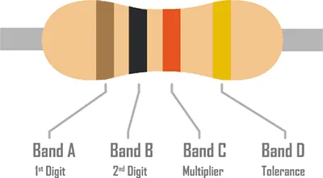
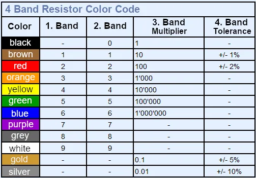
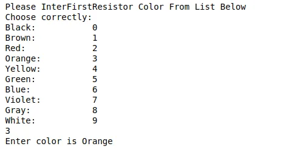
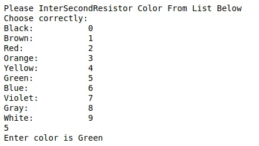
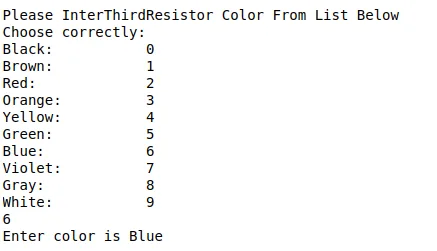
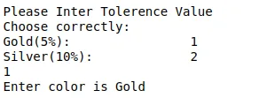
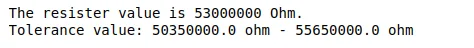

Are you having trouble reading resistor color codes? If your answer is yes, then this tool is specifically designed for you! Our Resistor Color Code Calculator is a handy tool for reading carbon-composition resistors 4-band type.

To use this tool, simply choose on a particular color and number and watch how the actual bands on the resistor illustration change. The resistance value is displayed in result together with the tolerance.

### Resistor Band Colors

Calculation Equation is

Total Resistance =[ firstColor + secondColor\*10 + (10\*\*thirdColor)] +- tolerance

**Codes**

Resistor color list

Printing value of resistor color Function

Printing the tolerance value of resistor color Function

Printing the Input color of resistor Function

Printing the Input tolerance color of resistor Function

Reading First Color

Reading Second Color

Reading Third Color

Reading Tolerance Color

Final Result

[Source Code](https://github.com/DoublePK/DataScientistProgramAssignments/blob/master/ResistorColorCodeReader.ipynb)
