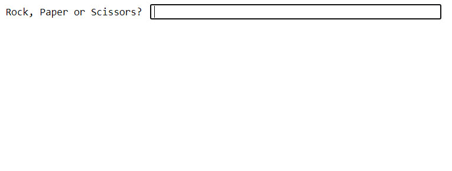

**Rock Paper Scissors** - a simple hand gesture game played by everyone. As the name suggests, three elements are defined in the game: a rock, a paper and a scissors where one dominates the other. The game can be played by any number of people.

It is a [zero-sum-game](https://en.wikipedia.org/wiki/Zero-sum_game) where there are only two outcomes for a player - a win or a tie. The rules of the game is simple, each players show any of the three signs simultaneously and the winner is then determined. The rock beats the scissors, the scissors beats the paper and the paper beats the rock (since paper can cover the rock).

This post shows to develop the game in **Python**. It can easily be developed with just using the loop and conditional statement. The idea of the code is simple - you repeat the code until the players chooses to exit the game and using the conditional statement you determine the outcome of the game.

Your first create a list with the three selections Rock Paper and Scissors. Using the random module you select any one of the choice and ask for the user input. Then based on the game rule, you determine the winner of the game.

**Step 1**: Initiate a list game with the options of either *Rock* or *Paper* or *Scissors*.

```python
game = ['ROCK','PAPER','SCISSORS']
```

**Step 2**: Import randint from random to generate a random number between 0 to 2.

```python
from random import randint
```

**Step 3**: Set cont to True in order to initiate the loop.

```python
cont = True
```

**Step 4**: Create a conditional loop which repeates until the answer is No.

```python
while cont == True:
    computer = game[randint(0,2)]
    user_input = input('Rock, Paper or Scissors? ').strip().upper()
    if user_input == computer:
        print("Computer chose {}, It's a tie".format(computer))
    elif user_input == 'ROCK':
        if computer == 'SCISSORS':
            print('Computer chose {}, You Win. Congratualtions!!'.format(computer))
        else:
            print('Computer chose {}, You Lose!!'.format(computer))
    elif user_input == 'PAPER':
        if computer == 'ROCK':
            print('Computer chose {}, You Win. Congratualtions!!'.format(computer))
        else:
            print('Computer chose {}, You Lose!!'.format(computer))
    elif user_input == 'SCISSORS':
        if computer == 'ROCK':
            print('Computer chose {}, You Lose!!'.format(computer))
        else:
            print('Computer chose {}, You Win. Congratualtions!!'.format(computer))
    else:
        print('Choose either rock or paper or scissors....')
    print('--x--x--x--x--x--x--x--x--x--x--x--x--x--x--')
    repeat = input('Play Again? (Y/N)').strip().upper()
    if repeat == "N":
        cont = False
        print('Bye Bye!!!')
```

A demo of the game is shown below:



You can checkout the file in my [Git](https://github.com/Clown-Face/Rock-Paper-Scissors---The-Game.git) .
