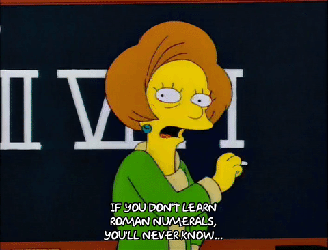
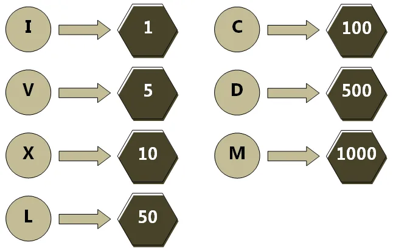
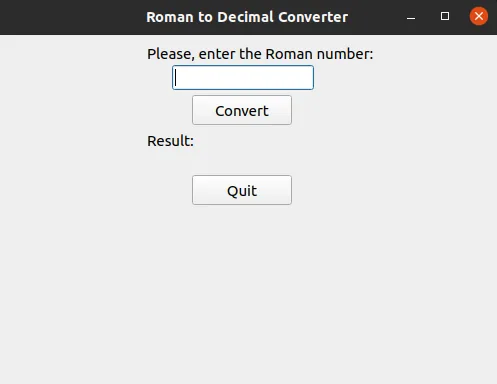
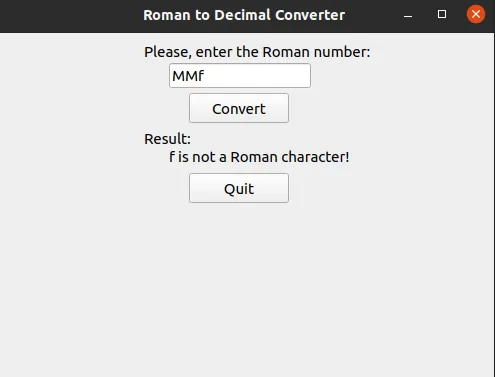
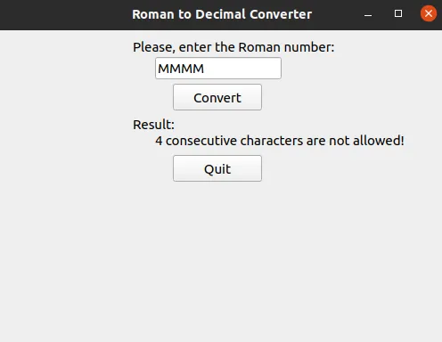
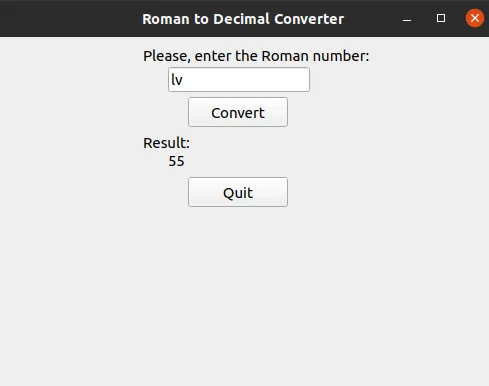
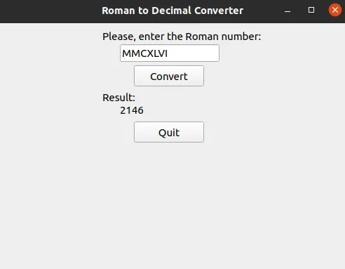
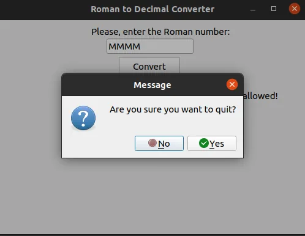

## Introduction:
Besides the Arabic numerals, integers can be expressed as Roman numbers. Here are the seven main Roman numbers:

However, Roman numbers can be used to express integers 1-3999 (both included). The reason is, the largest Roman symbol is 'M,' which is equivalent to 1000, and to express 4000, we should use 'MMMM,' but the max length for the same Roman character sequence is 3. After knowing this information, we can be interested in converting a Roman number to an integer. There is a simple rule for that: We start reading each character from the left, and if it is followed by a bigger Roman character, then we subtract a current Roman number from the subsequent one; otherwise, we add the corresponding value to the result. We create a simple GUI with the help of the PyQt5 library and Python script to read user input (Roman number or wrong input), convert it to integer, and display output on the screen. If there is a problem with the input, an error message will be shown. Here is how the app looks like

## Code and Explanation:
- importing necessary libraries

- Roman to Decimal converter function

First of all, we check whether the user has put an invalid character or not. If there is a non-roman number symbol, we return that character and indicate that it is not a roman number. Besides, Roman numerals cannot have four consecutive symbols, and our program checks that case and gives an error explaining the situation. After checking for wrong inputs and ensuring that input is correct, we handle the case sensitivity, i.e., if the user places 'm', it is read directly as 'M' and counted as 1000. Here is how conversion works if the input is correct: at each iteration, we add the corresponding integer for the current roman character to the **res** variable (short for the result), and if the current roman character is greater than the previous one, then we subtract the last roman character twice from our **res** variable.

- Creating GUI for our program

With the help of this class, we create a window with a title explaining the role of the app. Inside the window, we create a text label at the top that helps users determine what input they should put in the input box below. Convert button converts the given input to the integer if possible, with the help of the roman_to_integer function we created and sets the output below with descriptive text label. If the quit button or close sign is clicked, a message box appears to confirm whether the user is sure about closing the app.

- Creating a window object from our class and generating a user interface

**Viola, our app is completed now**. Let's **check it with different inputs:**

- Putting Non-Roman character

- Four consecutive Roman character

- Roman number with small letters

- Roman numeral with all capital letters

- Closing the app

## Conclusion:
In conclusion, we created a simple app to convert a Roman number to an integer, showed error messages for invalid inputs that explain what is wrong with the input, displayed corresponding output for the valid input, and made sure when the user accidentally clicks the close or quit button, the app doesn't close and shows confirmation message. You can look at the whole code together from the link below:

<https://github.com/KananMahammadli/Data-Insight2021/tree/main/Assignments/1%20-%20Writing%20Simple%20Apps%20Using%20Python/1%20-%20Roman%20Number%20to%20Decimal%20Converter%20App>
