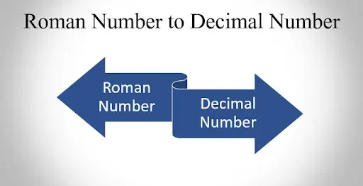
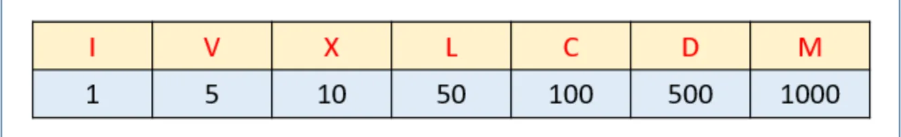
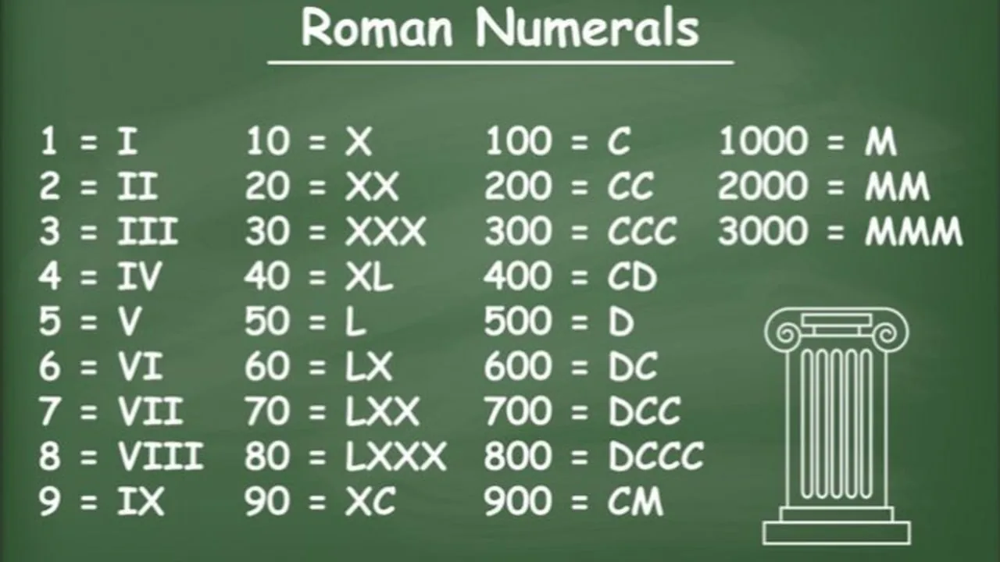

## General Introduction


Roman numerals are a numeral system that originated in ancient rome. Numbers in this system are represented by combinations of letters. Modern usage employs seven symbols, each with a fixed integer value:



The following image shows how Roman numerals are typically represented



A number containing several decimal digits is built by appending the Roman numeral equivalent for each, from highest to lowest, as in the following examples:

- 39 = XXX + IX =**XXXIX**.
- 789 = DCC + LXXX + IX = **DCCLXXXIX**
- 99 = XC + IX = **XCIX**

## Application in code
In order to be able to convert a Roman number into a decimal, we will proceed as follows.

Firstly, we will store the data of each number in a dictionnary like these

```python
romanNumbers = {'I': 1, 'V': 5, 'X': 10, 'L': 50, 'C': 100, 'D': 500, 'M': 1000 }
```

For validate patterns we have to create a dictionnary that can content each character possible previous character.

```python
previousRomanNumbers = {1: [5, 10], 10:[50, 100], 100: [500, 1000]}
```

Example **V** and **X** which have the value 5 and 10 can only have **I** **= 1** as previous character.

Also only dictionnary key can be repeated in roman number.

Then we will create a function call romanToInt which takes a character "roman" string representing the roman number and the return type for this function is int.

In our function we will create four variables total, current, previous and count.

- The total variable will content the sum of each value
- The current variable will content the value of the current roman number
- the previous variable will content the value of the previous roman number
- The count variable will number of time the current value is repeat

```python
...

def romanToInt(roman) -> int :
    total = 0
    current = 0
    previous = 0
    count = 0
```

For the following we will iterate each character of the variable roman in order to retrieve the different values ​​and to be able to calculate the sum and also we will check each time that the Roman number entered is indeed a valid Roman number.

**Validation step**:

1. Check each value is from highest to lowest

- If the current value is greater than the previous value, we have to check if the previous and the current value together forms a good pattern for each iteration except the first.

2. Check there is no character repeat more than three times.

**Calculation step:**

- If the current value is greater than the previous value, we have to remove the previous value to current value. For example MCM = 1900 if we add up each value the result is 2100. So in order to correct the calculation we will subtract twice the previous value from the current value.

```python
def romanToInt(roman) -> int:
    total = 0
    current = 0
    previous = 0
    count = 0

    for index in range(len(roman)):
        current = romanNumbers[roman[index]]
        if current > previous:
            if previous != 0 and current not in previousRomanNumbers[previous]:
                return 0
            total += current - 2 * previous
            count = 1
        elif current == previous:
            count += 1
            if count > 1 and current in [5, 50, 500]:
                return 0
            else:
                if count < 4 and current in [1, 10, 100, 1000]:
                    total += current
                else:
                    return 0
        else:
            total += current
            count = 1
        previous = current

    return total
```

Each time we could have a wrong roman number, our function return 0.

We will now test our function with the following few elements

```python
# Correct roman number
romanToInt('MMMCMXCIX') #output 3999

# Incorrect roman number
romanToInt('MMXVVI') # output 0
```

Although our function can convert enough numbers, it is not perfect because there are some cases that it does not take into account and can therefore be improved.

**Full Code**

```python
previousRomanNumbers = {1: [5, 10], 10:[50, 100], 100: [500, 1000]}

romanNumbers = {'I': 1, 'V': 5, 'X': 10, 'L': 50, 'C': 100, 'D': 500, 'M': 1000 }

def romanToInt(roman) -> int:
    total = 0
    current = 0
    previous = 0
    count = 0

    for index in range(len(roman)):
        current = romanNumbers[roman[index]]
        if current > previous:
            if previous != 0 and current not in previousRomanNumbers[previous]:
                return 0
            total += current - 2 * previous
            count = 1
        elif current == previous:
            count += 1
            if count > 1 and current in [5, 50, 500]:
                return 0
            else:
                if count < 4 and current in [1, 10, 100, 1000]:
                    total += current
                else:
                    return 0
        else:
            total += current
            count = 1
        previous = current

    return total

# Correct roman number
romanToInt('MMMCMXCIX') #output 3999

# Incorrect roman number
romanToInt('MMXVVI') # output 0
```

This simple application could be used to help people not knowing how to read roman numbers to be able to decipher the value of these numbers and also to test if they are valid numbers.
