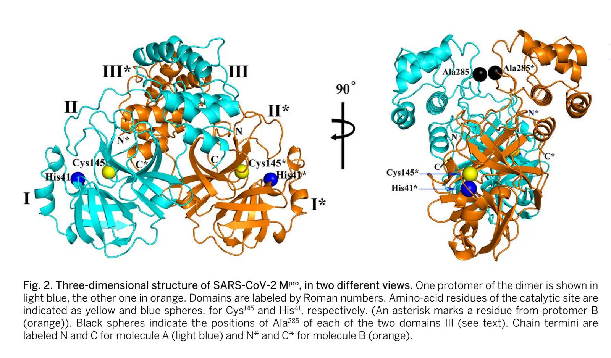

As we continue to battle the novel coronavirus, the urgency of this pandemic has made many research groups around the world including mine to shift their focus on COVID-19. At my first presentation on therapeutics for the disease, I proposed that the main protease of the virus is a potential therapeutic target as we now have its crystal structure deposited in the protein data bank. This idea is not new as it has been applied to other coronaviruses in the past. However, we need new strategies to target the SARS-CoV-2 main protease.

[Coronavirus](https://www.facebook.com/hashtag/coronavirus?__cft__[0]=AZX1D57YSgX5wjO8nUE6SlRL17x0t-RI04UUcu_G6Lokw1xKr8FiVnP0Ktm4Id5f8mCMBU5QUkUC7RPl_YI5E92FtuB2mXc-x4wbfS44fWnHxQ&__tn__=*NK-R) disease-19 (COVID-19) - The Severe acute respiratory syndrome coronavirus-2 (SARS-CoV-2) is responsible for the current COVID-19 pandemic. The RNA genome of SARS-CoV-2 is about 82% identical to the SARS-CoV which infected about 8000 people and killed 10% of them in early 2000. SARS-CoV-2 main protease (Mpro) is essential in the processing of polyproteins (pp1a and pp1ab) that are translated from the viral RNA. More importantly, the SARS-CoV-2 Mpro also has 96% sequence identity with SARS-CoV Mpro and both have similar structures. So we have a lot to learn from SARS.

SARS-CoV-2 main protease (Mpro) - Like other coronaviruses, SARS-CoV-2 Mpro is a potential therapeutic target for COVID-19. SARS-CoV-2 Mpro operates at no less than 11 cleavage sites on replicase pp1ab (~790 kDa). No human proteases with a similar cleavage specificity as SARS-CoV-2 Mpro are known. Therefore, inhibitors of SARS-CoV-2 Mpro are unlikely to be toxic. Although there are other therapeutic targets for coronaviruses like the spike protein, RNA-dependent RNA polymerase and other proteins on the virus surface, SARS-CoV-2 Mpro is critical once the virus is inside the human cell.

[SARS](https://www.facebook.com/hashtag/sars?__cft__[0]=AZX1D57YSgX5wjO8nUE6SlRL17x0t-RI04UUcu_G6Lokw1xKr8FiVnP0Ktm4Id5f8mCMBU5QUkUC7RPl_YI5E92FtuB2mXc-x4wbfS44fWnHxQ&__tn__=*NK-R)-CoV-2 Mpro potential therapeutic targets - The dimerization of SARS-CoV-2 Mpro is required for enzymatic activity. Domain III (residues 198-303) which is a globular cluster of five helices regulates the dimerization of SARS-CoV-2 Mpro, mainly through a salt-bridge between Glu290 of one protomer and Arg4 of the other. Domains I and II (residues 10-99 and 100-182) are six-stranded antiparallel β-barrels that harbor the substrate-binding site. Small molecule to bind domain I, for example, to prevent active dimerization state or using whole SARS-CoV-2 or part(s) (e.g Domain III) to raise antibodies (intrabodies) are some therapeutic strategies that can be explored.

[Request](https://www.facebook.com/hashtag/request?__cft__[0]=AZX1D57YSgX5wjO8nUE6SlRL17x0t-RI04UUcu_G6Lokw1xKr8FiVnP0Ktm4Id5f8mCMBU5QUkUC7RPl_YI5E92FtuB2mXc-x4wbfS44fWnHxQ&__tn__=*NK-R) for collaboration on COVID-19 Research - Unfortunately, my research group specializes in extracellular targets like the spike proteins on the coronavirus, and we want to focus on that for now. However, I feel strongly that SARS-CoV-2 main protease will be a good therapeutic target for COVID-19 and I am interested in research on this. So If you are a research group in academia or industry with proven expertise in delivering antibodies (intrabodies) in a timely fashion, to target the inside of cells, this massage is particularly for you; a request for collaboration on research to target the intracellular SARS-CoV-2 main protease as a therapeutic measure for COVID-19.

[Aina Adekunle](https://linktrest.io/aina)

References
1. Zhang et al., Crystal structure of SARS-CoV-2 main protease provides a basis for design of improved α-ketoamide inhibitors.
2. Wrapp et al., Cryo-EM structure of the 2019-nCoV spike in the prefusion conformation.
3. Wu et al., A new coronavirus associated with human respiratory disease in China.
