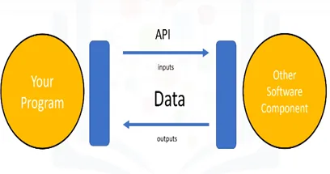
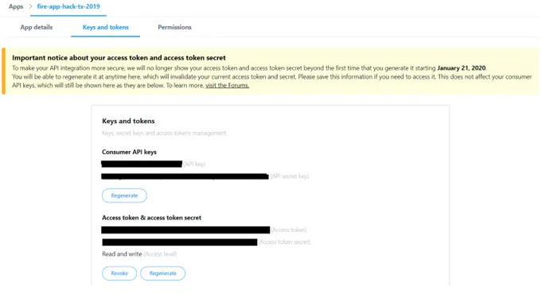
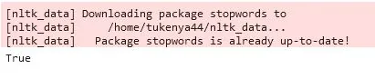
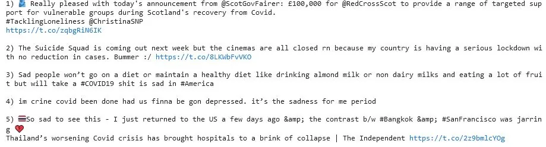
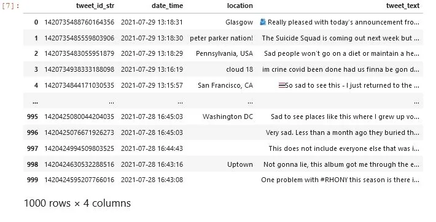
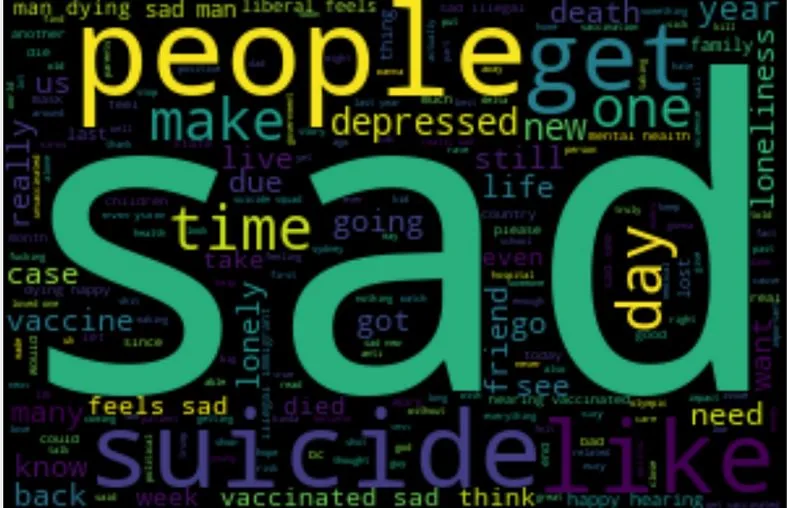

**Introduction**

The phrase *"data is the new oil"* is often bandied about by those who have interacted with data meaningfully. The weight of the statement can never be overstated. One can go as far as to say that social media is the middle-east to data's oil. That, then, might tempt someone to conclude that **twitter** is the Saudi Arabiaof **Data.**

Tweets are especially useful for sentiment analysis and one can easily gain access to publicly available tweets using **Tweepy's** twitter **APIs**.

The point of this tutorial then is to introduce the reader to the process of obtaining data from twitter **(scraping)**, cleaning it into a useful format or **(data munging)** with a view to **sentiment analysis**. The examples of code will be from a project I did.

**Tweepy and API**

Before delving into the code let us first explain what **Tweepy** is and its limitations and what **APIs** are.

**API** is an acronym for **Application Programming Interface.** This is a software intermediary that allows two applications to talk to each other. For instance, when you use say the Podcast Go application on your android phone to search for a favorite podcast like say invisibilia; the application connects to the internet then sends the data on invisibilia to a server. The server collects and acts on the data as requested then sends it back to the Podcast Go application which then re-interprets the data into a user friendly form. All this happens courtesy of an API.

If I were to book a bus ticket from Nairobi to Awendo. The booking buupass application is analogous to an API. It facilitates communication between the bus company and I.

Below is a pictorial representation of an API.



**figure 1: courtesy of** [**cognitiveclass.ai**](http://cognitiveclass.ai)

**Tweepy** is a python library that is used to access twitter API. There are a number of levels of access, mostly based on how much one is willing to pay. These levels can be further explored [here](https://developer.twitter.com/en/docs/twitter-api/getting-started/about-twitter-api) .In our case we will work with the standard free version which limits the access of tweets to the last 7 days, up to 18,000 tweets per quarter an hour and only 3200 tweets per user.

**Twitter API KEYS**

Before proceeding further, we will need to apply for credentials to become a twitter developer. This is normally a pretty straightforward process and mostly only requires one to answer the most basic of questions. The application can be done [here](https://developer.twitter.com/en/docs/twitter-api/getting-started/about-twitter-api). Within 48 hours, normally, there should be an approval for your application.

You then log in and set up a development environment in the developer dashboard then view the application details to retrieve your developer credentials as shown below.



**figure 2: Tweepy developer credentials**

A more elaborate explanation of the process of API generation can be found in the document attached below.

Besides tweepy ,one could use [**snscrape**](https://medium.com/dataseries/how-to-scrape-millions-of-tweets-using-snscrape-195ee3594721) which is a library that helps overcome tweepy's limitations.

**The Scraping begins**

Our scraping process will entail the use of search words to ultimately determine sentiments around COVID-19 vis-a-vis mental health. Of course, all that we will do here will be preparing data for the final processing with machine learning models.

To begin with, we will import the requisite libraries for scraping and munging. This is shown below:

Assuming you do not have tweepy installed, you should be able to do that as follows:

```python
!pip install tweepy
```

You can then import the library:

```python
import tweepy as tw
```

We then obtain credentials authorization by Tweepy so as to use its API as shown below:

```python
CONSUMER_KEY="bhakhgvhbjaskaklkklakakakb"
CONSUMER_SECRET="dghjfgkwgfuwuhiuguikgf"
ACCESS_TOKEN="hvaugkuafgalibybiayaytiliywa"
ACCESS_TOKEN_SECRET="aggjkqiywhiailhalhi"
```

To authenticate your credentials to Twitter, you then do the following:

```python
auth=tweepy.OAuthHandler(CONSUMER_KEY,CONSUMER_SECRET)
auth.set_access_token(ACCESS_TOKEN, ACCESS_TOKEN_SECRET)
```

We will then import other libraries:

```python
import pandas as pd
import csv
import re
import numpy as np
import matplotlib.pyplot as plt
plt.style.use('fivethirtyeight')

from wordcloud import WordCloud
import nltk
from nltk.tokenize.toktok import ToktokTokenizer
tokenizer = ToktokTokenizer() #initializing the class or rather creating an instance of the class
from nltk.corpus import stopwords
```

We will then obtain stopwords and later on update them:

```python
nltk.download("stopwords")
```

Upon running this, you should see the lines shown in figure 3 below if successful:



**figure 3: Downloading Stopwords**

A brief definition of **stopwords** would be English words that not add much meaning to a sentence. You can ignore them without harming a sentence's meaning.

Now lets begin working with the tweepy API by creating an object called **api** as follows:

```python
api=tweepy.API(auth,wait_on_rate_limit=True,wait_on_rate_limit_notify=True)
```

We then enter the search words we will be working with. These can be tuned as much as possible to better our results. Below we limit them to a few just for demonstration purposes:

```python
search_words= "(coronavirus OR covid OR pandemic OR covid19 OR lockdown)AND(loneliness OR lonely OR depressed OR suicide OR sad)"

#We would then want to exclude retweets and replies as those #could sway the results
my_search=search_words + "-filter:retweets"+"-filter:replies"
```

we then obtain relevant tweets as shown below:

```python
# tweets will be stored in an object tweets

tweets=api.search(q=my_search,lang="en",tweet_mode="extended",count=100)
```

Here, **q** is a parameter that gives the search criteria which could be based on *user_Id,search words* etc but in our case we deal with search words. **lang** stands for language and **tweet_mode** is a parameter that defines the mode of capture of tweets and here we work with the extended mode which extracts the entire code. More on modes can be perused [here](https://docs.tweepy.org/en/stable/extended_tweets.html). And **count** here simply means that particular number of tweets from zero to that particular number.

Using the code below, you could print out the first five tweets or any number you are interested in without exhausting memory.

```python
# Iterate and print tweets
i = 1
for tweet in tweets[0:5]:
    print(str(i) + ') ' + tweet.full_text + '\n')
    i = i + 1
```

figure 4 below gives the result:



**figure 4: Tweets given by the code snippet above**

For the purposes of converting the tweets into a panda DataFrame we can then proceed as follows:

```python
# Other method of collecting the tweets
tweets=tweepy.Cursor(api.search,q=my_search,lang="en",
tweet_mode='extended').items(1000)

# Extract the info we need from the tweets object
# we create a list comprehension of list objects of pertinent information

tweet_info=[[tweet.id_str,tweet.created_at,
tweet.user.location,tweet.full_text] for tweet in tweets]
```

**tweet_info** can then be converted to a DataFrame as shown below:

```python
df = pd.DataFrame(data=tweet_info,
columns=['tweet_id_str','date_time','location','tweet_text'])

#printing out the dateframe
df
```

The above gives you something like this:



**figure 5: An overview of tweet_info DataFrame**

**Data Munging**

This is the process of cleaning data and presenting it in a useful format.

Now that we have extracted data from twitter, we can proceed as follows:

First, we write functions that will aid us in our aim starting with the cleaning process.

```python
def clean_text(text):
    """
    A function to clean the tweet text
    """
    #Remove hyper links
    text = re.sub(r'https?:\/\/\S+', ' ', text)

    #Remove @mentions
    text = re.sub(r'@[A-Za-z0-9]+', ' ', text)

    #Remove anything that isn't a letter, number, or one of      the punctuation marks listed
    text = re.sub(r"[^A-Za-z0-9#'?!,.]+", ' ', text)

    return text
```

Next, we will write a function to remove the stopwords from the tweets.

```python
def remove_stopwords(text):
    """
    A function to remove stop words
    """
    # Tokenize the text
    tokens = tokenizer.tokenize(text)
    tokens = [token.strip() for token in tokens]
    # Remove stop words
    filtered_tokens = [token for token in tokens if token not in stopwords]
    filtered_text = ' '.join(filtered_tokens)
    return filtered_text
```

Briefly, I would like to explain what **tokenization** is. In Python tokenization refers **to splitting up a larger body of text into smaller lines, words or even creating words for a non-English language**.

It basically works like **str.strip(),str.split()** and **' '.join()** in python strings.

Next we will proceed with the application of the functions to our DataFrame. First, let us clean the data.

```python
# Apply the clean_text function to the 'tweet_text' column
df['tweet_text']=df['tweet_text'].apply(clean_text)
# to avoid any issues with text cases we will have everything     # in lower case
df['tweet_text']=df['tweet_text'].str.lower()
```

We will then get the list of **NLTK stop words** and also extend it by defining our own stopwords. This can be done as follows:

```python
stopwords = stopwords.words("english")
# Define our own list of stopwords
my_stopwords=['coronavirus','covid','pandemic',
'covid19','lockdown','amp','via']
# Extend the nltk stopwords list
stopwords.extend(my_stopwords)
```

The words contained in **my_stopwords** do not affect the meaning of any tweet with regards to sentiment.

We will then use the **remove_stopwords** function with the updated list of stopwords.

```python
# Apply the stopword removal function to the text of all tweets
df['tweet_text']=df['tweet_text'].apply(remove_stopwords)
```

We then proceed to visualize our data which, for our purposes, would be best served with **WordCloud.**

```python
# Plot a word cloud
all_words = ' '.join( [data for data in df['tweet_text']])
word_cloud = WordCloud(width=300, height=200, random_state=21, max_font_size = 300,
stopwords=stopwords).generate(all_words)

plt.figure(figsize = (20,10))
plt.imshow(word_cloud, interpolation='bilinear')
plt.axis('off')
plt.show()
```

This will then give the plot below.



[#Python](https://www.datainsightonline.com/blog/hashtags/Python) [#twitter](https://www.datainsightonline.com/blog/hashtags/twitter) [#DataScraping](https://www.datainsightonline.com/blog/hashtags/DataScraping) [#Datamunging](https://www.datainsightonline.com/blog/hashtags/Datamunging) [#Data](https://www.datainsightonline.com/blog/hashtags/Data)
