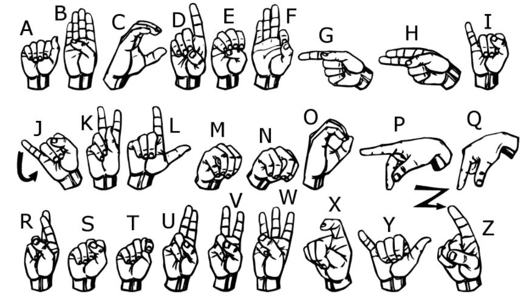

Hey everyone, I have recently published my kaggle notebook on "MNIST sign-language".

American Sign Language is a natural language that has the same linguistic properties as spoken languages, with grammar that differs from English. It is exxpressed by movements of the hands and face. It is useful for people who are deaf and hard of hearing. The dataset format is close to the classic MNIST. Each training and test case represents a label (0-25) as a one-to-one map for each alphabetic letter A-Z . There are no cases for J=9 and Z=25 due to gesture motions.

Important libraries used:-

a) Keras

b) Matplotlib

c) Pandas

d) Numpy

e) Seaborn

f) sklearn :- LabelBinarizer, ImageDataGenerator

Training data:- 27,455

Test data:- 7172

Image pixels: 28\*28 (784)

Link to notebook:- <https://www.kaggle.com/subarna577/sign-gesture-predictions-using-cnn>
