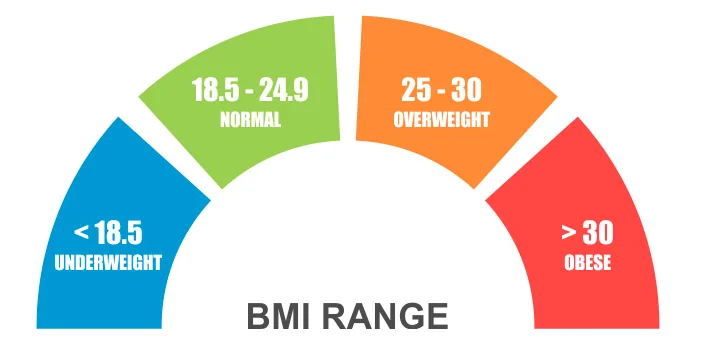
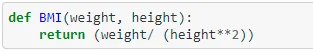
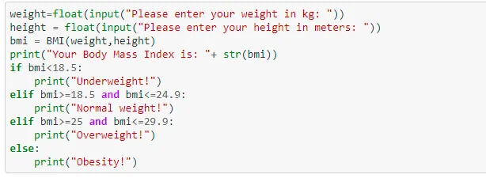
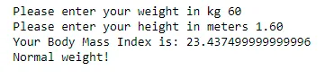

Body mass index (BMI) is a measure of body fat using height and weight that applies to both adult men and women.

This post is about a simple application using python that calculates the BMI using a height and a weight values given by the user and it also returns the user's weight category he/she falls in based on the calculated value.

### 1. BMI formula

BMI is weight in kilograms divided by height in meters squared.

**BMI = weight (in kg) / height (in m²)**

In our python application, we defined a function called BMI that takes the weight and the height as arguments and returns the BMI value as shown below:

### 2. Testing the BMI function

The code below shows the use of the BMI function and the classification in the weight category based on the returned value:

The values of height and weight are given by the user. Then, the BMI function is called and the returned value is displayed. Finally, the weight category of the user will be displayed based on the calculated BMI range.

This is an example of a test performed using the code above:

You can find the link to the github repo [here](https://github.com/arijbt/Data-Insight2021/blob/main/Assignments/1).
