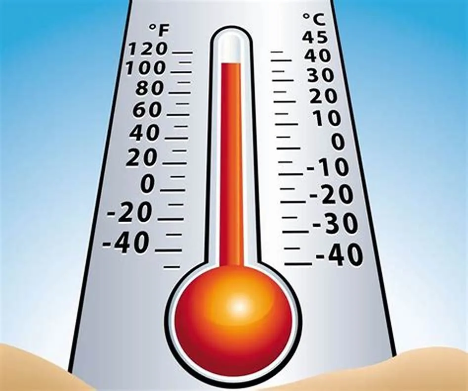
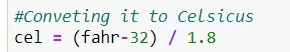
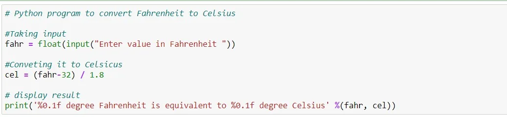

Fahrenheit and Celsius are the scales most often used for reporting room, weather, and water temperatures. The Fahrenheit scale is used in the United States, while the Celsius sale is used worldwide.

Indeed, most countries around the world measure their weather and temperatures using the relatively simple Celsius scale. But the United States is one of just a few remaining countries that use Fahrenheit, so it's important to know how to convert one to another especially when traveling or doing scientific research.

**1. Formula to Convert Temperature in Fahrenheit to Celsius**

**Celsius (°C) = (Fahrenheit - 32) / 1.8**

In our python application, we take input in Fahrenheit and convert it to Celsius using the formula above. The formula is

**2. Testing the Conversion Process**

The code below shows how temperature in Fahrenheit is converted to Celsius :

The values of Fahrenheit is entered by the user. Then, the formula to converts from Fahrenheit to Celsius is applied. Finally, the temperature in Celsius is displayed to the user.

This is an example of a test performed using the code above:

Link to the GitHub repo [Data-Insight-s-Data-Scientist-Program-2021/Convert temperature in Fahrenheit to Celsius..ipynb at master · Tanushree28/Data-Insight-s-Data-Scientist-Program-2021 (github.com)](https://github.com/Tanushree28/Data-Insight-s-Data-Scientist-Program-2021/blob/master/Convert%20temperature%20in%20Fahrenheit%20to%20Celsius..ipynb).
