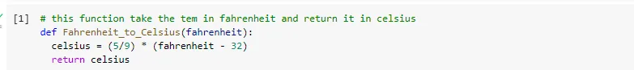
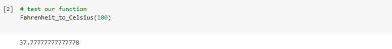

Converting temperature in Fahrenheit to Celsius can be done very easily using a mathematical formula as shown below.

I use python programming language to define a function that take temperature in Fahrenheit and return it to Celsius in the figure below

just to test our function pass a Fahrenheit value to return it in Celsius as shown

Conclusion

use the above mathematical formula to convert temperature from Fahrenheit to Celsius and vice versa.
