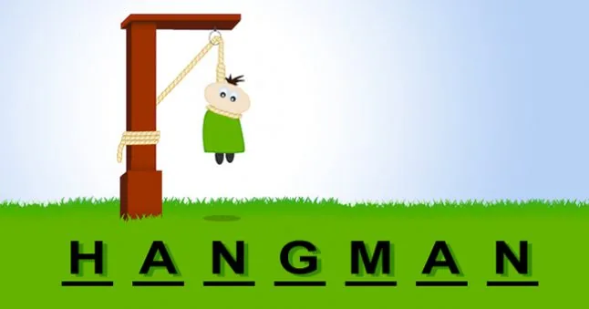
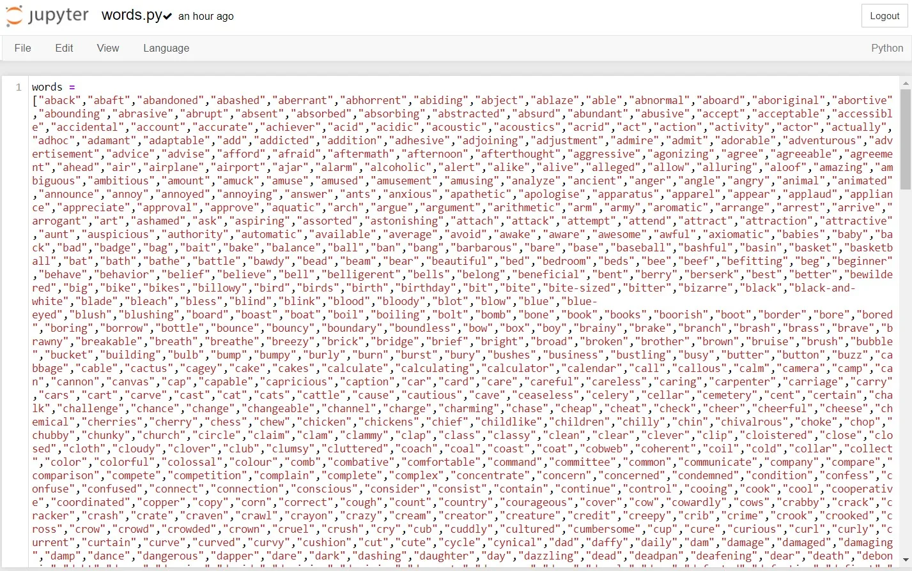
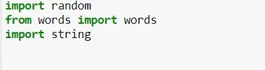
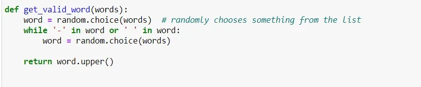
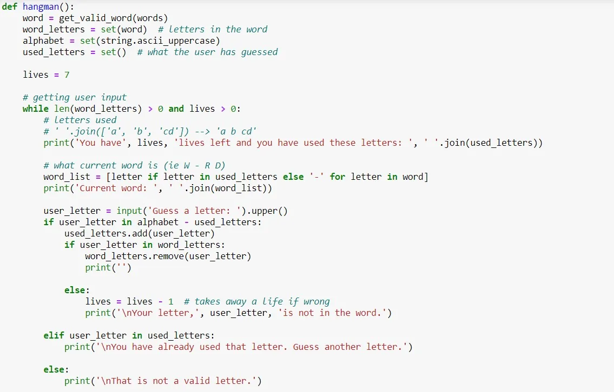
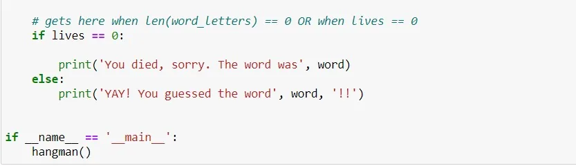
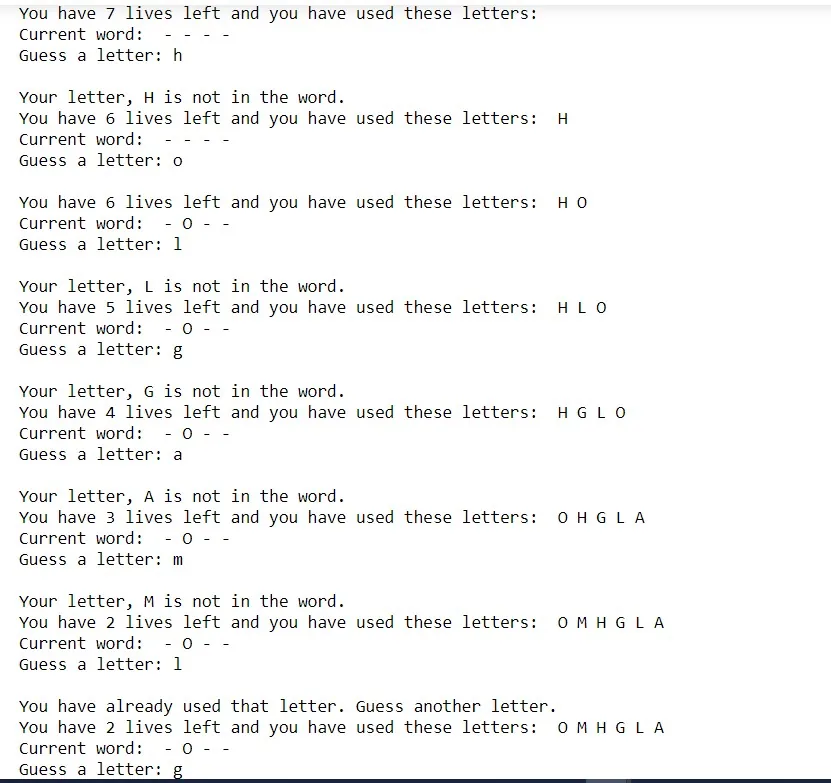
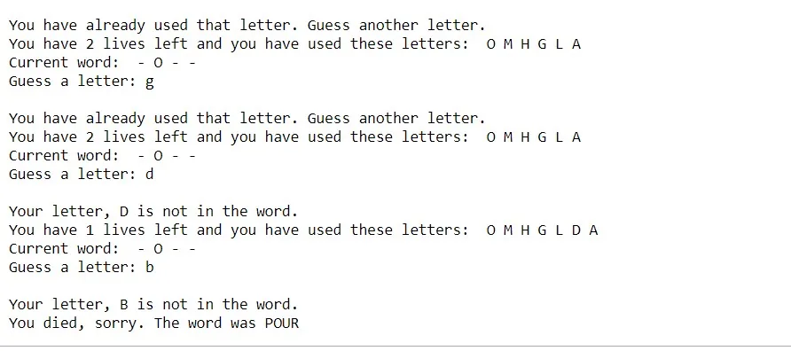

Hangman is a paper and pencil guessing game for two or more players. One player thinks of a word, phrase or sentence and the other(s) tries to guess it by suggesting letters within a certain number of guesses.

Due to advancement in technology nowadays we can play this game in our personal desktop. Also, this game can be self coded and we can have our own amazing version of hangman.

In this post, I will show you how to create a simple hangman game using Python. First of all, I will explain the rules of the game that I have created. Then, I will show you the code and at the end I will perform a simple game run to show the games working.

### 1.Game Rules

In this game, the player have to guess a word. And he/she has a maximum of 7 attempts to guess the right word generated by the system. If he/she gives 7 wrong guesses, the game is lost and the generated word will be revealed.

### 2.Code explanation

The code below represents the whole game, I will explain it step by step:

As the first step, I have created a .py file with list of words. There are more then 500 words. The list of words that I have added can be seen in the image below:

Then, I have imported the words in the list. The code to import the words is shown below:

Then a word is chosen randomly by the system by creating a function as shown below:

After that, the guessing process begins as shown below:

The player will have the chance to guess a word 7 times. There are dashes which will be filled if the letter is guessed right and if its guessed wrong the player will have to enter another letter. This process goes on 7 times. If the player does not guess the correct word in the 7 attempts, the word will be revealed and the player losses the game.

The code below shows the final output whether the user has guessed the right word or his/her word is wrong.

**3. Playing the game**

This is a simple test performed where I tried guessing the correct word.

GitHub repo link [here](https://github.com/Tanushree28/Data-Insight-s-Data-Scientist-Program-2021/blob/master/Hangman.ipynb).
