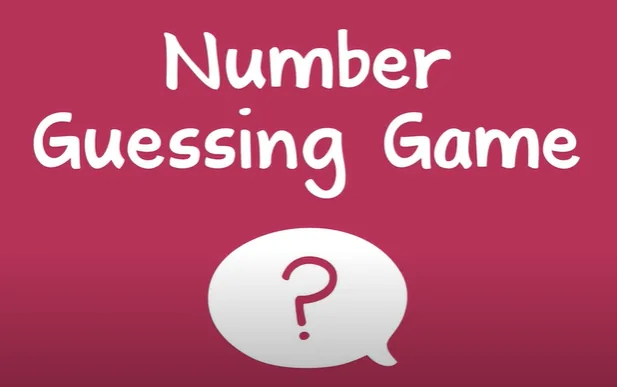
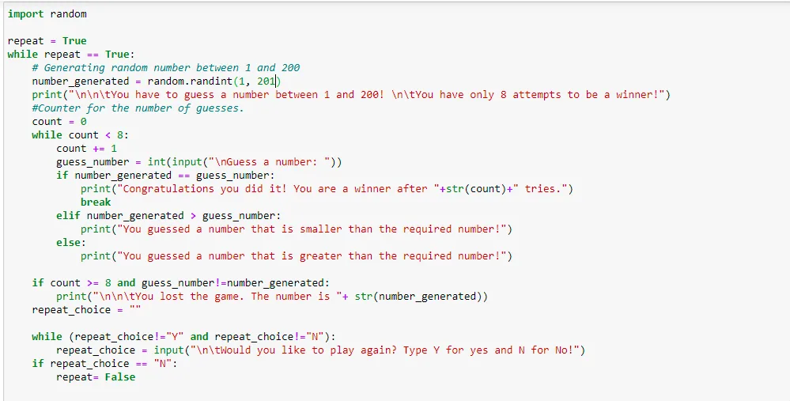
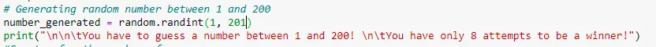
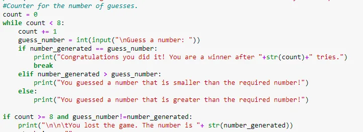
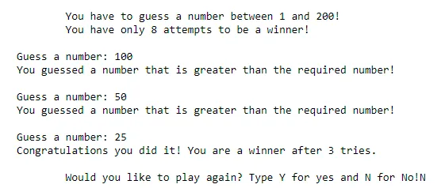

In this post, I will show you how to create a simple number guessing game using Python. First of all, I will explain the rules of the game that I have created. Then, I will show you the code and at the end I will perform a simple test case.

### 1.Game Rules

In this game, the player have to guess a number between 1 and 200. And he/she has a maximum of 8 attempts to guess the right number generated by the system. If he/she gives 8 wrong guesses, the game is lost and the generated number will be revealed. In both cases, the player is given the chance to retry again.

### 2.Code explanation

The code below represents the whole game, I will explain it step by step:

The first while loop is for repeating the game and it is a choice taken by the player at the end of the game.

The game starts by generating a number between 1 and 200 as shown below:

After that, the guessing process begins as shown below:

The player will have the chance to guess for 8 times. If he/she gives a wrong number a hint will be displayed telling if the guessed number is greater or smaller than the generated number. In the case of a right guess, a message will be displayed as well as the number of tries consumed. If the player does not guess the number in the 8 attempts, the number will be revealed and the game is lost.

Finally, as mentioned previously, the player will have the chance to repeat the game.

### 3.Performed test

This is a simple test performed where I succeeded to guess the number from the third try:

You can find the code repo [here](https://github.com/arijbt/Data-Insight2021/blob/main/Assignments/1): https://github.com/arijbt/Data-Insight2021/blob/main/Assignments/1)Number%20Guessing%20Game-first-assignment.ipynb
