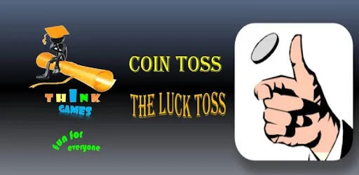

In this project, I will show you how to implement a simple coin toss game in python. The post is divided in three main part. First I will explain the game rules, then the python implementation of the game and finally I will perform some tests.

## 1. Game rules
This game is played by a single user against the computer. The player predicts the outcome of three consecutive coin tosses, for example **THH** where **H** stands for **heads** and **T** stands for **tails**. Behind the scenes, the computer makes its own prediction based on that of the user. The coin is then flipped until the last three consecutive coin tosses match either predictions. The player wins in the case his/her prediction is the one obtained, otherwise the computer wins. In either case, the player is given the chance to retry.

## 2. Code Explanation
The code is divided into three main pieces, two functions and the main playing loop. A seed of 2021 has been set to make sure that the randomness is "reproducible".

### a. The function play()

- The first function play, takes in the player's prediction as a string (case insensitive, that is 'ttt' = 'TTT') and converts it into a list of binary values: 1 for 'Heads' and 0 for 'Tails'.
- There's a nested function flip with no argument, that returns randomly 0 or 1, to simulate a coin flip.
- The computer prediction is derived from the player's as follows: if player's prediction is "X1-X2-X3" then computer = "not(X2)-X1-X1".
- The coin is then flipped, the result is appended to the variable outcome and the last three consecutive values are compared with both predictions, until either matches. The winner is announced by print(winner) along with the number of coin tosses executed, and the function returns nothing.

```python
import random
random.seed(2021) # ensure randomness "reproducibility"

def play(pred):
    # Convert prediction into a binary list with 'Tails' = 0, 'Heads' = 1
    pred = [1 if i == 'H' else 0 for i in pred]

    # coin flip simulation
    def flip():
        return random.randint(0,2)

    computer = [int(not pred[1]), pred[0], pred[0]]
    outcome = []

    while outcome[-3:] != computer and outcome[-3:] != pred:
        outcome.append(flip())

    if outcome[-3:] == pred:
        winner = 'Congratulations, you won after '+  str(len(outcome)) + ' flips!'
    else:
        winner = 'Computer won after ' +  str(len(outcome)) + ' flips!'
    print(winner)
    return
```

### b. The error handling function check()
It takes the user's prediction as argument and returns True if it has the right shape and contains the right letters, otherwise it returns False.

```python
def check(x):
    if len(x) != 3:
        return False
    check = []
    for i in x:
        check.append(i in ['t', 'T', 'h', 'H'])
    return check[0] and check[1] and check[2] and len(x)==3
```

### c. The main playing while loop
Here the player is asked to enter his/her prediction then this prediction is checked. The game continues only if the shape and letters of prediction are correct otherwise, an error message is thrown. One play round is performed, and the winner is prompted to select whether to play another round or to quit. The inner while loop makes helps make sure that the game continues until the player decides to quit. The decision of the player to continue (y) or to quit (q) is case insensitive.

```python
replay = True
while replay == True:
    pred = input('\nEnter your prediction in the shape "XXX" where X is either T or H\n')

    if not check(pred):
        raise ValueError('Input must be of shape "XXX" where X is either T or H either lower or uppercase\n')
        break

    play(pred)

    repeat = ''
    while (repeat not in ['y', 'Y'] and repeat not in ['q', 'Q']):
        repeat = input('\nPress y to play again or q to quit\n')

        if repeat in ['q', 'Q']:
            print("Thanks for playing \nGood Bye!!!")
        replay = repeat in ['y', 'Y']
```

## 3. Game tests

Here are the results of three tests I performed on the game:

- Here I won in the second round after 3 coin tosses.

```python
Enter your prediction in the shape "XXX" where X is either T or H
TTT
Computer won after 10 flips!

Press y to play again or q to quit
y

Enter your prediction in the shape "XXX" where X is either T or H
hhh
Congratulations, you won after 3 flips!

Press y to play again or q to quit
q
Thanks for playing
Good Bye!!!
```

- In the second test I entered a wrong prediction format and got an error as expected.

```python
Enter your prediction in the shape "XXX" where X is either T or H
tHG
---------------------------------------------------------------------------
ValueError                                Traceback (most recent call last)
<ipython-input-95-75ccb25d76e0> in <module>
      5
      6     if not check(pred):
----> 7         raise ValueError('Input must be of shape "XXX" where X is either T or H either lower or uppercase\n')
      8         break
      9

ValueError: Input must be of shape "XXX" where X is either T or H either lower or uppercase
```

Find the code in this [github repository](https://github.com/tem-ctrl/coin_toss_game)
