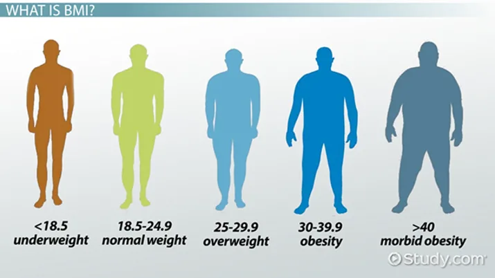

Body mass index (BMI) is a quotient that has been in use since the mid-19th century. It is used to identify adults and adolescents that have an abnormal weight in proportion to their height. It is the calculation of weight divided by height, and it is universally expressed in kg/m2.

It is important for a clinician to understand BMI due to the extensive research that is being done correlating BMI to various disease pathophysiology, and because of its use as stratification measure in many clinical treatment guidelines.



As in the figure we have a lot of catagories so we make a simple project with simple steps to know IBM.

First Step:

Make a Function to Calculate BMI.

# how to calculate BMI

def BMI(height, weight):

bmi = weight/(height\*\*2)

return bmi

Second Step:

we ask a user to give us weight and height

height=float(input("\n Enter your height in m : "))

weight=float(input("\n Enter your weight in kg : "))

Third Step:

call the BMI function

bmi = BMI(height, weight)

print("\n The BMI is", format(bmi), "so ", end=' ')

Fourth Step:

Conditions to find out BMI

if (bmi < 18.5):

print("underweight")

elif ( bmi >= 18.5 and bmi < 24.9):

print("Healthy")

elif ( bmi >= 24.9 and bmi < 30):

print("overweight")

elif ( bmi >=30):

print("Obesity")

elif ( bmi >= 40):

print("Morbid Obesity")

Finally, we test a program the output:

```python
 Enter your height in m : 1.4

 Enter your weight in kg : 35

 The BMI is 17.85714285714286 so underweight
```
