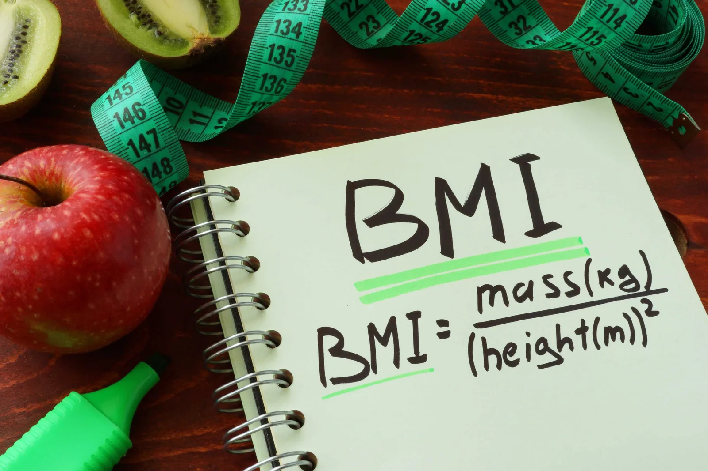
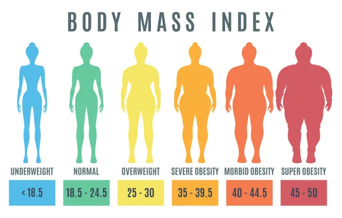

**What is BMI?**

The Body Mass Index (BMI) is a measurement of a person's leanness or corpulence based on their height and weight and is intended to quantify tissue mass. It is widely used as a general indicator of whether a person has a healthy body weight for their height. Specifically, the value obtained from the calculation of BMI is used to categorize whether a person is underweight, normal weight, overweight, or obese depending on what range the value falls between.

**Come on to build** **a** **simple BMI Calculator**

## How does it work?

A BMI Calculator will take in the height and weight individually and will calculate the BMI of the user.

**Body mass index (BMI) is a measure of body fat based on height and weight.**

Based on the BMI of the individual, it will print a statement stating the overall health case of the user.

**Coding Time :)**

The first thing we need to do is to ask the user about their height & weight.

```python
height = float(input("Enter your height in cm: "))
weight = float(input("Enter your weight in kg: "))
```

We used float() to convert the input string to float so that we can perform calculations with it.

Next, we have to calculate the BMI.

**The formula to calculate BMI is:**



So, the implementation of this formula in python will be:

```python
BMI = weight / (height/100)**2
```

Here we will be dividing the **height** by 100 to convert the **centimeters** into **meters**.

to print BMI:

```python
print(f"Your BMI is {BMI}")
```

Now we have to print a statement to state the current health case of the user based on their **BMI**.



And to implement this classification we use a simple if-else condition:

```python
if BMI <= 18.4:
    print("You are underweight !")
elif BMI <= 24.9:
    print("You are healthy :)")
elif BMI <= 29.9:
    print("You are over weight !")
elif BMI <= 34.9:
    print("You have obesity class 1 !")
elif BMI <= 39.9:
    print("You have obesity class 2 !")
else:
    print("You have obesity class 3 !")
```

The output will be:

- if BMI is **less than or equal to 18.4** then **You are underweight !** will be printed.
- if BMI is **less than or equal to 24.9** then **You are healthy :)** will be printed.
- if BMI is **less than or equal to 29.9** then **You are over weight !** will be printed.
- if BMI is **less than or equal to 34.9** then **You have obesity**
  **class 1 !** will be printed.
- if BMI is **less than or equal to 39.9** then **You have obesity**
  **class 2** ! will be printed.
- if BMI none of the above are true then **You have obesity class 3 !** will be printed.

That's it, I hope this article was worth reading and helped you acquire new knowledge no matter how small.

Feel free to check up on the [notebook](https://github.com/MariamAlsaedy/Data-Insight-Scholarship-Article-2/blob/main/BMI_Calculator.ipynb). You can find the results of code samples in this post.
