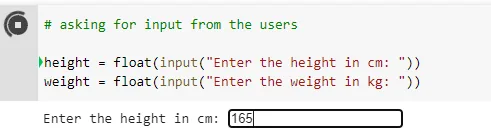
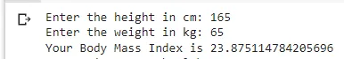

In this article, we will learn how to create a Body Mass Index(BMI) calculator using python. Before that, we need to understand the term Body Mass Index(BMI).

## Understanding Body Mass Index
Body Mass Index, in short BMI, is the measurement of a person's height and weight. Generally, we use BMI to label a person's health by measuring their height and weight. There are four categories in the BMI labeling such as underweight, healthy, overweight, and obese. Fitness trainers and doctors use this calculator to help promote healthy life and eating.

## Understanding the Calculation

I will create a table here to simply break down the BMI calculation and labeling.

|  |  |  |
| --- | --- | --- |
| **SL No.** | **​BMI** | **Label** |
| **1** | <18.5 | Underweight |
| **2** | 18.5 - 24.9 | Normal |
| **3** | 25.0 - 29.9 | Overweight |
| **4** | *30.0 and above* | Obese |

According to the above table, if a person's BMI is below 18.5 then that person is underweight. A Body Mass Index between 18.5 - 24.9 is normal and so on.

Now, let's start coding!!

## Creating the App
We will start by taking the height and weight of a person. Note that, we are taking **height** in cm and **weight** in kg.

```python
# asking for input from the users

height = float(input("Enter the height in cm: "))
weight = float(input("Enter the weight in kg: "))
```

If we run the code the output will look like this,



At first, it will ask for the height in cm then if you hit enter then it will ask for the weight. The image below shows that.

Looks Good right! Now, let's calculate the BMI using a function named BMI. It's always a good practice to use a relevant name while creating a function or variable.

```python
# defining a function for BMI
BMI = weight / (height/100)**2
```

Well, we have calculated the BMI using a function named BMI. Okay! so let's print it using a print statement.

```python
# printing the BMI
print("Your Body Mass Index is", BMI)
```

The above code will print a message like this image below,



We are getting the BMI number here. Let's check if the person is healthy or overweight or obese. For that, we will use the condition expression from python.

```python
# using the if-elif-else conditions
if BMI <= 18.5:
    print("Oops! You are underweight.")
elif BMI <= 24.9:
    print("Awesome! You are healthy.")
elif BMI <= 29.9:
    print("Sorry! You are over weight.")
else:
    print("Uh! Oh!  You are obese.")
```

The above code will produce an output like,


Congratulation!!! You have successfully made a BMI Calculator using Python. Let's see the full file,

```python
# asking for input from the users

height = float(input("Enter the height in cm: "))
weight = float(input("Enter the weight in kg: "))

# defining a function for BMI
BMI = weight / (height/100)**2

# printing the BMI
print("Your Body Mass Index is", BMI)

# using the if-elif-else conditions
if BMI <= 18.5:
    print("Oops! You are underweight.")
elif BMI <= 24.9:
    print("Awesome! You are healthy.")
elif BMI <= 29.9:
    print("Sorry! You are over weight.")
else:
    print("Uh! Oh!  You are obese.")
```

The output will be,

```python
Enter the height in cm: 165
Enter the weight in kg: 65
Your Body Mass Index is 23.875114784205696
Awesome! You are healthy.
```

Thanks for reading my article. I hope this article helped you understand some python syntax. You can find the repository [here](https://github.com/rubayat-tithi/BMI-Calculator-Using-Python). That's all for today.

Have a good time!!!
