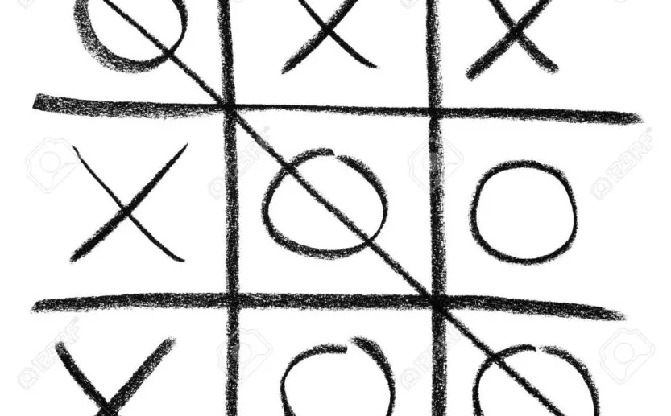

### Introduction:
Each of us has played this game at least once in our lives. But wait, what do you think about coding this game?

The game is played on a grid that's 3 squares by 3 squares. The first player to get 3 of her marks in a row is the winner.

First of all, lets import libraries which we need

We will use tkinter library for Graphical User Interface.

time library for time operations and choice for choosing variable randomly

We write computer estimates with the comp button function. First we look for appropriate place to put 'O' ('X')

These lines of code is for clicking to the button and checking for win or louse. If our flag rises to 8, the game is over. And because of this we call checkForWin() function again for looking for any winner.

#### Conclusion:

In conclusion, we create simple app for playing Tic-Tac-Toe game with the visually help of Tkinter. You can look at the whole code by click below:

<https://github.com/Ibrahimbeu/Tic-Tac-Toe>
