**Cumulative distribution function CDF**

1. Probability mass function – discrete variables PMF

2. Probability density function – continuous variables PDF

**First: PMF - discrete data**

Let’s have a dice, it has 6 outcomes, all are discrete, each of which has a probability of 1/6. If we decided to draw them:

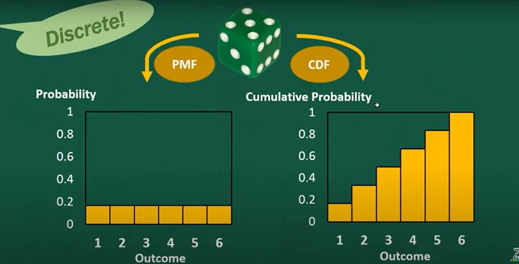

Let’s explain, what is the height of 3 in the right graph?

It means P(X<=3) is:

P(X=1)+P(X=2)+P(X=3) which gives the height of 3, but the last bar on the right must be 1, which means a 100%.

If we assumed for some reason, we don’t have 3 and 4 probabilities, his will makes them flat in the diagram.

**Second: PDF - continuous data**

We assume we have a data for some natural phenomena of height, and it is normally distributed and has 165 as a mean value.

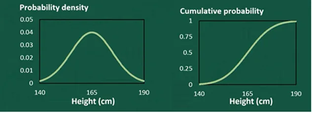

From any data that has a probability density on the bell shape we will have an s shape cumulative probability function like in the right.

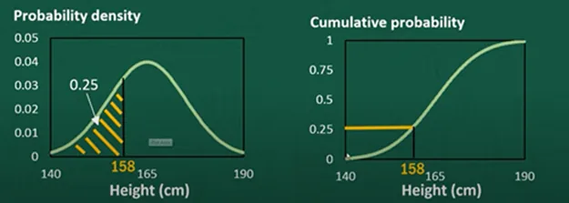

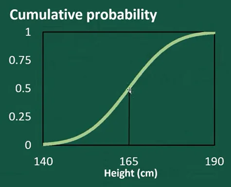

Can we know how much distribution around the mean 165, can we calculate that from cumulative probability?

We have a rule: the higher the gradient the higher the density, which mean more distribution around the highest gradient.

So how do we calculate the gradient?

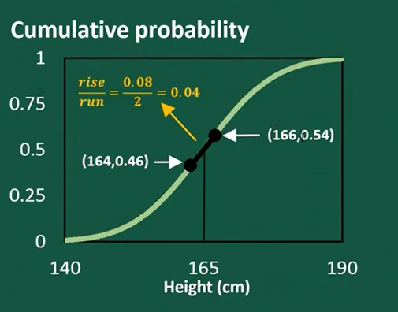

We take points around 165 , applying a simple calculation of the interval between those two points we have the gradient. If we continue to calculate the gradient for the pre and post values above and below 165 we will find it is all smaller than the gradient around 165.

Thus, we knew the density using the cumulative function.

More formally:

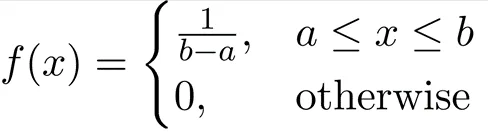

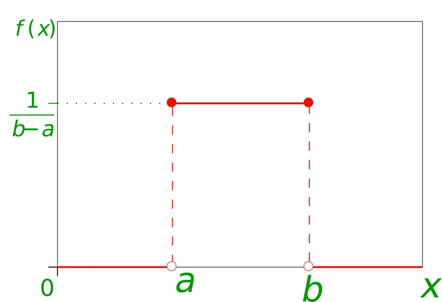

So, if the opposite, if we want the CDF from the density, we must calculate the area up to the point under calculation. The area is the integral under the graph.

***So, how do we calculate them in python? This what will be discussed in the next part.***

***let's code:***

***Example1: Probability mass function:***

```python
import numpy as np
import pandas as pd
import matplotlib.pyplot as plt
%matplotlib inline

#making a random numpy array
m = np.random.randint(2,10,40)
print(m)
```

```python
[4 8 7 8 6 3 4 6 9 5 2 5 8 7 6 9 8 5 4 9 6 3 3 2 2 8 7 8 4 6 6 9 3 6 5 2 8  8 8 7]
```

```python
df = pd.DataFrame(m)
df = pd.DataFrame(df[0].value_counts())
df
```

```python
	0
8	9
6	7
4	4
7	4
3	4
9	4
5	4
2	4
```

```python
length = len(m)
length
```

```python
40
```

Making it as a data frame with its counts:

```python
data = pd.DataFrame(df[0])
data
```

```python
	0
8	9
6	7
4	4
7	4
3	4
9	4
5	4
2	4
```

Giving the second column a name - 'counts':

```python
data.columns = ['counts']
data
```

```python
	counts
8	9
6	7
4	4
7	4
3	4
9	4
5	4
2	4
```

Calculating the probability mass functions by dividing the counts on the length for each value:

```python
data['pmf'] = data['counts']/length
data
#Calling the column pmf:
```

```python
	counts	pmf
8	9		0.225
6	7		0.175
4	4		0.100
7	4		0.100
3	4		0.100
9	4		0.100
5	4		0.100
2	4		0.100
```

**Drawing the probability mass function:**

```python
plt.bar(data['counts'], data['pmf'])
```

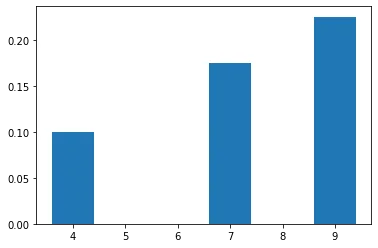

**In seaborn library:**

```python
import seaborn as sns
sns.barplot(data['counts'], data['pmf'])
```

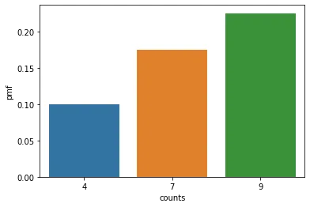

## Example 2: Calculating the probability Density Function:
```python
import statistics
from scipy.stats import norm
from numpy.random import normal
from matplotlib import pyplot
```

Making a random normal distribution using normal function with a size of 1000, then drawing the histogram:

```python
sample = normal(size=1000)
pyplot.hist(sample, bins =10)
pyplot.show()
```

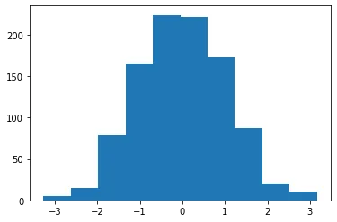

```python
sample = normal(loc=50, scale =5, size =1000)
#a random distribution with a mean of 50 and standard deviation of 5
sample
```

```python
47.95748153, 40.34564386, 50.01164928, 54.32280686, 41.04427149,        50.2892406 , 47.3207971 , 54.71207209, 51.79017643, 51.87503556,        55.10589778, 57.25431524, 49.57069179, 49.40989381, 45.33326354,        43.71962586, 49.11164287, 39.98838192, 37.99864367, 48.49290482,        49.00705331, 54.65592414, 58.47374221, 50.68965052, 49.13257586,        43.61781492, 43.68688805, 46.84165962, 51.32010763, 41.81333775,        42.31512765, 58.40195384, 50.34305462, 49.86786112, 57.27557826,
... cont
```

```python
pyplot.hist(sample, bins=20)
pyplot.show()
```

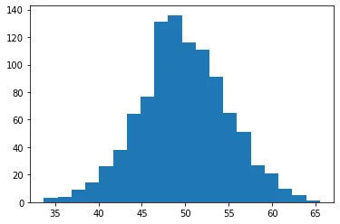

```python
#lets use the sample data and calculate the mean and standard deviation - assuming they are unknown
sample_mean =  statistics.mean(sample)
sample_std = statistics.stdev(sample)
print(sample_mean)
print(sample_std)
```

```python
49.76546130800147
5.0666050641642935
```

It is almost the same values of mean and standard deviation.

lets use them for a distribution:

```python
dist = norm(sample_mean, sample_std)
dist
```

Now, let's calculate the probabilities using pdf function:

```python
values = [value for value in range(10, 100)]
probabilities = [dist.pdf(value) for value in values]
probabilities
```

```python
[3.311373926819541e-15,  1.5286325808446857e-14,  6.787032869733504e-14,  2.8982693698873623e-13,  1.1903632088311218e-12,  4.702211915710378e-12,  1.786515768294292e-11,  6.528200188612428e-11,  2.294362456050957e-10,  7.755548981312193e-10,  2.521418973126638e-09,  7.884232844087442e-09,  2.3711324871634103e-08,  6.858579133604628e-08,  1.9080706034050084e-07,  5.10548119971032e-07,  1.313895652997853e-06,  3.252123458501082e-06,  7.742034927611404e-06,  1.7726589277743832e-05,  3.903706808481465e-05,  8.26820347562646e-05,  0.00016843295707052834,  0.0003300083621678515,  0.0006218773939450988,  0.0011271106384673107,  0.0019647635016098,  0.003294093852878467,  0.005311823172374812,  0.008238216548987137,  0.012288666321959895,  0.01763024120025207,  0.024327288744636417,  0.03228576785011499,  0.04121074666903327,  0.05059315940188343,  0.059738604336739935,  0.06784225847239059,  0.0741015813676873,  0.0778460550416785,  0.07865524635437793,  0.0764364900548816,  0.07144234980898798,  0.06422330908253364,  0.055527942374746474,  0.04617558822417242,  0.03693135535676238,  0.028409265781437907,  0.021018742379600674,  0.014956686765947625,  0.010236371135077532,  0.006738117847978683,  0.004265924208220292,  0.0025975841267741563,  0.0015212761695207174,  0.0008568966726527449,  0.00046422743679398493,  0.0002418884360316631,  0.00012122197692055198,  5.8429150472998766e-05,  2.7086926883112225e-05,  1.2077355574978122e-05,  5.179238661003693e-06,  2.1362001877918046e-06,  8.474223769407904e-07,  3.233254274695707e-07,  1.1864836200182552e-07,  4.1876038200680054e-08,  1.4215147863718504e-08,  4.641080801254378e-09,  1.457366664827378e-09,  4.4014977801779916e-10,  1.2785393433610443e-10,  3.5719852768980074e-11,  9.598142144838669e-12,  2.4805423635634602e-12,  6.165780691483418e-13,  1.474047410474995e-13,  3.3893528591539704e-14,  7.495559763497704e-15,  1.5943119874254821e-15,  3.261553491720773e-16,  6.417378480465309e-17,  1.2144307505139664e-17,  2.2103946007962494e-18,  3.8694462702360407e-19,  6.51493045211268e-20,  1.0550005865485625e-20,  1.643151365663256e-21,  2.4614124726842526e-22]
```

Plotting the histogram vs the probability density function:

```python
pyplot.hist(sample, bins=30, density = True)
pyplot.plot(values, probabilities)
pyplot.show()
```

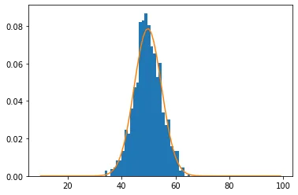

***References:***

zedstatistics. *Probability Distribution Functions (PMF, PDF, CDF) - Youtube*. 2 Mar. 2020, https://www.youtube.com/watch?v=YXLVjCKVP7U.

“Mathematics: Probability Distributions Set 1 (Uniform Distribution).” *GeeksforGeeks*, 6 Mar. 2018, https://www.geeksforgeeks.org/mathematics-probability-distributions-set-1/.
