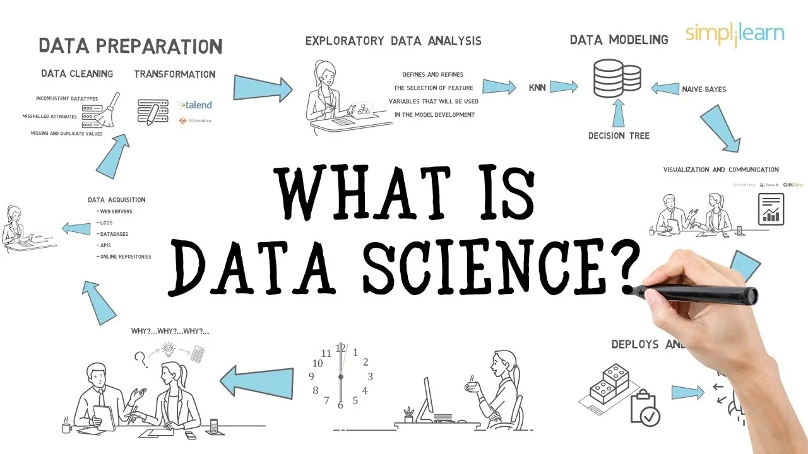
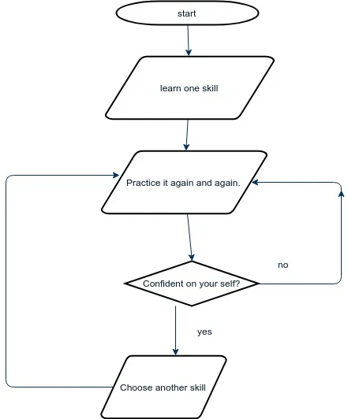

In this blog, I am going to write about the skills that are required to be a Data Scientist from the beginner level. Before going through the skills, let's understand what is data science, and why it was called "[the sexiest job of 21st century](https://hbr.org/2012/10/data-scientist-the-sexiest-job-of-the-21st-century)" by Harvard Business Review in 2012.

According to Wikipedia, Data Science is a multi-disciplinary field that uses scientific methods, processes, algorithms and systems to extract knowledge and insights from structured and unstructured data. Hmm!! What does it mean? It simply means to work with data and obtain meaningful information from it.

Data Science is called "the sexiest job of 21st century" because data scientists are masters of trial and error. They are highly adept at the art of efficiently utilizing cluster resources.

People claim that data science is all about creating complex models, awesome visualizations, and writing code. However, in my opinion, data science is about creating impact in any organization. Impact can be in the form of insights, data products, or product recommendations. It's all about solving the real business problems using tool whatever you have.

So, what skills do we require to become a data scientist? Let's look one by one.

**1.** **Good knowledge of Mathematics, especially Statistics**:

Most of the models that we create requires a solid foundation of Statistics. Statistical features is probably the most used statistics concept in data science. Some topics of statistics include:

**P.S \*\*** For your aid in learning, I have categorized the topics into levels of difficulty.

**Beginner Level:**  Mean, Mode, Median, Quartiles (Upper, Lower, Middle), Deviations (Mean Deviation, Standard Deviation), variance, confidence interval, correlation, skewness

**Intermediate Level:** Probability Distributions (Normal, also called Gaussian , Poisson), Bayesian Statistics, density function.

**Advanced Level :** Hypothesis Testing (Normality, Z-test, F-test, T-test, Chi- square tests, HOV, ANOVA, RBD, LSD, Two way ANOVA, One way CRD......), Regressions (Linear, Multiple, Polynomial, Logistic), Analysis( Factor, Cluster, Conjoint), Heteroskedasticity, Multicolinearity, Naive Bayes.......

Don't worry if you consider yourself a non-mathematician. You can always prefer Coursera to learn and expand your knowledge in statistics. [This is a good place to start](https://www.coursera.org/learn/basic-statistics).

**2.** **Proficiency in Programming Language****:**

One should be proficient in any of the programming language. However, for data scientists, Python and R are widely used. In-depth knowledge of one of these analytical tools is required. Generally, people prefer R to Python. Having profound knowledge in both of these languages is a plus factor. Talking about Python, firstly learn the basics, understand classes, modules. Learn different libraries like *numpy*, *pandas*, *matplotlib*, and then delve into Machine Learning.

For the basic start, these courses by edX are appropriate:

- [Python basics for data science](https://www.edx.org/course/python-basics-for-data-science-2)
- [Introduction to python for data science](https://www.edx.org/course/introduction-to-python-for-data-science-3)
- [Introduction to R for data science](https://www.edx.org/course/introduction-to-r-for-data-science-3)

**3.** **Hadoop**

Apache Hadoop is a collection of open-source software utilities that facilitate using a network of many computers to solve problems involving massive amounts of data and computation. Having experience with Pig or Hive is a bonus. Also, it is advisable to know about cloud tools such as Amazon S3, Kubernetes, or Microsoft Azure Services. As a data scientist, we may encounter a situation where the volume of data we have exceeds the memory of our system, or we need to send data to different servers, this is where Hadoop comes in. We can use Hadoop to quickly convey data into various points. Also, it is used for data exploration , data filtration and many more. You can learn [Hadoop](https://www.coursera.org/learn/hadoop) from Coursera.

**4.** **Apache Spark**

Apache Spark is an open-source distributed general-purpose cluster-computing framework. It is similar to Hadoop. The key difference is that Apache is faster than Hadoop. The prominent use of Apache Spark is that it prevents the loss of data. It's speed and platform makes it a widely chosen framework for data science projects. The best course you can get as a beginner study for Apache Spark is [CS105x](https://www.edx.org/course/introduction-apache-spark-uc-berkeleyx-cs105x) by UC Berkeley.

**5.** **SQL Database + Coding**

SQL stands for Structured Query Language. It is widely used for database management systems. It is a programming language used to perform operations like add, delete and extract data from a database, and also to perform analytical functions and transform database structures. This [beginner-friendly course](https://www.coursera.org/learn/sql-data-science) is really catching and helpful for data science aspirants.

**6.** **Data Visualization**

Data Visualization is one of the core component of Data Science. Massive data can be comprehended into the picture to give more meaningful information. One can use different data visualization tools like *matplotlib*, *pyplot*, *plotly*, *seaborn* ,*d3.js* and *Tableau*.

Most of the people have difficulty understanding ***p value*** and serial correlation. They need to be shown properly in picture format. [Python](https://www.coursera.org/learn/understanding-visualization-data) and [R](https://towardsdatascience.com/a-guide-to-data-visualisation-in-r-for-beginners-ef6d41a34174). Also, it is advisable to learn [Data Visualization with Tableau](https://www.coursera.org/learn/data-visualization-tableau).

Remember that, all of these courses are for beginner level.

**7.** **AI: Machine Learning + Deep Learning**

To be a more skilled data scientist, one must possess sufficient knowledge about Machine and Deep Learning. This includes reinforcement learning, deep neural networks, Support Vector Machines (SVM), adversarial learning, decision trees, logistic regression, supervised, unsupervised, semi-supervised, NLP, Computer Vision, Time-Series Analysis and many more.

It is good to start with this [course](https://www.coursera.org/learn/ai-for-everyone). Later on, one can opt-for [Machine Learning course](https://www.coursera.org/learn/machine-learning) by Andrew Ng on Coursera.

**8**. **Unstructured Data**

A data science aspirant must possess knowledge of unstructured data. These are data which doesn't fit into databases. For example, videos, blog posts, customer reviews, social media posts, video feeds, audio etc. Understanding "Beautiful Soup" is a bonus here. You can know more about unstructured data in Google and the ways to deal with unstructured data. Generally, in medical field, one has to play with those data.

This [course](https://www.coursera.org/learn/mining-medical-data) by Coursera is a beginner course where we work with medical unstructured data and bring meaningful information out of it. Also, you will learn about NLP (Natural Language Processing) and Medical Image Analysis.

These are the technical skills one should possess to become a really, excellent data scientist. Apart from these skills, one must also possess:

A) **Communication Skills**

B) **Team Work**

C) **Creativity**

D) **Basic knowledge of how business works**

E) **Patience**

The good thing is that these skills can be developed over time by practice.

That's all-- the skills required to be a data scientist. I know you might be overwhelmed by the skills I wrote about. But , don't worry. Everything happens step by step. Learn one thing. Practice it until you are confident in it even if it is a small topic for you. Hone your skills. Learn another skills. Repeat.

This is a flowchart of it.

Have patience and just believe in yourself.

If you have any questions, feel free to leave your feedback and your valuable suggestions here. Happy Coding!!!
