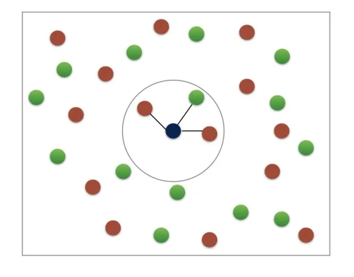
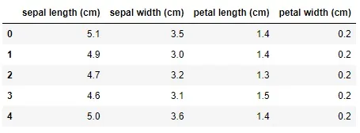
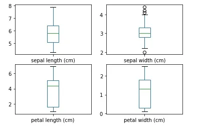
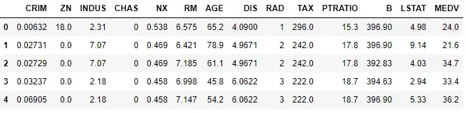
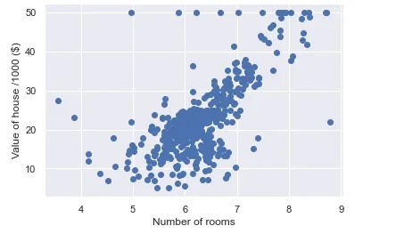
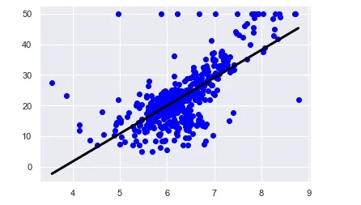

Machine learning is the science and art of giving computers the ability to learn to make decisions from data without being explicitly programmed. Let’s get some examples for that, e.g. your computer can learn to predict whether an email is a spam or not spam given its content.
another example: your computer can learn to cluster articles into different categories based on the words they contain. It could then assign any new article to one of the existing clusters that assigned before.

in the first example, we are trying to predict a particular class label, that is, spam or not spam. In the second example, there is no such label to assign the data to.

When there are labels present, we call it supervised learning. When there are no labels present, we call it unsupervised learning.

In this article, we will go through the previous two types to know each of them.

**Supervised learning**

Here we have samples, described using predictor variables or features and a target variable. Our data is commonly represented in a table structure.

Each row represents measurements and each column is a particular kind of measurement. The aim of supervised learning is to build a model that can predict the target variable.

We have different types of supervised learning models, If the target variable consists of categories, like 'spam' or 'not spam' for emails, we call the learning task classification.
 if the target variable is a continuously varying variable, for example, the price of a house, it is a regression task.

> the feature has the same meaning as predictor variable or independent variable.

> target variable = dependent variable = response variable.

Firstly, We will look at simple example for classification task using k-Nearest Neighbors.

k-Nearest Neighbors simply predict the label of a data point by looking at the ‘k’ closest labeled data points and take the majority of them.



In the previous shape, we look at the closest three points to the unlabeled point.

Let’s look at a dataset from scikit learn and see how we can build a simple classifier model based on this data:

```python
iris.keys()
```

```python
dict_keys(['data', 'target', 'frame', 'target_names', 'DESCR', 'feature_names', 'filename'])
```

As we see, these are the keys for the dataset.

Also as sklearn requires that the data to be in an array format, let's make sure that this is done here:

```python
type(iris.data),type(iris.target)
```

```python
(numpy.nx=iris.data
```

y=iris.target

df=pd.DataFrame(x,columns=iris.feature_names)darray, numpy.ndarray)

```python
# the target variable has certain values 0=> setosa ,1=> versicolor , 2=> virginica
# so the target variable will contain one of these values in each column of it
iris.target_names
```

```python
array(['setosa', 'versicolor', 'virginica'], dtype='<U10')
```

those are the target names or the labels that our model will predict one outcome of them.

let's put the data in a dataframe:

```python
x=iris.data
y=iris.target
df=pd.DataFrame(x,columns=iris.feature_names)
```

```python
df.head()
```



As we see that the features or the variables are in numeric form so let's visualize them:

```python
df.plot(kind='box', subplots=True, layout=(2,2), sharex=False, sharey=False)
plt.show()
```



Ok, let's start to build our model:

```python
from sklearn.neighbors import KNeighborsClassifier

# we use the most closest 6 labeled data
knn = KNeighborsClassifier(n_neighbors=6)

# fit the model
knn.fit(iris['data'], iris['target'])
```

In the above, we instantiate the KNeighborsClassifier and set the "k" to be 6, then we fit the data to the model.

```python
X_new = np.array([[5.6, 2.8, 3.9, 1.1],
[5.7, 2.6, 3.8, 1.3],
[4.7, 3.2, 1.3, 0.2]])
```

the X_new is unlabeled data, so we will use our classifier to predict their labels.

```python
prediction = knn.predict(X_new)

print('Prediction: {}',format(prediction))
```

```python
Prediction: {} [1 1 0]
```

As we see those are the labels for the new data as predicted by the model, so the first and second ones are versicolor and the third one is setosa.

**Regression**

As we said before that when the target variable is a continuously varying variable, this will be called a regression task, the regression model can be implemented using the gradient descent, so we can minimize the error function.

y = ax + b

this is simple equation, if we are using one single feature. And in case of two features: y = a1 x1 + a2 x2 + b

so it depends on the number of features that you have. In addition to that the number of training examples that are available.

let's move to the code:

```python
boston=pd.read_csv('boston.csv')
boston.head()
```



We need to create the feature and target arrays:

```python
X = boston.drop('MEDV', axis=1).values
y = boston['MEDV'].values
```

In this example,we will Predict the house value using a single feature.

```python
X_rooms = X[:,5]
type(X_rooms), type(y)
```

```python
(numpy.ndarray, numpy.ndarray)
```

As we see, they are numpy arrays.

By plotting the variables, we can get interesting results, let's see:

```python
sns.set()
plt.scatter(X_rooms, y)
plt.ylabel('Value of house /1000 ($)')
plt.xlabel('Number of rooms')
plt.show()
```



We see that as the number of rooms increase, the value of the house also increases.

ok, let's create the regression model that will fit these points.

```python
import numpy as np
from sklearn.linear_model import LinearRegression

reg = LinearRegression()

reg.fit(X_rooms, y)

prediction_space = np.linspace(min(X_rooms),max(X_rooms)).reshape(-1, 1)
```

```python
plt.scatter(X_rooms, y, color='blue')
plt.plot(prediction_space, reg.predict(prediction_space),color='black', linewidth=3)
plt.show()
```



Interesting, we now have our regression model that we can use to predict the value for new houses.

Resources: Datacamp course Supervised Learning with scikit-learn: [here](https://app.datacamp.com/learn/courses/supervised-learning-with-scikit-learn)

GitHub repo: [here](https://github.com/Abdelrahman7000/simple_supervised_learning_overview).

*That was part of Data Insight's Data Scientist program.*
